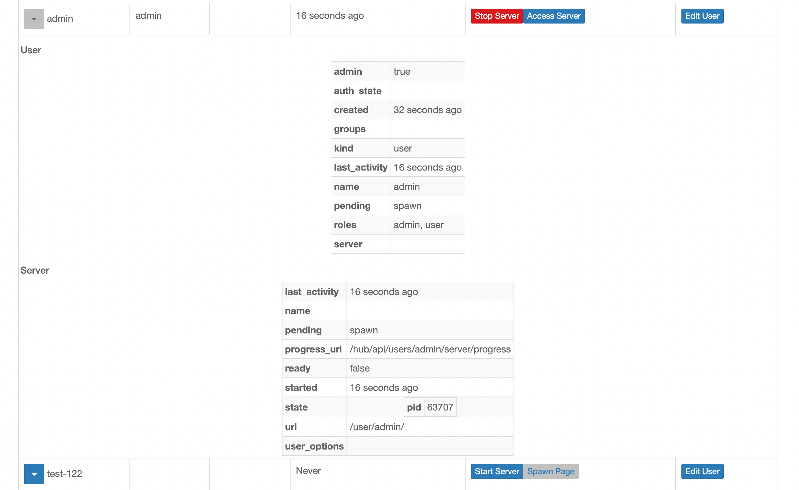

# Changelog

For detailed changes from the prior release, click on the version number, and
its link will bring up a GitHub listing of changes. Use `git log` on the
command line for details.

## [Unreleased]

## 3.0

### 3.0.0

3.0 is a major upgrade, but a small one.

It qualifies as a major upgrade because of two changes:

1. It includes a database schema change (`jupyterhub --upgrade-db`).
   The schema change should not be disruptive, but we've decided that
   any schema change qualifies as a major version upgrade.
2. We've dropped support for Python 3.6, which reached End-of-Life in 2021.
   If you are using at least Python 3.7, this change should have no effect.

The database schema change is small and should not be disruptive,
but downgrading is always harder than upgrading after a db migration,
which makes rolling back the update more likely to be problematic.

#### Changes in RBAC

The biggest changes in 3.0 relate to {ref}`RBAC`,
which also means they shouldn't affect most users.
The users most affected will be JupyterHub admins using JupyterHub roles
extensively to define user permissions.

After testing 2.0 in the wild,
we learned that we had used _roles_ in a few places that should have been _scopes_.
Specifically, OAuth tokens now have _scopes_ instead of _roles_
(and token-issuing oauth clients now have `allowed_scopes` instead of `allowed_roles`).
The consequences should be fairly transparent to users,
but anyone who ran into the restrictions of roles in the oauth process
should find scopes easier to work with.
We tried not to break anything here, so any prior use of roles will still work with a deprecation,
but the role will be resolved _immediately_ at token-issue time,
rather than every time the token is used.

This especially came up testing the new {ref}`custom-scopes` feature.
Authors of JupyterHub-authenticated services can now extend JupyterHub's RBAC functionality to define their own scopes,
and assign them to users and groups via roles.
This can be used to e.g. limit student/grader/instructor permissions in a grading service,
or grant instructors read-only access to their students' single-user servers starting with upcoming Jupyter Server 2.0.

Further extending granular control of permissions,
we have added `!service` and `!server` filters for scopes (:ref:`self-referencing-filters`),
like we had for `!user`.

Access to the admin UI is now governed by a dedicated `admin-ui` scope,
rather than combined `admin:servers` and `admin:users` in 2.0.
More info in `ref`{available-scopes-target}.

#### More highlights

- The admin UI can now show more detailed info about users and their servers in a drop-down details table:

  

- Several bugfixes and improvements in the new admin UI.
- Direct access to the Hub's database is deprecated.
  We intend to change the database connection lifecycle in the future to enable scalability and high-availability (HA),
  and limiting where connections and transactions can occur is an important part of making that possible.
- Lots more bugfixes and error-handling improvements.

([full changelog](https://github.com/jupyterhub/jupyterhub/compare/2.3.1...3.0.0b1))

#### New features added

- Add ConfigurableHTTPProxy.log_level [#3962](https://github.com/jupyterhub/jupyterhub/pull/3962) ([@manics](https://github.com/manics), [@minrk](https://github.com/minrk))
- include stopped servers in user model [#3909](https://github.com/jupyterhub/jupyterhub/pull/3909) ([@minrk](https://github.com/minrk), [@consideRatio](https://github.com/consideRatio))
- allow HubAuth to be async [#3883](https://github.com/jupyterhub/jupyterhub/pull/3883) ([@minrk](https://github.com/minrk), [@consideRatio](https://github.com/consideRatio), [@sgibson91](https://github.com/sgibson91))
- add 'admin-ui' scope for access to the admin ui [#3878](https://github.com/jupyterhub/jupyterhub/pull/3878) ([@minrk](https://github.com/minrk), [@GeorgianaElena](https://github.com/GeorgianaElena), [@manics](https://github.com/manics))
- store scopes on oauth clients, too [#3877](https://github.com/jupyterhub/jupyterhub/pull/3877) ([@minrk](https://github.com/minrk), [@consideRatio](https://github.com/consideRatio), [@manics](https://github.com/manics))
- !service and !server filters [#3851](https://github.com/jupyterhub/jupyterhub/pull/3851) ([@minrk](https://github.com/minrk), [@consideRatio](https://github.com/consideRatio))
- allow user-defined custom scopes [#3713](https://github.com/jupyterhub/jupyterhub/pull/3713) ([@minrk](https://github.com/minrk), [@consideRatio](https://github.com/consideRatio), [@manics](https://github.com/manics))

#### Enhancements made

- admin: format user/server-info tables [#4001](https://github.com/jupyterhub/jupyterhub/pull/4001) ([@minrk](https://github.com/minrk))
- add correct autocomplete fields for login form [#3958](https://github.com/jupyterhub/jupyterhub/pull/3958) ([@minrk](https://github.com/minrk), [@consideRatio](https://github.com/consideRatio))
- memoize some scope functions [#3850](https://github.com/jupyterhub/jupyterhub/pull/3850) ([@minrk](https://github.com/minrk), [@manics](https://github.com/manics))
- Tokens have scopes instead of roles [#3833](https://github.com/jupyterhub/jupyterhub/pull/3833) ([@minrk](https://github.com/minrk), [@consideRatio](https://github.com/consideRatio))

#### Bugs fixed

- nbclassic extension name has been renamed [#3971](https://github.com/jupyterhub/jupyterhub/pull/3971) ([@minrk](https://github.com/minrk), [@consideRatio](https://github.com/consideRatio))
- Fix disabling of individual page template announcements [#3969](https://github.com/jupyterhub/jupyterhub/pull/3969) ([@consideRatio](https://github.com/consideRatio), [@manics](https://github.com/manics), [@minrk](https://github.com/minrk))
- validate proxy.extra_routes [#3967](https://github.com/jupyterhub/jupyterhub/pull/3967) ([@minrk](https://github.com/minrk), [@consideRatio](https://github.com/consideRatio))
- Fix GET /api/proxy with pagination [#3960](https://github.com/jupyterhub/jupyterhub/pull/3960) ([@cqzlxl](https://github.com/cqzlxl), [@minrk](https://github.com/minrk))
- FreeBSD, missing -n for pw useradd [#3953](https://github.com/jupyterhub/jupyterhub/pull/3953) ([@silenius](https://github.com/silenius), [@minrk](https://github.com/minrk), [@manics](https://github.com/manics))
- admin: Hub is responsible for username validation [#3936](https://github.com/jupyterhub/jupyterhub/pull/3936) ([@minrk](https://github.com/minrk), [@consideRatio](https://github.com/consideRatio), [@NarekA](https://github.com/NarekA), [@yuvipanda](https://github.com/yuvipanda))
- admin: Fix spawn page link for default server [#3935](https://github.com/jupyterhub/jupyterhub/pull/3935) ([@minrk](https://github.com/minrk), [@consideRatio](https://github.com/consideRatio), [@benz0li](https://github.com/benz0li))
- let errors raised in an auth_state_hook halt spawn [#3908](https://github.com/jupyterhub/jupyterhub/pull/3908) ([@minrk](https://github.com/minrk), [@consideRatio](https://github.com/consideRatio))
- Escape named server name [#3904](https://github.com/jupyterhub/jupyterhub/pull/3904) ([@manics](https://github.com/manics), [@minrk](https://github.com/minrk))

#### Maintenance and upkeep improvements

- [admin] update, clean jsx deps [#4000](https://github.com/jupyterhub/jupyterhub/pull/4000) ([@minrk](https://github.com/minrk))
- Avoid IOLoop.current in singleuser mixins [#3992](https://github.com/jupyterhub/jupyterhub/pull/3992) ([@minrk](https://github.com/minrk), [@consideRatio](https://github.com/consideRatio))
- Increase stacklevel for decorated warnings [#3978](https://github.com/jupyterhub/jupyterhub/pull/3978) ([@minrk](https://github.com/minrk), [@consideRatio](https://github.com/consideRatio))
- Bump Dockerfile base image to 22.04 [#3975](https://github.com/jupyterhub/jupyterhub/pull/3975) ([@minrk](https://github.com/minrk), [@consideRatio](https://github.com/consideRatio), [@manics](https://github.com/manics))
- Avoid deprecated 'IOLoop.current' method [#3974](https://github.com/jupyterhub/jupyterhub/pull/3974) ([@minrk](https://github.com/minrk), [@consideRatio](https://github.com/consideRatio), [@manics](https://github.com/manics))
- switch to importlib_metadata for entrypoints [#3937](https://github.com/jupyterhub/jupyterhub/pull/3937) ([@minrk](https://github.com/minrk), [@consideRatio](https://github.com/consideRatio))
- pages.py: Remove unreachable code [#3921](https://github.com/jupyterhub/jupyterhub/pull/3921) ([@manics](https://github.com/manics), [@minrk](https://github.com/minrk), [@consideRatio](https://github.com/consideRatio))
- Build admin app in setup.py [#3914](https://github.com/jupyterhub/jupyterhub/pull/3914) ([@manics](https://github.com/manics), [@minrk](https://github.com/minrk))
- Use isort for import formatting [#3852](https://github.com/jupyterhub/jupyterhub/pull/3852) ([@minrk](https://github.com/minrk), [@consideRatio](https://github.com/consideRatio), [@choldgraf](https://github.com/choldgraf), [@yuvipanda](https://github.com/yuvipanda))

#### Documentation improvements

- Remove outdated cookie-secret note in security docs [#3997](https://github.com/jupyterhub/jupyterhub/pull/3997) ([@minrk](https://github.com/minrk), [@consideRatio](https://github.com/consideRatio))
- Update Contributing documentation [#3915](https://github.com/jupyterhub/jupyterhub/pull/3915) ([@manics](https://github.com/manics), [@minrk](https://github.com/minrk))
- `jupyter troubleshooting` ➡️ `jupyter troubleshoot` [#3903](https://github.com/jupyterhub/jupyterhub/pull/3903) ([@manics](https://github.com/manics), [@minrk](https://github.com/minrk), [@consideRatio](https://github.com/consideRatio))
- `admin_access` no longer works as it is overridden by RBAC scopes [#3899](https://github.com/jupyterhub/jupyterhub/pull/3899) ([@manics](https://github.com/manics), [@minrk](https://github.com/minrk))
- Document the 'display' attribute of services [#3895](https://github.com/jupyterhub/jupyterhub/pull/3895) ([@yuvipanda](https://github.com/yuvipanda), [@minrk](https://github.com/minrk), [@sgibson91](https://github.com/sgibson91))
- remove apache NE flag as it prevents opening folders and renaming fil… [#3891](https://github.com/jupyterhub/jupyterhub/pull/3891) ([@bbrauns](https://github.com/bbrauns), [@minrk](https://github.com/minrk))

#### API and Breaking Changes

- Require Python 3.7 [#3976](https://github.com/jupyterhub/jupyterhub/pull/3976) ([@minrk](https://github.com/minrk), [@consideRatio](https://github.com/consideRatio), [@manics](https://github.com/manics))
- Deprecate Authenticator.db, Spawner.db [#3885](https://github.com/jupyterhub/jupyterhub/pull/3885) ([@minrk](https://github.com/minrk), [@manics](https://github.com/manics))

#### Contributors to this release

([GitHub contributors page for this release](https://github.com/jupyterhub/jupyterhub/graphs/contributors?from=2022-03-14&to=2022-08-02&type=c))

[@bbrauns](https://github.com/search?q=repo%3Ajupyterhub%2Fjupyterhub+involves%3Abbrauns+updated%3A2022-03-14..2022-08-02&type=Issues) | [@benz0li](https://github.com/search?q=repo%3Ajupyterhub%2Fjupyterhub+involves%3Abenz0li+updated%3A2022-03-14..2022-08-02&type=Issues) | [@betatim](https://github.com/search?q=repo%3Ajupyterhub%2Fjupyterhub+involves%3Abetatim+updated%3A2022-03-14..2022-08-02&type=Issues) | [@blink1073](https://github.com/search?q=repo%3Ajupyterhub%2Fjupyterhub+involves%3Ablink1073+updated%3A2022-03-14..2022-08-02&type=Issues) | [@brospars](https://github.com/search?q=repo%3Ajupyterhub%2Fjupyterhub+involves%3Abrospars+updated%3A2022-03-14..2022-08-02&type=Issues) | [@Carreau](https://github.com/search?q=repo%3Ajupyterhub%2Fjupyterhub+involves%3ACarreau+updated%3A2022-03-14..2022-08-02&type=Issues) | [@choldgraf](https://github.com/search?q=repo%3Ajupyterhub%2Fjupyterhub+involves%3Acholdgraf+updated%3A2022-03-14..2022-08-02&type=Issues) | [@cmd-ntrf](https://github.com/search?q=repo%3Ajupyterhub%2Fjupyterhub+involves%3Acmd-ntrf+updated%3A2022-03-14..2022-08-02&type=Issues) | [@code-review-doctor](https://github.com/search?q=repo%3Ajupyterhub%2Fjupyterhub+involves%3Acode-review-doctor+updated%3A2022-03-14..2022-08-02&type=Issues) | [@consideRatio](https://github.com/search?q=repo%3Ajupyterhub%2Fjupyterhub+involves%3AconsideRatio+updated%3A2022-03-14..2022-08-02&type=Issues) | [@cqzlxl](https://github.com/search?q=repo%3Ajupyterhub%2Fjupyterhub+involves%3Acqzlxl+updated%3A2022-03-14..2022-08-02&type=Issues) | [@dependabot](https://github.com/search?q=repo%3Ajupyterhub%2Fjupyterhub+involves%3Adependabot+updated%3A2022-03-14..2022-08-02&type=Issues) | [@fabianbaier](https://github.com/search?q=repo%3Ajupyterhub%2Fjupyterhub+involves%3Afabianbaier+updated%3A2022-03-14..2022-08-02&type=Issues) | [@GeorgianaElena](https://github.com/search?q=repo%3Ajupyterhub%2Fjupyterhub+involves%3AGeorgianaElena+updated%3A2022-03-14..2022-08-02&type=Issues) | [@github-actions](https://github.com/search?q=repo%3Ajupyterhub%2Fjupyterhub+involves%3Agithub-actions+updated%3A2022-03-14..2022-08-02&type=Issues) | [@hansen-m](https://github.com/search?q=repo%3Ajupyterhub%2Fjupyterhub+involves%3Ahansen-m+updated%3A2022-03-14..2022-08-02&type=Issues) | [@huage1994](https://github.com/search?q=repo%3Ajupyterhub%2Fjupyterhub+involves%3Ahuage1994+updated%3A2022-03-14..2022-08-02&type=Issues) | [@jbaksta](https://github.com/search?q=repo%3Ajupyterhub%2Fjupyterhub+involves%3Ajbaksta+updated%3A2022-03-14..2022-08-02&type=Issues) | [@jgwerner](https://github.com/search?q=repo%3Ajupyterhub%2Fjupyterhub+involves%3Ajgwerner+updated%3A2022-03-14..2022-08-02&type=Issues) | [@jhermann](https://github.com/search?q=repo%3Ajupyterhub%2Fjupyterhub+involves%3Ajhermann+updated%3A2022-03-14..2022-08-02&type=Issues) | [@johnkpark](https://github.com/search?q=repo%3Ajupyterhub%2Fjupyterhub+involves%3Ajohnkpark+updated%3A2022-03-14..2022-08-02&type=Issues) | [@jwclark](https://github.com/search?q=repo%3Ajupyterhub%2Fjupyterhub+involves%3Ajwclark+updated%3A2022-03-14..2022-08-02&type=Issues) | [@maluhoss](https://github.com/search?q=repo%3Ajupyterhub%2Fjupyterhub+involves%3Amaluhoss+updated%3A2022-03-14..2022-08-02&type=Issues) | [@manics](https://github.com/search?q=repo%3Ajupyterhub%2Fjupyterhub+involves%3Amanics+updated%3A2022-03-14..2022-08-02&type=Issues) | [@mathematicalmichael](https://github.com/search?q=repo%3Ajupyterhub%2Fjupyterhub+involves%3Amathematicalmichael+updated%3A2022-03-14..2022-08-02&type=Issues) | [@meeseeksdev](https://github.com/search?q=repo%3Ajupyterhub%2Fjupyterhub+involves%3Ameeseeksdev+updated%3A2022-03-14..2022-08-02&type=Issues) | [@minrk](https://github.com/search?q=repo%3Ajupyterhub%2Fjupyterhub+involves%3Aminrk+updated%3A2022-03-14..2022-08-02&type=Issues) | [@mriedem](https://github.com/search?q=repo%3Ajupyterhub%2Fjupyterhub+involves%3Amriedem+updated%3A2022-03-14..2022-08-02&type=Issues) | [@naatebarber](https://github.com/search?q=repo%3Ajupyterhub%2Fjupyterhub+involves%3Anaatebarber+updated%3A2022-03-14..2022-08-02&type=Issues) | [@NarekA](https://github.com/search?q=repo%3Ajupyterhub%2Fjupyterhub+involves%3ANarekA+updated%3A2022-03-14..2022-08-02&type=Issues) | [@naveensrinivasan](https://github.com/search?q=repo%3Ajupyterhub%2Fjupyterhub+involves%3Anaveensrinivasan+updated%3A2022-03-14..2022-08-02&type=Issues) | [@nicorikken](https://github.com/search?q=repo%3Ajupyterhub%2Fjupyterhub+involves%3Anicorikken+updated%3A2022-03-14..2022-08-02&type=Issues) | [@nsshah1288](https://github.com/search?q=repo%3Ajupyterhub%2Fjupyterhub+involves%3Ansshah1288+updated%3A2022-03-14..2022-08-02&type=Issues) | [@panruipr](https://github.com/search?q=repo%3Ajupyterhub%2Fjupyterhub+involves%3Apanruipr+updated%3A2022-03-14..2022-08-02&type=Issues) | [@paulkerry1](https://github.com/search?q=repo%3Ajupyterhub%2Fjupyterhub+involves%3Apaulkerry1+updated%3A2022-03-14..2022-08-02&type=Issues) | [@pre-commit-ci](https://github.com/search?q=repo%3Ajupyterhub%2Fjupyterhub+involves%3Apre-commit-ci+updated%3A2022-03-14..2022-08-02&type=Issues) | [@rcthomas](https://github.com/search?q=repo%3Ajupyterhub%2Fjupyterhub+involves%3Arcthomas+updated%3A2022-03-14..2022-08-02&type=Issues) | [@robnagler](https://github.com/search?q=repo%3Ajupyterhub%2Fjupyterhub+involves%3Arobnagler+updated%3A2022-03-14..2022-08-02&type=Issues) | [@rpwagner](https://github.com/search?q=repo%3Ajupyterhub%2Fjupyterhub+involves%3Arpwagner+updated%3A2022-03-14..2022-08-02&type=Issues) | [@ryogesh](https://github.com/search?q=repo%3Ajupyterhub%2Fjupyterhub+involves%3Aryogesh+updated%3A2022-03-14..2022-08-02&type=Issues) | [@sgibson91](https://github.com/search?q=repo%3Ajupyterhub%2Fjupyterhub+involves%3Asgibson91+updated%3A2022-03-14..2022-08-02&type=Issues) | [@silenius](https://github.com/search?q=repo%3Ajupyterhub%2Fjupyterhub+involves%3Asilenius+updated%3A2022-03-14..2022-08-02&type=Issues) | [@SonakshiGrover](https://github.com/search?q=repo%3Ajupyterhub%2Fjupyterhub+involves%3ASonakshiGrover+updated%3A2022-03-14..2022-08-02&type=Issues) | [@tharwan](https://github.com/search?q=repo%3Ajupyterhub%2Fjupyterhub+involves%3Atharwan+updated%3A2022-03-14..2022-08-02&type=Issues) | [@vpavlin](https://github.com/search?q=repo%3Ajupyterhub%2Fjupyterhub+involves%3Avpavlin+updated%3A2022-03-14..2022-08-02&type=Issues) | [@willingc](https://github.com/search?q=repo%3Ajupyterhub%2Fjupyterhub+involves%3Awillingc+updated%3A2022-03-14..2022-08-02&type=Issues) | [@ykazakov](https://github.com/search?q=repo%3Ajupyterhub%2Fjupyterhub+involves%3Aykazakov+updated%3A2022-03-14..2022-08-02&type=Issues) | [@yuvipanda](https://github.com/search?q=repo%3Ajupyterhub%2Fjupyterhub+involves%3Ayuvipanda+updated%3A2022-03-14..2022-08-02&type=Issues) | [@zoltan-fedor](https://github.com/search?q=repo%3Ajupyterhub%2Fjupyterhub+involves%3Azoltan-fedor+updated%3A2022-03-14..2022-08-02&type=Issues)

## 2.3

### 2.3.1 - 2022-06-06

This release includes a selection of bugfixes.

#### Bugs fixed

- use equality to filter token prefixes [#3910](https://github.com/jupyterhub/jupyterhub/pull/3910) ([@minrk](https://github.com/minrk), [@yuvipanda](https://github.com/yuvipanda))
- ensure custom template is loaded with jupyter-server notebook extension [#3919](https://github.com/jupyterhub/jupyterhub/pull/3919) ([@minrk](https://github.com/minrk), [@yuvipanda](https://github.com/yuvipanda))
- set default_url via config [#3918](https://github.com/jupyterhub/jupyterhub/pull/3918) ([@minrk](https://github.com/minrk), [@yuvipanda](https://github.com/yuvipanda))
- Force add existing certificates [#3906](https://github.com/jupyterhub/jupyterhub/pull/3906) ([@fabianbaier](https://github.com/fabianbaier), [@minrk](https://github.com/minrk))
- admin: make user-info table selectable [#3889](https://github.com/jupyterhub/jupyterhub/pull/3889) ([@johnkpark](https://github.com/johnkpark), [@minrk](https://github.com/minrk), [@naatebarber](https://github.com/naatebarber), [@NarekA](https://github.com/NarekA))
- ensure \_import_error is set when JUPYTERHUB_SINGLEUSER_APP is unavailable [#3837](https://github.com/jupyterhub/jupyterhub/pull/3837) ([@minrk](https://github.com/minrk), [@consideRatio](https://github.com/consideRatio))

#### Contributors to this release

([GitHub contributors page for this release](https://github.com/jupyterhub/jupyterhub/graphs/contributors?from=2022-05-06&to=2022-06-06&type=c))

[@bbrauns](https://github.com/search?q=repo%3Ajupyterhub%2Fjupyterhub+involves%3Abbrauns+updated%3A2022-05-06..2022-06-06&type=Issues) | [@betatim](https://github.com/search?q=repo%3Ajupyterhub%2Fjupyterhub+involves%3Abetatim+updated%3A2022-05-06..2022-06-06&type=Issues) | [@blink1073](https://github.com/search?q=repo%3Ajupyterhub%2Fjupyterhub+involves%3Ablink1073+updated%3A2022-05-06..2022-06-06&type=Issues) | [@brospars](https://github.com/search?q=repo%3Ajupyterhub%2Fjupyterhub+involves%3Abrospars+updated%3A2022-05-06..2022-06-06&type=Issues) | [@Carreau](https://github.com/search?q=repo%3Ajupyterhub%2Fjupyterhub+involves%3ACarreau+updated%3A2022-05-06..2022-06-06&type=Issues) | [@choldgraf](https://github.com/search?q=repo%3Ajupyterhub%2Fjupyterhub+involves%3Acholdgraf+updated%3A2022-05-06..2022-06-06&type=Issues) | [@consideRatio](https://github.com/search?q=repo%3Ajupyterhub%2Fjupyterhub+involves%3AconsideRatio+updated%3A2022-05-06..2022-06-06&type=Issues) | [@fabianbaier](https://github.com/search?q=repo%3Ajupyterhub%2Fjupyterhub+involves%3Afabianbaier+updated%3A2022-05-06..2022-06-06&type=Issues) | [@GeorgianaElena](https://github.com/search?q=repo%3Ajupyterhub%2Fjupyterhub+involves%3AGeorgianaElena+updated%3A2022-05-06..2022-06-06&type=Issues) | [@github-actions](https://github.com/search?q=repo%3Ajupyterhub%2Fjupyterhub+involves%3Agithub-actions+updated%3A2022-05-06..2022-06-06&type=Issues) | [@hansen-m](https://github.com/search?q=repo%3Ajupyterhub%2Fjupyterhub+involves%3Ahansen-m+updated%3A2022-05-06..2022-06-06&type=Issues) | [@jbaksta](https://github.com/search?q=repo%3Ajupyterhub%2Fjupyterhub+involves%3Ajbaksta+updated%3A2022-05-06..2022-06-06&type=Issues) | [@jgwerner](https://github.com/search?q=repo%3Ajupyterhub%2Fjupyterhub+involves%3Ajgwerner+updated%3A2022-05-06..2022-06-06&type=Issues) | [@jhermann](https://github.com/search?q=repo%3Ajupyterhub%2Fjupyterhub+involves%3Ajhermann+updated%3A2022-05-06..2022-06-06&type=Issues) | [@johnkpark](https://github.com/search?q=repo%3Ajupyterhub%2Fjupyterhub+involves%3Ajohnkpark+updated%3A2022-05-06..2022-06-06&type=Issues) | [@maluhoss](https://github.com/search?q=repo%3Ajupyterhub%2Fjupyterhub+involves%3Amaluhoss+updated%3A2022-05-06..2022-06-06&type=Issues) | [@manics](https://github.com/search?q=repo%3Ajupyterhub%2Fjupyterhub+involves%3Amanics+updated%3A2022-05-06..2022-06-06&type=Issues) | [@mathematicalmichael](https://github.com/search?q=repo%3Ajupyterhub%2Fjupyterhub+involves%3Amathematicalmichael+updated%3A2022-05-06..2022-06-06&type=Issues) | [@meeseeksdev](https://github.com/search?q=repo%3Ajupyterhub%2Fjupyterhub+involves%3Ameeseeksdev+updated%3A2022-05-06..2022-06-06&type=Issues) | [@minrk](https://github.com/search?q=repo%3Ajupyterhub%2Fjupyterhub+involves%3Aminrk+updated%3A2022-05-06..2022-06-06&type=Issues) | [@mriedem](https://github.com/search?q=repo%3Ajupyterhub%2Fjupyterhub+involves%3Amriedem+updated%3A2022-05-06..2022-06-06&type=Issues) | [@naatebarber](https://github.com/search?q=repo%3Ajupyterhub%2Fjupyterhub+involves%3Anaatebarber+updated%3A2022-05-06..2022-06-06&type=Issues) | [@NarekA](https://github.com/search?q=repo%3Ajupyterhub%2Fjupyterhub+involves%3ANarekA+updated%3A2022-05-06..2022-06-06&type=Issues) | [@nicorikken](https://github.com/search?q=repo%3Ajupyterhub%2Fjupyterhub+involves%3Anicorikken+updated%3A2022-05-06..2022-06-06&type=Issues) | [@nsshah1288](https://github.com/search?q=repo%3Ajupyterhub%2Fjupyterhub+involves%3Ansshah1288+updated%3A2022-05-06..2022-06-06&type=Issues) | [@panruipr](https://github.com/search?q=repo%3Ajupyterhub%2Fjupyterhub+involves%3Apanruipr+updated%3A2022-05-06..2022-06-06&type=Issues) | [@paulkerry1](https://github.com/search?q=repo%3Ajupyterhub%2Fjupyterhub+involves%3Apaulkerry1+updated%3A2022-05-06..2022-06-06&type=Issues) | [@rcthomas](https://github.com/search?q=repo%3Ajupyterhub%2Fjupyterhub+involves%3Arcthomas+updated%3A2022-05-06..2022-06-06&type=Issues) | [@robnagler](https://github.com/search?q=repo%3Ajupyterhub%2Fjupyterhub+involves%3Arobnagler+updated%3A2022-05-06..2022-06-06&type=Issues) | [@ryogesh](https://github.com/search?q=repo%3Ajupyterhub%2Fjupyterhub+involves%3Aryogesh+updated%3A2022-05-06..2022-06-06&type=Issues) | [@sgibson91](https://github.com/search?q=repo%3Ajupyterhub%2Fjupyterhub+involves%3Asgibson91+updated%3A2022-05-06..2022-06-06&type=Issues) | [@SonakshiGrover](https://github.com/search?q=repo%3Ajupyterhub%2Fjupyterhub+involves%3ASonakshiGrover+updated%3A2022-05-06..2022-06-06&type=Issues) | [@tharwan](https://github.com/search?q=repo%3Ajupyterhub%2Fjupyterhub+involves%3Atharwan+updated%3A2022-05-06..2022-06-06&type=Issues) | [@vpavlin](https://github.com/search?q=repo%3Ajupyterhub%2Fjupyterhub+involves%3Avpavlin+updated%3A2022-05-06..2022-06-06&type=Issues) | [@welcome](https://github.com/search?q=repo%3Ajupyterhub%2Fjupyterhub+involves%3Awelcome+updated%3A2022-05-06..2022-06-06&type=Issues) | [@willingc](https://github.com/search?q=repo%3Ajupyterhub%2Fjupyterhub+involves%3Awillingc+updated%3A2022-05-06..2022-06-06&type=Issues) | [@yuvipanda](https://github.com/search?q=repo%3Ajupyterhub%2Fjupyterhub+involves%3Ayuvipanda+updated%3A2022-05-06..2022-06-06&type=Issues) | [@zoltan-fedor](https://github.com/search?q=repo%3Ajupyterhub%2Fjupyterhub+involves%3Azoltan-fedor+updated%3A2022-05-06..2022-06-06&type=Issues)

### 2.3.0 - 2022-05-06

#### Enhancements made

- Admin Dashboard - Collapsible Details View [#3834](https://github.com/jupyterhub/jupyterhub/pull/3834) ([@NarekA](https://github.com/NarekA), [@minrk](https://github.com/minrk), [@ykazakov](https://github.com/ykazakov), [@johnkpark](https://github.com/johnkpark))
- Admin Dashboard - Add search bar for user name [#3827](https://github.com/jupyterhub/jupyterhub/pull/3827) ([@NarekA](https://github.com/NarekA), [@minrk](https://github.com/minrk), [@ykazakov](https://github.com/ykazakov))

#### Bugs fixed

- Cleanup everything on API shutdown [#3886](https://github.com/jupyterhub/jupyterhub/pull/3886) ([@minrk](https://github.com/minrk), [@manics](https://github.com/manics))
- don't confuse :// in next_url query params for a redirect hostname [#3876](https://github.com/jupyterhub/jupyterhub/pull/3876) ([@minrk](https://github.com/minrk), [@GeorgianaElena](https://github.com/GeorgianaElena))
- Search bar disabled on admin dashboard [#3863](https://github.com/jupyterhub/jupyterhub/pull/3863) ([@NarekA](https://github.com/NarekA), [@minrk](https://github.com/minrk))
- Do not store Spawner.ip/port on spawner.server during get_env [#3859](https://github.com/jupyterhub/jupyterhub/pull/3859) ([@minrk](https://github.com/minrk), [@manics](https://github.com/manics), [@consideRatio](https://github.com/consideRatio))
- Fix xsrf_cookie_kwargs ValueError [#3853](https://github.com/jupyterhub/jupyterhub/pull/3853) ([@jwclark](https://github.com/jwclark), [@minrk](https://github.com/minrk))
- ensure \_import_error is set when JUPYTERHUB_SINGLEUSER_APP is unavailable [#3837](https://github.com/jupyterhub/jupyterhub/pull/3837) ([@minrk](https://github.com/minrk), [@consideRatio](https://github.com/consideRatio))

#### Maintenance and upkeep improvements

- Use log.exception when logging exceptions [#3882](https://github.com/jupyterhub/jupyterhub/pull/3882) ([@yuvipanda](https://github.com/yuvipanda), [@minrk](https://github.com/minrk), [@sgibson91](https://github.com/sgibson91))
- Missing `f` prefix on f-strings fix [#3874](https://github.com/jupyterhub/jupyterhub/pull/3874) ([@code-review-doctor](https://github.com/code-review-doctor), [@minrk](https://github.com/minrk), [@consideRatio](https://github.com/consideRatio))
- adopt pytest-asyncio asyncio_mode='auto' [#3841](https://github.com/jupyterhub/jupyterhub/pull/3841) ([@minrk](https://github.com/minrk), [@consideRatio](https://github.com/consideRatio), [@manics](https://github.com/manics))
- remove lingering reference to distutils [#3835](https://github.com/jupyterhub/jupyterhub/pull/3835) ([@minrk](https://github.com/minrk), [@consideRatio](https://github.com/consideRatio))

#### Documentation improvements

- Fix typo in REST API link in README.md [#3862](https://github.com/jupyterhub/jupyterhub/pull/3862) ([@cmd-ntrf](https://github.com/cmd-ntrf), [@consideRatio](https://github.com/consideRatio))
- The word `used` is duplicated in upgrade.md [#3849](https://github.com/jupyterhub/jupyterhub/pull/3849) ([@huage1994](https://github.com/huage1994), [@consideRatio](https://github.com/consideRatio))
- Some typos in docs [#3843](https://github.com/jupyterhub/jupyterhub/pull/3843) ([@minrk](https://github.com/minrk), [@consideRatio](https://github.com/consideRatio))
- Document version mismatch log message [#3839](https://github.com/jupyterhub/jupyterhub/pull/3839) ([@yuvipanda](https://github.com/yuvipanda), [@consideRatio](https://github.com/consideRatio), [@minrk](https://github.com/minrk))

#### Contributors to this release

([GitHub contributors page for this release](https://github.com/jupyterhub/jupyterhub/graphs/contributors?from=2022-03-14&to=2022-05-05&type=c))

[@choldgraf](https://github.com/search?q=repo%3Ajupyterhub%2Fjupyterhub+involves%3Acholdgraf+updated%3A2022-03-14..2022-05-05&type=Issues) | [@cmd-ntrf](https://github.com/search?q=repo%3Ajupyterhub%2Fjupyterhub+involves%3Acmd-ntrf+updated%3A2022-03-14..2022-05-05&type=Issues) | [@code-review-doctor](https://github.com/search?q=repo%3Ajupyterhub%2Fjupyterhub+involves%3Acode-review-doctor+updated%3A2022-03-14..2022-05-05&type=Issues) | [@consideRatio](https://github.com/search?q=repo%3Ajupyterhub%2Fjupyterhub+involves%3AconsideRatio+updated%3A2022-03-14..2022-05-05&type=Issues) | [@dependabot](https://github.com/search?q=repo%3Ajupyterhub%2Fjupyterhub+involves%3Adependabot+updated%3A2022-03-14..2022-05-05&type=Issues) | [@GeorgianaElena](https://github.com/search?q=repo%3Ajupyterhub%2Fjupyterhub+involves%3AGeorgianaElena+updated%3A2022-03-14..2022-05-05&type=Issues) | [@github-actions](https://github.com/search?q=repo%3Ajupyterhub%2Fjupyterhub+involves%3Agithub-actions+updated%3A2022-03-14..2022-05-05&type=Issues) | [@huage1994](https://github.com/search?q=repo%3Ajupyterhub%2Fjupyterhub+involves%3Ahuage1994+updated%3A2022-03-14..2022-05-05&type=Issues) | [@johnkpark](https://github.com/search?q=repo%3Ajupyterhub%2Fjupyterhub+involves%3Ajohnkpark+updated%3A2022-03-14..2022-05-05&type=Issues) | [@jwclark](https://github.com/search?q=repo%3Ajupyterhub%2Fjupyterhub+involves%3Ajwclark+updated%3A2022-03-14..2022-05-05&type=Issues) | [@manics](https://github.com/search?q=repo%3Ajupyterhub%2Fjupyterhub+involves%3Amanics+updated%3A2022-03-14..2022-05-05&type=Issues) | [@minrk](https://github.com/search?q=repo%3Ajupyterhub%2Fjupyterhub+involves%3Aminrk+updated%3A2022-03-14..2022-05-05&type=Issues) | [@NarekA](https://github.com/search?q=repo%3Ajupyterhub%2Fjupyterhub+involves%3ANarekA+updated%3A2022-03-14..2022-05-05&type=Issues) | [@pre-commit-ci](https://github.com/search?q=repo%3Ajupyterhub%2Fjupyterhub+involves%3Apre-commit-ci+updated%3A2022-03-14..2022-05-05&type=Issues) | [@sgibson91](https://github.com/search?q=repo%3Ajupyterhub%2Fjupyterhub+involves%3Asgibson91+updated%3A2022-03-14..2022-05-05&type=Issues) | [@ykazakov](https://github.com/search?q=repo%3Ajupyterhub%2Fjupyterhub+involves%3Aykazakov+updated%3A2022-03-14..2022-05-05&type=Issues) | [@yuvipanda](https://github.com/search?q=repo%3Ajupyterhub%2Fjupyterhub+involves%3Ayuvipanda+updated%3A2022-03-14..2022-05-05&type=Issues)

## 2.2

### 2.2.2 2022-03-14

2.2.2 fixes a small regressions in 2.2.1.

([full changelog](https://github.com/jupyterhub/jupyterhub/compare/2.2.1...6c5e5452bc734dfd5c5a9482e4980b988ddd304e))

#### Bugs fixed

- Fix failure to update admin-react.js by re-compiling from our source [#3825](https://github.com/jupyterhub/jupyterhub/pull/3825) ([@NarekA](https://github.com/NarekA), [@consideRatio](https://github.com/consideRatio), [@minrk](https://github.com/minrk), [@manics](https://github.com/manics))

#### Continuous integration improvements

- ci: standalone jsx workflow and verify compiled asset matches source code [#3826](https://github.com/jupyterhub/jupyterhub/pull/3826) ([@consideRatio](https://github.com/consideRatio), [@NarekA](https://github.com/NarekA))

#### Contributors to this release

([GitHub contributors page for this release](https://github.com/jupyterhub/jupyterhub/graphs/contributors?from=2022-03-11&to=2022-03-14&type=c))

[@consideRatio](https://github.com/search?q=repo%3Ajupyterhub%2Fjupyterhub+involves%3AconsideRatio+updated%3A2022-03-11..2022-03-14&type=Issues) | [@manics](https://github.com/search?q=repo%3Ajupyterhub%2Fjupyterhub+involves%3Amanics+updated%3A2022-03-11..2022-03-14&type=Issues) | [@minrk](https://github.com/search?q=repo%3Ajupyterhub%2Fjupyterhub+involves%3Aminrk+updated%3A2022-03-11..2022-03-14&type=Issues) | [@NarekA](https://github.com/search?q=repo%3Ajupyterhub%2Fjupyterhub+involves%3ANarekA+updated%3A2022-03-11..2022-03-14&type=Issues)

### 2.2.1 2022-03-11

2.2.1 fixes a few small regressions in 2.2.0.

([full changelog](https://github.com/jupyterhub/jupyterhub/compare/2.2.0...2.2.1))

#### Bugs fixed

- Fix clearing cookie with custom xsrf cookie options [#3823](https://github.com/jupyterhub/jupyterhub/pull/3823) ([@minrk](https://github.com/minrk), [@consideRatio](https://github.com/consideRatio))
- Fix admin dashboard table sorting [#3822](https://github.com/jupyterhub/jupyterhub/pull/3822) ([@NarekA](https://github.com/NarekA), [@minrk](https://github.com/minrk), [@consideRatio](https://github.com/consideRatio))

#### Maintenance and upkeep improvements

- allow Spawner.server to be mocked without underlying orm_spawner [#3819](https://github.com/jupyterhub/jupyterhub/pull/3819) ([@minrk](https://github.com/minrk), [@yuvipanda](https://github.com/yuvipanda), [@consideRatio](https://github.com/consideRatio))

#### Documentation

- Add some docs on common log messages [#3820](https://github.com/jupyterhub/jupyterhub/pull/3820) ([@yuvipanda](https://github.com/yuvipanda), [@choldgraf](https://github.com/choldgraf), [@consideRatio](https://github.com/consideRatio))

#### Contributors to this release

([GitHub contributors page for this release](https://github.com/jupyterhub/jupyterhub/graphs/contributors?from=2022-03-07&to=2022-03-11&type=c))

[@choldgraf](https://github.com/search?q=repo%3Ajupyterhub%2Fjupyterhub+involves%3Acholdgraf+updated%3A2022-03-07..2022-03-11&type=Issues) | [@consideRatio](https://github.com/search?q=repo%3Ajupyterhub%2Fjupyterhub+involves%3AconsideRatio+updated%3A2022-03-07..2022-03-11&type=Issues) | [@minrk](https://github.com/search?q=repo%3Ajupyterhub%2Fjupyterhub+involves%3Aminrk+updated%3A2022-03-07..2022-03-11&type=Issues) | [@NarekA](https://github.com/search?q=repo%3Ajupyterhub%2Fjupyterhub+involves%3ANarekA+updated%3A2022-03-07..2022-03-11&type=Issues) | [@yuvipanda](https://github.com/search?q=repo%3Ajupyterhub%2Fjupyterhub+involves%3Ayuvipanda+updated%3A2022-03-07..2022-03-11&type=Issues)

### 2.2.0 2022-03-07

JupyterHub 2.2.0 is a small release.
The main new feature is the ability of Authenticators to [manage group membership](authenticator-groups),
e.g. when the identity provider has its own concept of groups that should be preserved
in JupyterHub.

The links to access user servers from the admin page have been restored.

([full changelog](https://github.com/jupyterhub/jupyterhub/compare/2.1.1...2.2.0))

#### New features added

- Enable `options_from_form(spawner, form_data)` signature from configuration file [#3791](https://github.com/jupyterhub/jupyterhub/pull/3791) ([@rcthomas](https://github.com/rcthomas), [@minrk](https://github.com/minrk))
- Authenticator user group management [#3548](https://github.com/jupyterhub/jupyterhub/pull/3548) ([@thomafred](https://github.com/thomafred), [@minrk](https://github.com/minrk))

#### Enhancements made

- Add user token to JupyterLab PageConfig [#3809](https://github.com/jupyterhub/jupyterhub/pull/3809) ([@minrk](https://github.com/minrk), [@manics](https://github.com/manics), [@consideRatio](https://github.com/consideRatio))
- show insecure-login-warning for all authenticators [#3793](https://github.com/jupyterhub/jupyterhub/pull/3793) ([@satra](https://github.com/satra), [@minrk](https://github.com/minrk))
- short-circuit token permission check if token and owner share role [#3792](https://github.com/jupyterhub/jupyterhub/pull/3792) ([@minrk](https://github.com/minrk), [@consideRatio](https://github.com/consideRatio))
- Named server support, access links in admin page [#3790](https://github.com/jupyterhub/jupyterhub/pull/3790) ([@NarekA](https://github.com/NarekA), [@minrk](https://github.com/minrk), [@ykazakov](https://github.com/ykazakov), [@manics](https://github.com/manics))

#### Bugs fixed

- Keep Spawner.server in sync with underlying orm_spawner.server [#3810](https://github.com/jupyterhub/jupyterhub/pull/3810) ([@minrk](https://github.com/minrk), [@manics](https://github.com/manics), [@GeorgianaElena](https://github.com/GeorgianaElena), [@consideRatio](https://github.com/consideRatio))
- Replace failed spawners when starting new launch [#3802](https://github.com/jupyterhub/jupyterhub/pull/3802) ([@minrk](https://github.com/minrk), [@consideRatio](https://github.com/consideRatio))
- Log proxy's public_url only when started by JupyterHub [#3781](https://github.com/jupyterhub/jupyterhub/pull/3781) ([@cqzlxl](https://github.com/cqzlxl), [@consideRatio](https://github.com/consideRatio), [@minrk](https://github.com/minrk))

#### Documentation improvements

- Apache2 Documentation: Updates Reverse Proxy Configuration (TLS/SSL, Protocols, Headers) [#3813](https://github.com/jupyterhub/jupyterhub/pull/3813) ([@rzo1](https://github.com/rzo1), [@minrk](https://github.com/minrk))
- Update example to not reference an undefined scope [#3812](https://github.com/jupyterhub/jupyterhub/pull/3812) ([@ktaletsk](https://github.com/ktaletsk), [@minrk](https://github.com/minrk))
- Apache: set X-Forwarded-Proto header [#3808](https://github.com/jupyterhub/jupyterhub/pull/3808) ([@manics](https://github.com/manics), [@consideRatio](https://github.com/consideRatio), [@rzo1](https://github.com/rzo1), [@tobi45](https://github.com/tobi45))
- idle-culler example config missing closing bracket [#3803](https://github.com/jupyterhub/jupyterhub/pull/3803) ([@tmtabor](https://github.com/tmtabor), [@consideRatio](https://github.com/consideRatio))

#### Behavior Changes

- Stop opening PAM sessions by default [#3787](https://github.com/jupyterhub/jupyterhub/pull/3787) ([@minrk](https://github.com/minrk), [@consideRatio](https://github.com/consideRatio))

#### Contributors to this release

([GitHub contributors page for this release](https://github.com/jupyterhub/jupyterhub/graphs/contributors?from=2022-01-25&to=2022-03-07&type=c))

[@blink1073](https://github.com/search?q=repo%3Ajupyterhub%2Fjupyterhub+involves%3Ablink1073+updated%3A2022-01-25..2022-03-07&type=Issues) | [@clkao](https://github.com/search?q=repo%3Ajupyterhub%2Fjupyterhub+involves%3Aclkao+updated%3A2022-01-25..2022-03-07&type=Issues) | [@consideRatio](https://github.com/search?q=repo%3Ajupyterhub%2Fjupyterhub+involves%3AconsideRatio+updated%3A2022-01-25..2022-03-07&type=Issues) | [@cqzlxl](https://github.com/search?q=repo%3Ajupyterhub%2Fjupyterhub+involves%3Acqzlxl+updated%3A2022-01-25..2022-03-07&type=Issues) | [@dependabot](https://github.com/search?q=repo%3Ajupyterhub%2Fjupyterhub+involves%3Adependabot+updated%3A2022-01-25..2022-03-07&type=Issues) | [@dtaniwaki](https://github.com/search?q=repo%3Ajupyterhub%2Fjupyterhub+involves%3Adtaniwaki+updated%3A2022-01-25..2022-03-07&type=Issues) | [@fcollonval](https://github.com/search?q=repo%3Ajupyterhub%2Fjupyterhub+involves%3Afcollonval+updated%3A2022-01-25..2022-03-07&type=Issues) | [@GeorgianaElena](https://github.com/search?q=repo%3Ajupyterhub%2Fjupyterhub+involves%3AGeorgianaElena+updated%3A2022-01-25..2022-03-07&type=Issues) | [@github-actions](https://github.com/search?q=repo%3Ajupyterhub%2Fjupyterhub+involves%3Agithub-actions+updated%3A2022-01-25..2022-03-07&type=Issues) | [@kshitija08](https://github.com/search?q=repo%3Ajupyterhub%2Fjupyterhub+involves%3Akshitija08+updated%3A2022-01-25..2022-03-07&type=Issues) | [@ktaletsk](https://github.com/search?q=repo%3Ajupyterhub%2Fjupyterhub+involves%3Aktaletsk+updated%3A2022-01-25..2022-03-07&type=Issues) | [@manics](https://github.com/search?q=repo%3Ajupyterhub%2Fjupyterhub+involves%3Amanics+updated%3A2022-01-25..2022-03-07&type=Issues) | [@minrk](https://github.com/search?q=repo%3Ajupyterhub%2Fjupyterhub+involves%3Aminrk+updated%3A2022-01-25..2022-03-07&type=Issues) | [@NarekA](https://github.com/search?q=repo%3Ajupyterhub%2Fjupyterhub+involves%3ANarekA+updated%3A2022-01-25..2022-03-07&type=Issues) | [@pre-commit-ci](https://github.com/search?q=repo%3Ajupyterhub%2Fjupyterhub+involves%3Apre-commit-ci+updated%3A2022-01-25..2022-03-07&type=Issues) | [@rajat404](https://github.com/search?q=repo%3Ajupyterhub%2Fjupyterhub+involves%3Arajat404+updated%3A2022-01-25..2022-03-07&type=Issues) | [@rcthomas](https://github.com/search?q=repo%3Ajupyterhub%2Fjupyterhub+involves%3Arcthomas+updated%3A2022-01-25..2022-03-07&type=Issues) | [@ryogesh](https://github.com/search?q=repo%3Ajupyterhub%2Fjupyterhub+involves%3Aryogesh+updated%3A2022-01-25..2022-03-07&type=Issues) | [@rzo1](https://github.com/search?q=repo%3Ajupyterhub%2Fjupyterhub+involves%3Arzo1+updated%3A2022-01-25..2022-03-07&type=Issues) | [@satra](https://github.com/search?q=repo%3Ajupyterhub%2Fjupyterhub+involves%3Asatra+updated%3A2022-01-25..2022-03-07&type=Issues) | [@thomafred](https://github.com/search?q=repo%3Ajupyterhub%2Fjupyterhub+involves%3Athomafred+updated%3A2022-01-25..2022-03-07&type=Issues) | [@tmtabor](https://github.com/search?q=repo%3Ajupyterhub%2Fjupyterhub+involves%3Atmtabor+updated%3A2022-01-25..2022-03-07&type=Issues) | [@tobi45](https://github.com/search?q=repo%3Ajupyterhub%2Fjupyterhub+involves%3Atobi45+updated%3A2022-01-25..2022-03-07&type=Issues) | [@ykazakov](https://github.com/search?q=repo%3Ajupyterhub%2Fjupyterhub+involves%3Aykazakov+updated%3A2022-01-25..2022-03-07&type=Issues)

## 2.1

### 2.1.1 2022-01-25

2.1.1 is a tiny bugfix release,
fixing an issue where admins did not receive the new `read:metrics` permission.

([full changelog](https://github.com/jupyterhub/jupyterhub/compare/2.1.0...2.1.1))

#### Bugs fixed

- add missing read:metrics scope to admin role [#3778](https://github.com/jupyterhub/jupyterhub/pull/3778) ([@minrk](https://github.com/minrk), [@consideRatio](https://github.com/consideRatio))

#### Contributors to this release

([GitHub contributors page for this release](https://github.com/jupyterhub/jupyterhub/graphs/contributors?from=2022-01-21&to=2022-01-25&type=c))

[@consideRatio](https://github.com/search?q=repo%3Ajupyterhub%2Fjupyterhub+involves%3AconsideRatio+updated%3A2022-01-21..2022-01-25&type=Issues) | [@dependabot](https://github.com/search?q=repo%3Ajupyterhub%2Fjupyterhub+involves%3Adependabot+updated%3A2022-01-21..2022-01-25&type=Issues) | [@manics](https://github.com/search?q=repo%3Ajupyterhub%2Fjupyterhub+involves%3Amanics+updated%3A2022-01-21..2022-01-25&type=Issues) | [@minrk](https://github.com/search?q=repo%3Ajupyterhub%2Fjupyterhub+involves%3Aminrk+updated%3A2022-01-21..2022-01-25&type=Issues)

### 2.1.0 2022-01-21

2.1.0 is a small bugfix release, resolving regressions in 2.0 and further refinements.
In particular, the authenticated prometheus metrics endpoint did not work in 2.0 because it lacked a scope.
To access the authenticated metrics endpoint with a token,
upgrade to 2.1 and make sure the token/owner has the `read:metrics` scope.

Custom error messages for failed spawns are now handled more consistently on the spawn-progress API and the spawn-failed HTML page.
Previously, spawn-progress did not relay the custom message provided by `exception.jupyterhub_message`,
and full HTML messages in `exception.jupyterhub_html_message` can now be displayed in both contexts.

The long-deprecated, inconsistent behavior when users visited a URL for another user's server,
where they could sometimes be redirected back to their own server,
has been removed in favor of consistent behavior based on the user's permissions.
To share a URL that will take any user to their own server, use `https://my.hub/hub/user-redirect/path/...`.

([full changelog](https://github.com/jupyterhub/jupyterhub/compare/2.0.2...2.1.0))

#### Enhancements made

- relay custom messages in exception.jupyterhub_message in progress API [#3764](https://github.com/jupyterhub/jupyterhub/pull/3764) ([@minrk](https://github.com/minrk))
- Add the capability to inform a connection to Alembic Migration Script [#3762](https://github.com/jupyterhub/jupyterhub/pull/3762) ([@DougTrajano](https://github.com/DougTrajano))

#### Bugs fixed

- Fix loading Spawner.user_options from db [#3773](https://github.com/jupyterhub/jupyterhub/pull/3773) ([@IgorBerman](https://github.com/IgorBerman))
- Add missing `read:metrics` scope for authenticated metrics endpoint [#3770](https://github.com/jupyterhub/jupyterhub/pull/3770) ([@minrk](https://github.com/minrk))
- apply scope checks to some admin-or-self situations [#3763](https://github.com/jupyterhub/jupyterhub/pull/3763) ([@minrk](https://github.com/minrk))

#### Maintenance and upkeep improvements

- DOCS: Add github metadata for edit button [#3775](https://github.com/jupyterhub/jupyterhub/pull/3775) ([@minrk](https://github.com/minrk))

#### Documentation improvements

- Improve documentation about spawner exception handling [#3765](https://github.com/jupyterhub/jupyterhub/pull/3765) ([@twalcari](https://github.com/twalcari))

#### Contributors to this release

([GitHub contributors page for this release](https://github.com/jupyterhub/jupyterhub/graphs/contributors?from=2022-01-10&to=2022-01-21&type=c))

[@consideRatio](https://github.com/search?q=repo%3Ajupyterhub%2Fjupyterhub+involves%3AconsideRatio+updated%3A2022-01-10..2022-01-21&type=Issues) | [@dependabot](https://github.com/search?q=repo%3Ajupyterhub%2Fjupyterhub+involves%3Adependabot+updated%3A2022-01-10..2022-01-21&type=Issues) | [@DougTrajano](https://github.com/search?q=repo%3Ajupyterhub%2Fjupyterhub+involves%3ADougTrajano+updated%3A2022-01-10..2022-01-21&type=Issues) | [@IgorBerman](https://github.com/search?q=repo%3Ajupyterhub%2Fjupyterhub+involves%3AIgorBerman+updated%3A2022-01-10..2022-01-21&type=Issues) | [@minrk](https://github.com/search?q=repo%3Ajupyterhub%2Fjupyterhub+involves%3Aminrk+updated%3A2022-01-10..2022-01-21&type=Issues) | [@twalcari](https://github.com/search?q=repo%3Ajupyterhub%2Fjupyterhub+involves%3Atwalcari+updated%3A2022-01-10..2022-01-21&type=Issues) | [@welcome](https://github.com/search?q=repo%3Ajupyterhub%2Fjupyterhub+involves%3Awelcome+updated%3A2022-01-10..2022-01-21&type=Issues)

## 2.0

### [2.0.2] 2022-01-10

2.0.2 fixes a regression in 2.0.1 causing false positives
rejecting valid requests as cross-origin,
mostly when JupyterHub is behind additional proxies.

([full changelog](https://github.com/jupyterhub/jupyterhub/compare/2.0.1...2.0.2))

#### Bugs fixed

- use outermost proxied entry when looking up browser protocol [#3757](https://github.com/jupyterhub/jupyterhub/pull/3757) ([@minrk](https://github.com/minrk))

#### Maintenance and upkeep improvements

- remove unused macro with missing references [#3760](https://github.com/jupyterhub/jupyterhub/pull/3760) ([@minrk](https://github.com/minrk))
- ci: refactor to avoid triggering all tests on changes to docs [#3750](https://github.com/jupyterhub/jupyterhub/pull/3750) ([@consideRatio](https://github.com/consideRatio))
- Extra test_cors_check tests [#3746](https://github.com/jupyterhub/jupyterhub/pull/3746) ([@manics](https://github.com/manics))

#### Documentation improvements

- DOCS: Update theme configuration [#3754](https://github.com/jupyterhub/jupyterhub/pull/3754) ([@choldgraf](https://github.com/choldgraf))
- DOC: Add note about allowed_users not being set [#3748](https://github.com/jupyterhub/jupyterhub/pull/3748) ([@choldgraf](https://github.com/choldgraf))
- localhost URL is http, not https [#3747](https://github.com/jupyterhub/jupyterhub/pull/3747) ([@minrk](https://github.com/minrk))

#### Contributors to this release

([GitHub contributors page for this release](https://github.com/jupyterhub/jupyterhub/graphs/contributors?from=2021-12-22&to=2022-01-10&type=c))

[@choldgraf](https://github.com/search?q=repo%3Ajupyterhub%2Fjupyterhub+involves%3Acholdgraf+updated%3A2021-12-22..2022-01-10&type=Issues) | [@consideRatio](https://github.com/search?q=repo%3Ajupyterhub%2Fjupyterhub+involves%3AconsideRatio+updated%3A2021-12-22..2022-01-10&type=Issues) | [@github-actions](https://github.com/search?q=repo%3Ajupyterhub%2Fjupyterhub+involves%3Agithub-actions+updated%3A2021-12-22..2022-01-10&type=Issues) | [@jakob-keller](https://github.com/search?q=repo%3Ajupyterhub%2Fjupyterhub+involves%3Ajakob-keller+updated%3A2021-12-22..2022-01-10&type=Issues) | [@manics](https://github.com/search?q=repo%3Ajupyterhub%2Fjupyterhub+involves%3Amanics+updated%3A2021-12-22..2022-01-10&type=Issues) | [@meeseeksmachine](https://github.com/search?q=repo%3Ajupyterhub%2Fjupyterhub+involves%3Ameeseeksmachine+updated%3A2021-12-22..2022-01-10&type=Issues) | [@minrk](https://github.com/search?q=repo%3Ajupyterhub%2Fjupyterhub+involves%3Aminrk+updated%3A2021-12-22..2022-01-10&type=Issues) | [@pre-commit-ci](https://github.com/search?q=repo%3Ajupyterhub%2Fjupyterhub+involves%3Apre-commit-ci+updated%3A2021-12-22..2022-01-10&type=Issues) | [@welcome](https://github.com/search?q=repo%3Ajupyterhub%2Fjupyterhub+involves%3Awelcome+updated%3A2021-12-22..2022-01-10&type=Issues)

### [2.0.1]

([full changelog](https://github.com/jupyterhub/jupyterhub/compare/2.0.0...2.0.1))

2.0.1 is a bugfix release, with some additional small improvements,
especially in the new RBAC handling and admin page.

Several issues are fixed where users might not have the
default 'user' role as expected.

#### Enhancements made

- Use URL from authenticator on default login form [#3723](https://github.com/jupyterhub/jupyterhub/pull/3723) ([@sgaist](https://github.com/sgaist))
- always assign default roles on login [#3722](https://github.com/jupyterhub/jupyterhub/pull/3722) ([@minrk](https://github.com/minrk))
- use intersect_scopes utility to check token permissions [#3705](https://github.com/jupyterhub/jupyterhub/pull/3705) ([@minrk](https://github.com/minrk))
- React Error Handling [#3697](https://github.com/jupyterhub/jupyterhub/pull/3697) ([@naatebarber](https://github.com/naatebarber))
- add option to use a different Host header for referer checks [#3195](https://github.com/jupyterhub/jupyterhub/pull/3195) ([@kylewm](https://github.com/kylewm))

#### Bugs fixed

- initialize new admin users with default roles [#3735](https://github.com/jupyterhub/jupyterhub/pull/3735) ([@minrk](https://github.com/minrk))
- Fix missing f-string modifier [#3733](https://github.com/jupyterhub/jupyterhub/pull/3733) ([@manics](https://github.com/manics))
- accept token auth on `/hub/user/...` [#3731](https://github.com/jupyterhub/jupyterhub/pull/3731) ([@minrk](https://github.com/minrk))
- simplify default role assignment [#3720](https://github.com/jupyterhub/jupyterhub/pull/3720) ([@minrk](https://github.com/minrk))
- fix Spawner.oauth_roles config [#3717](https://github.com/jupyterhub/jupyterhub/pull/3717) ([@minrk](https://github.com/minrk))
- Fix error message about Authenticator.pre_spawn_start [#3716](https://github.com/jupyterhub/jupyterhub/pull/3716) ([@minrk](https://github.com/minrk))
- admin: Pass Base Url [#3715](https://github.com/jupyterhub/jupyterhub/pull/3715) ([@naatebarber](https://github.com/naatebarber))
- Grant role after user creation during config load [#3714](https://github.com/jupyterhub/jupyterhub/pull/3714) ([@a3626a](https://github.com/a3626a))
- Avoid clearing user role membership when defining custom user scopes [#3708](https://github.com/jupyterhub/jupyterhub/pull/3708) ([@minrk](https://github.com/minrk))
- cors: handle mismatched implicit/explicit ports in host header [#3701](https://github.com/jupyterhub/jupyterhub/pull/3701) ([@minrk](https://github.com/minrk))

#### Maintenance and upkeep improvements

- clarify `role` argument in grant/strip_role [#3727](https://github.com/jupyterhub/jupyterhub/pull/3727) ([@minrk](https://github.com/minrk))
- check for db clients before requesting install [#3719](https://github.com/jupyterhub/jupyterhub/pull/3719) ([@minrk](https://github.com/minrk))
- run jsx tests in their own job [#3698](https://github.com/jupyterhub/jupyterhub/pull/3698) ([@minrk](https://github.com/minrk))

#### Documentation improvements

- update service-whoami example [#3726](https://github.com/jupyterhub/jupyterhub/pull/3726) ([@minrk](https://github.com/minrk))

#### Contributors to this release

([GitHub contributors page for this release](https://github.com/jupyterhub/jupyterhub/graphs/contributors?from=2021-12-01&to=2021-12-22&type=c))

[@a3626a](https://github.com/search?q=repo%3Ajupyterhub%2Fjupyterhub+involves%3Aa3626a+updated%3A2021-12-01..2021-12-22&type=Issues) | [@betatim](https://github.com/search?q=repo%3Ajupyterhub%2Fjupyterhub+involves%3Abetatim+updated%3A2021-12-01..2021-12-22&type=Issues) | [@consideRatio](https://github.com/search?q=repo%3Ajupyterhub%2Fjupyterhub+involves%3AconsideRatio+updated%3A2021-12-01..2021-12-22&type=Issues) | [@github-actions](https://github.com/search?q=repo%3Ajupyterhub%2Fjupyterhub+involves%3Agithub-actions+updated%3A2021-12-01..2021-12-22&type=Issues) | [@kylewm](https://github.com/search?q=repo%3Ajupyterhub%2Fjupyterhub+involves%3Akylewm+updated%3A2021-12-01..2021-12-22&type=Issues) | [@manics](https://github.com/search?q=repo%3Ajupyterhub%2Fjupyterhub+involves%3Amanics+updated%3A2021-12-01..2021-12-22&type=Issues) | [@minrk](https://github.com/search?q=repo%3Ajupyterhub%2Fjupyterhub+involves%3Aminrk+updated%3A2021-12-01..2021-12-22&type=Issues) | [@naatebarber](https://github.com/search?q=repo%3Ajupyterhub%2Fjupyterhub+involves%3Anaatebarber+updated%3A2021-12-01..2021-12-22&type=Issues) | [@pre-commit-ci](https://github.com/search?q=repo%3Ajupyterhub%2Fjupyterhub+involves%3Apre-commit-ci+updated%3A2021-12-01..2021-12-22&type=Issues) | [@sgaist](https://github.com/search?q=repo%3Ajupyterhub%2Fjupyterhub+involves%3Asgaist+updated%3A2021-12-01..2021-12-22&type=Issues) | [@welcome](https://github.com/search?q=repo%3Ajupyterhub%2Fjupyterhub+involves%3Awelcome+updated%3A2021-12-01..2021-12-22&type=Issues)

### [2.0.0]

JupyterHub 2.0 is a big release!

The most significant change is the addition of [roles and scopes][rbac]
to the JupyterHub permissions model,
allowing more fine-grained access control.
Read more about it [in the docs][rbac].

In particular, the 'admin' level of permissions should not be needed anymore,
and you can now grant users and services only the permissions they need, not more.
We encourage you to review permissions, especially any service or user with `admin: true`
and consider assigning only the necessary roles and scopes.

[rbac]: ./rbac/index.md

JupyterHub 2.0 requires an update to the database schema,
so **make sure to [read the upgrade documentation and backup your database](admin/upgrading)
before upgrading**.

:::{admonition} stop all servers before upgrading
Upgrading JupyterHub to 2.0 revokes all tokens issued before the upgrade,
which means that single-user servers started before the upgrade
will become inaccessible after the upgrade until they have been stopped and started again.
To avoid this, it is best to shutdown all servers prior to the upgrade.
:::

Other major changes that may require updates to your deployment,
depending on what features you use:

- List endpoints now support [pagination][], and have a max page size,
  which means API consumers must be updated to make paginated requests
  if you have a lot of users and/or groups.
- Spawners have stopped specifying _any_ command-line options to spawners by default.
  Previously, `--ip` and `--port` could be specified on the command-line.
  From 2.0 forward, JupyterHub will only communicate options to Spawners via environment variables,
  and the command to be launched is configured exclusively via `Spawner.cmd` and `Spawner.args`.

[pagination]: api-pagination

Other new features:

- new Admin page, written in React.
  With RBAC, it should now be fully possible to implement a custom admin panel
  as a service via the REST API.
- JupyterLab is the default UI for single-user servers,
  if available in the user environment.
  See [more info](classic-notebook-ui)
  in the docs about switching back to the classic notebook,
  if you are not ready to switch to JupyterLab.
- NullAuthenticator is now bundled with JupyterHub,
  so you no longer need to install the `nullauthenticator` package to disable login,
  you can set `c.JupyterHub.authenticator_class = 'null'`.
- Support `jupyterhub --show-config` option to see your current jupyterhub configuration.
- Add expiration date dropdown to Token page

and major bug fixes:

- Improve database rollback recovery on broken connections

and other changes:

- Requests to a not-running server (e.g. visiting `/user/someuser/`)
  will return an HTTP 424 error instead of 503,
  making it easier to monitor for real deployment problems.
  JupyterLab in the user environment should be at least version 3.1.16
  to recognize this error code as a stopped server.
  You can temporarily opt-in to the older behavior (e.g. if older JupyterLab is required)
  by setting `c.JupyterHub.use_legacy_stopped_server_status_code = True`.

Plus lots of little fixes along the way.

### 2.0.0 - 2021-12-01

([full changelog](https://github.com/jupyterhub/jupyterhub/compare/1.5.0...2.0.0))

#### New features added

- Add NullAuthenticator to jupyterhub [#3619](https://github.com/jupyterhub/jupyterhub/pull/3619) ([@manics](https://github.com/manics))
- 2.0: jupyterlab by default [#3615](https://github.com/jupyterhub/jupyterhub/pull/3615) ([@minrk](https://github.com/minrk))
- support inherited `--show-config` flags from base Application [#3559](https://github.com/jupyterhub/jupyterhub/pull/3559) ([@minrk](https://github.com/minrk))
- Add expiration date dropdown to Token page [#3552](https://github.com/jupyterhub/jupyterhub/pull/3552) ([@dolfinus](https://github.com/dolfinus))
- add opt-in model for paginated list results [#3535](https://github.com/jupyterhub/jupyterhub/pull/3535) ([@minrk](https://github.com/minrk))
- Support auto login when used as a OAuth2 provider [#3488](https://github.com/jupyterhub/jupyterhub/pull/3488) ([@yuvipanda](https://github.com/yuvipanda))
- Roles and Scopes (RBAC) [#3438](https://github.com/jupyterhub/jupyterhub/pull/3438) ([@minrk](https://github.com/minrk))
- Make JupyterHub Admin page into a React app [#3398](https://github.com/jupyterhub/jupyterhub/pull/3398) ([@naatebarber](https://github.com/naatebarber))
- Stop specifying `--ip` and `--port` on the command-line [#3381](https://github.com/jupyterhub/jupyterhub/pull/3381) ([@minrk](https://github.com/minrk))

#### Enhancements made

- Add Session id to token/identify models [#3685](https://github.com/jupyterhub/jupyterhub/pull/3685) ([@minrk](https://github.com/minrk))
- Log single-user app versions at startup [#3681](https://github.com/jupyterhub/jupyterhub/pull/3681) ([@minrk](https://github.com/minrk))
- create groups declared in roles [#3664](https://github.com/jupyterhub/jupyterhub/pull/3664) ([@minrk](https://github.com/minrk))
- Fail suspected API requests with 424, not 503 [#3636](https://github.com/jupyterhub/jupyterhub/pull/3636) ([@yuvipanda](https://github.com/yuvipanda))
- add delete scopes for users, groups, servers [#3616](https://github.com/jupyterhub/jupyterhub/pull/3616) ([@minrk](https://github.com/minrk))
- Reduce logging verbosity of 'checking routes' [#3604](https://github.com/jupyterhub/jupyterhub/pull/3604) ([@yuvipanda](https://github.com/yuvipanda))
- Remove a couple every-request debug statements [#3582](https://github.com/jupyterhub/jupyterhub/pull/3582) ([@minrk](https://github.com/minrk))
- Validate Content-Type Header for api POST requests [#3575](https://github.com/jupyterhub/jupyterhub/pull/3575) ([@VaishnaviHire](https://github.com/VaishnaviHire))
- Improved Grammar for the Documentation [#3572](https://github.com/jupyterhub/jupyterhub/pull/3572) ([@eruditehassan](https://github.com/eruditehassan))

#### Bugs fixed

- Hub: only accept tokens in API requests [#3686](https://github.com/jupyterhub/jupyterhub/pull/3686) ([@minrk](https://github.com/minrk))
- Forward-port fixes from 1.5.0 security release [#3679](https://github.com/jupyterhub/jupyterhub/pull/3679) ([@minrk](https://github.com/minrk))
- raise 404 on admin attempt to spawn nonexistent user [#3653](https://github.com/jupyterhub/jupyterhub/pull/3653) ([@minrk](https://github.com/minrk))
- new user token returns 200 instead of 201 [#3646](https://github.com/jupyterhub/jupyterhub/pull/3646) ([@joegasewicz](https://github.com/joegasewicz))
- Added base_url to path for jupyterhub-session-id cookie [#3625](https://github.com/jupyterhub/jupyterhub/pull/3625) ([@albertmichaelj](https://github.com/albertmichaelj))
- Fix wrong name of auth_state_hook in the exception log [#3569](https://github.com/jupyterhub/jupyterhub/pull/3569) ([@dolfinus](https://github.com/dolfinus))
- Stop injecting statsd parameters into the configurable HTTP proxy [#3568](https://github.com/jupyterhub/jupyterhub/pull/3568) ([@paccorsi](https://github.com/paccorsi))
- explicit DB rollback for 500 errors [#3566](https://github.com/jupyterhub/jupyterhub/pull/3566) ([@nsshah1288](https://github.com/nsshah1288))
- don't omit server model if it's empty [#3564](https://github.com/jupyterhub/jupyterhub/pull/3564) ([@minrk](https://github.com/minrk))
- ensure admin requests for missing users 404 [#3563](https://github.com/jupyterhub/jupyterhub/pull/3563) ([@minrk](https://github.com/minrk))
- Avoid zombie processes in case of using LocalProcessSpawner [#3543](https://github.com/jupyterhub/jupyterhub/pull/3543) ([@dolfinus](https://github.com/dolfinus))
- Fix regression where external services api_token became required [#3531](https://github.com/jupyterhub/jupyterhub/pull/3531) ([@consideRatio](https://github.com/consideRatio))
- Fix allow_all check when only allow_admin is set [#3526](https://github.com/jupyterhub/jupyterhub/pull/3526) ([@dolfinus](https://github.com/dolfinus))
- Bug: save_bearer_token (provider.py) passes a float value to the expires_at field (int) [#3484](https://github.com/jupyterhub/jupyterhub/pull/3484) ([@weisdd](https://github.com/weisdd))

#### Maintenance and upkeep improvements

- build jupyterhub/singleuser along with other images [#3690](https://github.com/jupyterhub/jupyterhub/pull/3690) ([@minrk](https://github.com/minrk))
- always use relative paths in data_files [#3682](https://github.com/jupyterhub/jupyterhub/pull/3682) ([@minrk](https://github.com/minrk))
- Forward-port fixes from 1.5.0 security release [#3679](https://github.com/jupyterhub/jupyterhub/pull/3679) ([@minrk](https://github.com/minrk))
- verify that successful login assigns default role [#3674](https://github.com/jupyterhub/jupyterhub/pull/3674) ([@minrk](https://github.com/minrk))
- more calculators [#3673](https://github.com/jupyterhub/jupyterhub/pull/3673) ([@minrk](https://github.com/minrk))
- use v2 of jupyterhub/action-major-minor-tag-calculator [#3672](https://github.com/jupyterhub/jupyterhub/pull/3672) ([@minrk](https://github.com/minrk))
- Add support-bot [#3670](https://github.com/jupyterhub/jupyterhub/pull/3670) ([@manics](https://github.com/manics))
- use tbump to tag versions [#3669](https://github.com/jupyterhub/jupyterhub/pull/3669) ([@minrk](https://github.com/minrk))
- use stable autodoc-traits [#3667](https://github.com/jupyterhub/jupyterhub/pull/3667) ([@minrk](https://github.com/minrk))
- Tests for our openapi spec [#3665](https://github.com/jupyterhub/jupyterhub/pull/3665) ([@minrk](https://github.com/minrk))
- clarify some log messages during role assignment [#3663](https://github.com/jupyterhub/jupyterhub/pull/3663) ([@minrk](https://github.com/minrk))
- Rename 'all' metascope to more descriptive 'inherit' [#3661](https://github.com/jupyterhub/jupyterhub/pull/3661) ([@minrk](https://github.com/minrk))
- minor refinement of excessive scopes error message [#3660](https://github.com/jupyterhub/jupyterhub/pull/3660) ([@minrk](https://github.com/minrk))
- deprecate instead of remove `@admin_only` auth decorator [#3659](https://github.com/jupyterhub/jupyterhub/pull/3659) ([@minrk](https://github.com/minrk))
- improve timeout handling and messages [#3658](https://github.com/jupyterhub/jupyterhub/pull/3658) ([@minrk](https://github.com/minrk))
- add api-only doc [#3640](https://github.com/jupyterhub/jupyterhub/pull/3640) ([@minrk](https://github.com/minrk))
- Add pyupgrade --py36-plus to pre-commit config [#3586](https://github.com/jupyterhub/jupyterhub/pull/3586) ([@consideRatio](https://github.com/consideRatio))
- pyupgrade: run pyupgrade --py36-plus and black on all but tests [#3585](https://github.com/jupyterhub/jupyterhub/pull/3585) ([@consideRatio](https://github.com/consideRatio))
- pyupgrade: run pyupgrade --py36-plus and black on jupyterhub/tests [#3584](https://github.com/jupyterhub/jupyterhub/pull/3584) ([@consideRatio](https://github.com/consideRatio))
- remove use of deprecated distutils [#3562](https://github.com/jupyterhub/jupyterhub/pull/3562) ([@minrk](https://github.com/minrk))
- remove old, unused tasks.py [#3561](https://github.com/jupyterhub/jupyterhub/pull/3561) ([@minrk](https://github.com/minrk))
- remove very old backward-compat for LocalProcess subclasses [#3558](https://github.com/jupyterhub/jupyterhub/pull/3558) ([@minrk](https://github.com/minrk))
- Remove pre-commit from GHA [#3524](https://github.com/jupyterhub/jupyterhub/pull/3524) ([@minrk](https://github.com/minrk))
- bump autodoc-traits [#3510](https://github.com/jupyterhub/jupyterhub/pull/3510) ([@minrk](https://github.com/minrk))
- release docker workflow: 'branchRegex: ^\w[\w-.]\*$' [#3509](https://github.com/jupyterhub/jupyterhub/pull/3509) ([@manics](https://github.com/manics))
- exclude dependabot push events from release workflow [#3505](https://github.com/jupyterhub/jupyterhub/pull/3505) ([@minrk](https://github.com/minrk))
- prepare to rename default branch to main [#3462](https://github.com/jupyterhub/jupyterhub/pull/3462) ([@minrk](https://github.com/minrk))

#### Documentation improvements

- Service auth doc [#3695](https://github.com/jupyterhub/jupyterhub/pull/3695) ([@minrk](https://github.com/minrk))
- changelog for 2.0.0rc5 [#3692](https://github.com/jupyterhub/jupyterhub/pull/3692) ([@minrk](https://github.com/minrk))
- update 2.0 changelog [#3687](https://github.com/jupyterhub/jupyterhub/pull/3687) ([@minrk](https://github.com/minrk))
- changelog for 2.0 release candidate [#3662](https://github.com/jupyterhub/jupyterhub/pull/3662) ([@minrk](https://github.com/minrk))
- docs: fix typo in proxy config example [#3657](https://github.com/jupyterhub/jupyterhub/pull/3657) ([@edgarcosta](https://github.com/edgarcosta))
- add 424 status code change to changelog [#3649](https://github.com/jupyterhub/jupyterhub/pull/3649) ([@minrk](https://github.com/minrk))
- add latest changes to 2.0 changelog [#3628](https://github.com/jupyterhub/jupyterhub/pull/3628) ([@minrk](https://github.com/minrk))
- server-api example typo: trim space in token file [#3626](https://github.com/jupyterhub/jupyterhub/pull/3626) ([@minrk](https://github.com/minrk))
- Fix heading level in changelog [#3610](https://github.com/jupyterhub/jupyterhub/pull/3610) ([@mriedem](https://github.com/mriedem))
- update quickstart requirements [#3607](https://github.com/jupyterhub/jupyterhub/pull/3607) ([@minrk](https://github.com/minrk))
- 2.0 changelog [#3602](https://github.com/jupyterhub/jupyterhub/pull/3602) ([@minrk](https://github.com/minrk))
- Update/cleanup README [#3601](https://github.com/jupyterhub/jupyterhub/pull/3601) ([@manics](https://github.com/manics))
- mailto link typo [#3593](https://github.com/jupyterhub/jupyterhub/pull/3593) ([@minrk](https://github.com/minrk))
- [doc] add example specifying scopes for a default role [#3581](https://github.com/jupyterhub/jupyterhub/pull/3581) ([@minrk](https://github.com/minrk))
- Add detailed doc for starting/waiting for servers via api [#3565](https://github.com/jupyterhub/jupyterhub/pull/3565) ([@minrk](https://github.com/minrk))
- doc: Mention a list of known proxies available [#3546](https://github.com/jupyterhub/jupyterhub/pull/3546) ([@AbdealiJK](https://github.com/AbdealiJK))
- Update changelog for 1.4.2 in main branch [#3539](https://github.com/jupyterhub/jupyterhub/pull/3539) ([@consideRatio](https://github.com/consideRatio))
- Retrospectively update changelog for 1.4.1 in main branch [#3537](https://github.com/jupyterhub/jupyterhub/pull/3537) ([@consideRatio](https://github.com/consideRatio))
- Fix contributor documentation's link [#3521](https://github.com/jupyterhub/jupyterhub/pull/3521) ([@icankeep](https://github.com/icankeep))
- Add research study participation notice to readme [#3506](https://github.com/jupyterhub/jupyterhub/pull/3506) ([@sgibson91](https://github.com/sgibson91))
- Fix typo [#3494](https://github.com/jupyterhub/jupyterhub/pull/3494) ([@davidbrochart](https://github.com/davidbrochart))
- Add Chameleon to JupyterHub deployment gallery [#3482](https://github.com/jupyterhub/jupyterhub/pull/3482) ([@diurnalist](https://github.com/diurnalist))
- Initial SECURITY.md [#3445](https://github.com/jupyterhub/jupyterhub/pull/3445) ([@rpwagner](https://github.com/rpwagner))

#### Contributors to this release

([GitHub contributors page for this release](https://github.com/jupyterhub/jupyterhub/graphs/contributors?from=2021-04-19&to=2021-11-30&type=c))

[@0mar](https://github.com/search?q=repo%3Ajupyterhub%2Fjupyterhub+involves%3A0mar+updated%3A2021-04-19..2021-11-30&type=Issues) | [@AbdealiJK](https://github.com/search?q=repo%3Ajupyterhub%2Fjupyterhub+involves%3AAbdealiJK+updated%3A2021-04-19..2021-11-30&type=Issues) | [@albertmichaelj](https://github.com/search?q=repo%3Ajupyterhub%2Fjupyterhub+involves%3Aalbertmichaelj+updated%3A2021-04-19..2021-11-30&type=Issues) | [@betatim](https://github.com/search?q=repo%3Ajupyterhub%2Fjupyterhub+involves%3Abetatim+updated%3A2021-04-19..2021-11-30&type=Issues) | [@bollwyvl](https://github.com/search?q=repo%3Ajupyterhub%2Fjupyterhub+involves%3Abollwyvl+updated%3A2021-04-19..2021-11-30&type=Issues) | [@choldgraf](https://github.com/search?q=repo%3Ajupyterhub%2Fjupyterhub+involves%3Acholdgraf+updated%3A2021-04-19..2021-11-30&type=Issues) | [@consideRatio](https://github.com/search?q=repo%3Ajupyterhub%2Fjupyterhub+involves%3AconsideRatio+updated%3A2021-04-19..2021-11-30&type=Issues) | [@cslocum](https://github.com/search?q=repo%3Ajupyterhub%2Fjupyterhub+involves%3Acslocum+updated%3A2021-04-19..2021-11-30&type=Issues) | [@danlester](https://github.com/search?q=repo%3Ajupyterhub%2Fjupyterhub+involves%3Adanlester+updated%3A2021-04-19..2021-11-30&type=Issues) | [@davidbrochart](https://github.com/search?q=repo%3Ajupyterhub%2Fjupyterhub+involves%3Adavidbrochart+updated%3A2021-04-19..2021-11-30&type=Issues) | [@dependabot](https://github.com/search?q=repo%3Ajupyterhub%2Fjupyterhub+involves%3Adependabot+updated%3A2021-04-19..2021-11-30&type=Issues) | [@diurnalist](https://github.com/search?q=repo%3Ajupyterhub%2Fjupyterhub+involves%3Adiurnalist+updated%3A2021-04-19..2021-11-30&type=Issues) | [@dolfinus](https://github.com/search?q=repo%3Ajupyterhub%2Fjupyterhub+involves%3Adolfinus+updated%3A2021-04-19..2021-11-30&type=Issues) | [@echarles](https://github.com/search?q=repo%3Ajupyterhub%2Fjupyterhub+involves%3Aecharles+updated%3A2021-04-19..2021-11-30&type=Issues) | [@edgarcosta](https://github.com/search?q=repo%3Ajupyterhub%2Fjupyterhub+involves%3Aedgarcosta+updated%3A2021-04-19..2021-11-30&type=Issues) | [@ellisonbg](https://github.com/search?q=repo%3Ajupyterhub%2Fjupyterhub+involves%3Aellisonbg+updated%3A2021-04-19..2021-11-30&type=Issues) | [@eruditehassan](https://github.com/search?q=repo%3Ajupyterhub%2Fjupyterhub+involves%3Aeruditehassan+updated%3A2021-04-19..2021-11-30&type=Issues) | [@icankeep](https://github.com/search?q=repo%3Ajupyterhub%2Fjupyterhub+involves%3Aicankeep+updated%3A2021-04-19..2021-11-30&type=Issues) | [@IvanaH8](https://github.com/search?q=repo%3Ajupyterhub%2Fjupyterhub+involves%3AIvanaH8+updated%3A2021-04-19..2021-11-30&type=Issues) | [@joegasewicz](https://github.com/search?q=repo%3Ajupyterhub%2Fjupyterhub+involves%3Ajoegasewicz+updated%3A2021-04-19..2021-11-30&type=Issues) | [@manics](https://github.com/search?q=repo%3Ajupyterhub%2Fjupyterhub+involves%3Amanics+updated%3A2021-04-19..2021-11-30&type=Issues) | [@meeseeksmachine](https://github.com/search?q=repo%3Ajupyterhub%2Fjupyterhub+involves%3Ameeseeksmachine+updated%3A2021-04-19..2021-11-30&type=Issues) | [@minrk](https://github.com/search?q=repo%3Ajupyterhub%2Fjupyterhub+involves%3Aminrk+updated%3A2021-04-19..2021-11-30&type=Issues) | [@mriedem](https://github.com/search?q=repo%3Ajupyterhub%2Fjupyterhub+involves%3Amriedem+updated%3A2021-04-19..2021-11-30&type=Issues) | [@naatebarber](https://github.com/search?q=repo%3Ajupyterhub%2Fjupyterhub+involves%3Anaatebarber+updated%3A2021-04-19..2021-11-30&type=Issues) | [@nsshah1288](https://github.com/search?q=repo%3Ajupyterhub%2Fjupyterhub+involves%3Ansshah1288+updated%3A2021-04-19..2021-11-30&type=Issues) | [@octavd](https://github.com/search?q=repo%3Ajupyterhub%2Fjupyterhub+involves%3Aoctavd+updated%3A2021-04-19..2021-11-30&type=Issues) | [@OrnithOrtion](https://github.com/search?q=repo%3Ajupyterhub%2Fjupyterhub+involves%3AOrnithOrtion+updated%3A2021-04-19..2021-11-30&type=Issues) | [@paccorsi](https://github.com/search?q=repo%3Ajupyterhub%2Fjupyterhub+involves%3Apaccorsi+updated%3A2021-04-19..2021-11-30&type=Issues) | [@panruipr](https://github.com/search?q=repo%3Ajupyterhub%2Fjupyterhub+involves%3Apanruipr+updated%3A2021-04-19..2021-11-30&type=Issues) | [@pre-commit-ci](https://github.com/search?q=repo%3Ajupyterhub%2Fjupyterhub+involves%3Apre-commit-ci+updated%3A2021-04-19..2021-11-30&type=Issues) | [@rpwagner](https://github.com/search?q=repo%3Ajupyterhub%2Fjupyterhub+involves%3Arpwagner+updated%3A2021-04-19..2021-11-30&type=Issues) | [@sgibson91](https://github.com/search?q=repo%3Ajupyterhub%2Fjupyterhub+involves%3Asgibson91+updated%3A2021-04-19..2021-11-30&type=Issues) | [@support](https://github.com/search?q=repo%3Ajupyterhub%2Fjupyterhub+involves%3Asupport+updated%3A2021-04-19..2021-11-30&type=Issues) | [@twalcari](https://github.com/search?q=repo%3Ajupyterhub%2Fjupyterhub+involves%3Atwalcari+updated%3A2021-04-19..2021-11-30&type=Issues) | [@VaishnaviHire](https://github.com/search?q=repo%3Ajupyterhub%2Fjupyterhub+involves%3AVaishnaviHire+updated%3A2021-04-19..2021-11-30&type=Issues) | [@warwing](https://github.com/search?q=repo%3Ajupyterhub%2Fjupyterhub+involves%3Awarwing+updated%3A2021-04-19..2021-11-30&type=Issues) | [@weisdd](https://github.com/search?q=repo%3Ajupyterhub%2Fjupyterhub+involves%3Aweisdd+updated%3A2021-04-19..2021-11-30&type=Issues) | [@welcome](https://github.com/search?q=repo%3Ajupyterhub%2Fjupyterhub+involves%3Awelcome+updated%3A2021-04-19..2021-11-30&type=Issues) | [@willingc](https://github.com/search?q=repo%3Ajupyterhub%2Fjupyterhub+involves%3Awillingc+updated%3A2021-04-19..2021-11-30&type=Issues) | [@ykazakov](https://github.com/search?q=repo%3Ajupyterhub%2Fjupyterhub+involves%3Aykazakov+updated%3A2021-04-19..2021-11-30&type=Issues) | [@yuvipanda](https://github.com/search?q=repo%3Ajupyterhub%2Fjupyterhub+involves%3Ayuvipanda+updated%3A2021-04-19..2021-11-30&type=Issues)

## 1.5

JupyterHub 1.5 is a **security release**,
fixing a vulnerability [ghsa-cw7p-q79f-m2v7][] where JupyterLab users
with multiple tabs open could fail to logout completely,
leaving their browser with valid credentials until they logout again.

A few fully backward-compatible features have been backported from 2.0.

[ghsa-cw7p-q79f-m2v7]: https://github.com/jupyterhub/jupyterhub/security/advisories/GHSA-cw7p-q79f-m2v7

### [1.5.0] 2021-11-04

([full changelog](https://github.com/jupyterhub/jupyterhub/compare/1.4.2...1.5.0))

#### New features added

- Backport #3636 to 1.4.x (opt-in support for JupyterHub.use_legacy_stopped_server_status_code) [#3639](https://github.com/jupyterhub/jupyterhub/pull/3639) ([@yuvipanda](https://github.com/yuvipanda))
- Backport PR #3552 on branch 1.4.x (Add expiration date dropdown to Token page) [#3580](https://github.com/jupyterhub/jupyterhub/pull/3580) ([@meeseeksmachine](https://github.com/meeseeksmachine))
- Backport PR #3488 on branch 1.4.x (Support auto login when used as a OAuth2 provider) [#3579](https://github.com/jupyterhub/jupyterhub/pull/3579) ([@meeseeksmachine](https://github.com/meeseeksmachine))

#### Maintenance and upkeep improvements

- 1.4.x: update doc requirements [#3677](https://github.com/jupyterhub/jupyterhub/pull/3677) ([@minrk](https://github.com/minrk))

#### Documentation improvements

- use_legacy_stopped_server_status_code: use 1.\* language [#3676](https://github.com/jupyterhub/jupyterhub/pull/3676) ([@manics](https://github.com/manics))

#### Contributors to this release

([GitHub contributors page for this release](https://github.com/jupyterhub/jupyterhub/graphs/contributors?from=2021-07-16&to=2021-11-03&type=c))

[@choldgraf](https://github.com/search?q=repo%3Ajupyterhub%2Fjupyterhub+involves%3Acholdgraf+updated%3A2021-07-16..2021-11-03&type=Issues) | [@consideRatio](https://github.com/search?q=repo%3Ajupyterhub%2Fjupyterhub+involves%3AconsideRatio+updated%3A2021-07-16..2021-11-03&type=Issues) | [@manics](https://github.com/search?q=repo%3Ajupyterhub%2Fjupyterhub+involves%3Amanics+updated%3A2021-07-16..2021-11-03&type=Issues) | [@meeseeksmachine](https://github.com/search?q=repo%3Ajupyterhub%2Fjupyterhub+involves%3Ameeseeksmachine+updated%3A2021-07-16..2021-11-03&type=Issues) | [@minrk](https://github.com/search?q=repo%3Ajupyterhub%2Fjupyterhub+involves%3Aminrk+updated%3A2021-07-16..2021-11-03&type=Issues) | [@support](https://github.com/search?q=repo%3Ajupyterhub%2Fjupyterhub+involves%3Asupport+updated%3A2021-07-16..2021-11-03&type=Issues) | [@welcome](https://github.com/search?q=repo%3Ajupyterhub%2Fjupyterhub+involves%3Awelcome+updated%3A2021-07-16..2021-11-03&type=Issues) | [@yuvipanda](https://github.com/search?q=repo%3Ajupyterhub%2Fjupyterhub+involves%3Ayuvipanda+updated%3A2021-07-16..2021-11-03&type=Issues)

## 1.4

JupyterHub 1.4 is a small release, with several enhancements, bug fixes,
and new configuration options.

There are no database schema changes requiring migration from 1.3 to 1.4.

1.4 is also the first version to start publishing docker images for arm64.

In particular, OAuth tokens stored in user cookies,
used for accessing single-user servers and hub-authenticated services,
have changed their expiration from one hour to the expiry of the cookie
in which they are stored (default: two weeks).
This is now also configurable via `JupyterHub.oauth_token_expires_in`.

The result is that it should be much less likely for auth tokens stored in cookies
to expire during the lifetime of a server.

### [1.4.2] 2021-06-15

1.4.2 is a small bugfix release for 1.4.

([full changelog](https://github.com/jupyterhub/jupyterhub/compare/1.4.1...d9860aa98cc537cf685022f81b8f725bfef41304))

#### Bugs fixed

- Fix regression where external services api_token became required [#3531](https://github.com/jupyterhub/jupyterhub/pull/3531) ([@consideRatio](https://github.com/consideRatio))
- Bug: save_bearer_token (provider.py) passes a float value to the expires_at field (int) [#3484](https://github.com/jupyterhub/jupyterhub/pull/3484) ([@weisdd](https://github.com/weisdd))

#### Maintenance and upkeep improvements

- bump autodoc-traits [#3510](https://github.com/jupyterhub/jupyterhub/pull/3510) ([@minrk](https://github.com/minrk))

#### Documentation improvements

- Fix contributor documentation's link [#3521](https://github.com/jupyterhub/jupyterhub/pull/3521) ([@icankeep](https://github.com/icankeep))
- Fix typo [#3494](https://github.com/jupyterhub/jupyterhub/pull/3494) ([@davidbrochart](https://github.com/davidbrochart))

#### Contributors to this release

([GitHub contributors page for this release](https://github.com/jupyterhub/jupyterhub/graphs/contributors?from=2021-05-12&to=2021-07-15&type=c))

[@consideRatio](https://github.com/search?q=repo%3Ajupyterhub%2Fjupyterhub+involves%3AconsideRatio+updated%3A2021-05-12..2021-07-15&type=Issues) | [@davidbrochart](https://github.com/search?q=repo%3Ajupyterhub%2Fjupyterhub+involves%3Adavidbrochart+updated%3A2021-05-12..2021-07-15&type=Issues) | [@icankeep](https://github.com/search?q=repo%3Ajupyterhub%2Fjupyterhub+involves%3Aicankeep+updated%3A2021-05-12..2021-07-15&type=Issues) | [@minrk](https://github.com/search?q=repo%3Ajupyterhub%2Fjupyterhub+involves%3Aminrk+updated%3A2021-05-12..2021-07-15&type=Issues) | [@weisdd](https://github.com/search?q=repo%3Ajupyterhub%2Fjupyterhub+involves%3Aweisdd+updated%3A2021-05-12..2021-07-15&type=Issues)

### [1.4.1] 2021-05-12

1.4.1 is a small bugfix release for 1.4.

([full changelog](https://github.com/jupyterhub/jupyterhub/compare/1.4.0...1.4.1))

#### Enhancements made

#### Bugs fixed

- define Spawner.delete_forever on base Spawner [#3454](https://github.com/jupyterhub/jupyterhub/pull/3454) ([@minrk](https://github.com/minrk))
- patch base handlers from both jupyter_server and notebook [#3437](https://github.com/jupyterhub/jupyterhub/pull/3437) ([@minrk](https://github.com/minrk))

#### Maintenance and upkeep improvements

- ci: fix typo in environment variable [#3457](https://github.com/jupyterhub/jupyterhub/pull/3457) ([@consideRatio](https://github.com/consideRatio))
- avoid re-using asyncio.Locks across event loops [#3456](https://github.com/jupyterhub/jupyterhub/pull/3456) ([@minrk](https://github.com/minrk))
- ci: github workflow security, pin action to sha etc [#3436](https://github.com/jupyterhub/jupyterhub/pull/3436) ([@consideRatio](https://github.com/consideRatio))

#### Documentation improvements

- Fix documentation [#3452](https://github.com/jupyterhub/jupyterhub/pull/3452) ([@davidbrochart](https://github.com/davidbrochart))

#### Contributors to this release

([GitHub contributors page for this release](https://github.com/jupyterhub/jupyterhub/graphs/contributors?from=2021-04-19&to=2021-05-12&type=c))

[@0mar](https://github.com/search?q=repo%3Ajupyterhub%2Fjupyterhub+involves%3A0mar+updated%3A2021-04-19..2021-05-12&type=Issues) | [@betatim](https://github.com/search?q=repo%3Ajupyterhub%2Fjupyterhub+involves%3Abetatim+updated%3A2021-04-19..2021-05-12&type=Issues) | [@consideRatio](https://github.com/search?q=repo%3Ajupyterhub%2Fjupyterhub+involves%3AconsideRatio+updated%3A2021-04-19..2021-05-12&type=Issues) | [@danlester](https://github.com/search?q=repo%3Ajupyterhub%2Fjupyterhub+involves%3Adanlester+updated%3A2021-04-19..2021-05-12&type=Issues) | [@davidbrochart](https://github.com/search?q=repo%3Ajupyterhub%2Fjupyterhub+involves%3Adavidbrochart+updated%3A2021-04-19..2021-05-12&type=Issues) | [@IvanaH8](https://github.com/search?q=repo%3Ajupyterhub%2Fjupyterhub+involves%3AIvanaH8+updated%3A2021-04-19..2021-05-12&type=Issues) | [@manics](https://github.com/search?q=repo%3Ajupyterhub%2Fjupyterhub+involves%3Amanics+updated%3A2021-04-19..2021-05-12&type=Issues) | [@minrk](https://github.com/search?q=repo%3Ajupyterhub%2Fjupyterhub+involves%3Aminrk+updated%3A2021-04-19..2021-05-12&type=Issues) | [@naatebarber](https://github.com/search?q=repo%3Ajupyterhub%2Fjupyterhub+involves%3Anaatebarber+updated%3A2021-04-19..2021-05-12&type=Issues) | [@OrnithOrtion](https://github.com/search?q=repo%3Ajupyterhub%2Fjupyterhub+involves%3AOrnithOrtion+updated%3A2021-04-19..2021-05-12&type=Issues) | [@support](https://github.com/search?q=repo%3Ajupyterhub%2Fjupyterhub+involves%3Asupport+updated%3A2021-04-19..2021-05-12&type=Issues) | [@welcome](https://github.com/search?q=repo%3Ajupyterhub%2Fjupyterhub+involves%3Awelcome+updated%3A2021-04-19..2021-05-12&type=Issues)

### [1.4.0] 2021-04-19

([full changelog](https://github.com/jupyterhub/jupyterhub/compare/1.3.0...1.4.0))

#### New features added

- Support Proxy.extra_routes [#3430](https://github.com/jupyterhub/jupyterhub/pull/3430) ([@yuvipanda](https://github.com/yuvipanda))
- login-template: Add a "login_container" block inside the div-container. [#3422](https://github.com/jupyterhub/jupyterhub/pull/3422) ([@olifre](https://github.com/olifre))
- Docker arm64 builds [#3421](https://github.com/jupyterhub/jupyterhub/pull/3421) ([@manics](https://github.com/manics))
- make oauth token expiry configurable [#3411](https://github.com/jupyterhub/jupyterhub/pull/3411) ([@minrk](https://github.com/minrk))
- allow the hub to not be the default route [#3373](https://github.com/jupyterhub/jupyterhub/pull/3373) ([@minrk](https://github.com/minrk))
- Allow customization of service menu via templates [#3345](https://github.com/jupyterhub/jupyterhub/pull/3345) ([@stv0g](https://github.com/stv0g))
- Add Spawner.delete_forever [#3337](https://github.com/jupyterhub/jupyterhub/pull/3337) ([@nsshah1288](https://github.com/nsshah1288))
- Allow to set spawner-specific hub connect URL [#3326](https://github.com/jupyterhub/jupyterhub/pull/3326) ([@dtaniwaki](https://github.com/dtaniwaki))
- Make Authenticator Custom HTML Flexible [#3315](https://github.com/jupyterhub/jupyterhub/pull/3315) ([@dtaniwaki](https://github.com/dtaniwaki))

#### Enhancements made

- Log the exception raised in Spawner.post_stop_hook instead of raising it [#3418](https://github.com/jupyterhub/jupyterhub/pull/3418) ([@jiajunjie](https://github.com/jiajunjie))
- Don't delete all oauth clients on startup [#3407](https://github.com/jupyterhub/jupyterhub/pull/3407) ([@yuvipanda](https://github.com/yuvipanda))
- Use 'secrets' module to generate secrets [#3394](https://github.com/jupyterhub/jupyterhub/pull/3394) ([@yuvipanda](https://github.com/yuvipanda))
- Allow cookie_secret to be set to a hexadecimal string [#3343](https://github.com/jupyterhub/jupyterhub/pull/3343) ([@consideRatio](https://github.com/consideRatio))
- Clear tornado xsrf cookie on logout [#3341](https://github.com/jupyterhub/jupyterhub/pull/3341) ([@dtaniwaki](https://github.com/dtaniwaki))
- always log slow requests at least at info-level [#3338](https://github.com/jupyterhub/jupyterhub/pull/3338) ([@minrk](https://github.com/minrk))

#### Bugs fixed

- always start redirect count at 1 when redirecting /hub/user/:name -> /user/:name [#3377](https://github.com/jupyterhub/jupyterhub/pull/3377) ([@minrk](https://github.com/minrk))
- Always raise on failed token creation [#3370](https://github.com/jupyterhub/jupyterhub/pull/3370) ([@minrk](https://github.com/minrk))
- make_singleuser_app: patch-in HubAuthenticatedHandler at lower priority [#3347](https://github.com/jupyterhub/jupyterhub/pull/3347) ([@minrk](https://github.com/minrk))
- Fix pagination with named servers [#3335](https://github.com/jupyterhub/jupyterhub/pull/3335) ([@rcthomas](https://github.com/rcthomas))

#### Maintenance and upkeep improvements

- typos in onbuild, demo images for push [#3429](https://github.com/jupyterhub/jupyterhub/pull/3429) ([@minrk](https://github.com/minrk))
- Disable docker jupyterhub-demo arm64 build [#3425](https://github.com/jupyterhub/jupyterhub/pull/3425) ([@manics](https://github.com/manics))
- Docker arm64 builds [#3421](https://github.com/jupyterhub/jupyterhub/pull/3421) ([@manics](https://github.com/manics))
- avoid deprecated engine.table_names [#3392](https://github.com/jupyterhub/jupyterhub/pull/3392) ([@minrk](https://github.com/minrk))
- alpine dockerfile: avoid compilation by getting some deps from apk [#3386](https://github.com/jupyterhub/jupyterhub/pull/3386) ([@minrk](https://github.com/minrk))
- Fix sqlachemy.interfaces.PoolListener deprecation for tests [#3383](https://github.com/jupyterhub/jupyterhub/pull/3383) ([@IvanaH8](https://github.com/IvanaH8))
- Update pre-commit hooks versions [#3362](https://github.com/jupyterhub/jupyterhub/pull/3362) ([@consideRatio](https://github.com/consideRatio))
- add (and run) prettier pre-commit hook [#3360](https://github.com/jupyterhub/jupyterhub/pull/3360) ([@minrk](https://github.com/minrk))
- move get_custom_html to base Authenticator class [#3359](https://github.com/jupyterhub/jupyterhub/pull/3359) ([@minrk](https://github.com/minrk))
- publish release outputs as artifacts [#3349](https://github.com/jupyterhub/jupyterhub/pull/3349) ([@minrk](https://github.com/minrk))
- [TST] Do not implicitly create users in auth_header [#3344](https://github.com/jupyterhub/jupyterhub/pull/3344) ([@minrk](https://github.com/minrk))
- specify minimum alembic 1.4 [#3339](https://github.com/jupyterhub/jupyterhub/pull/3339) ([@minrk](https://github.com/minrk))
- ci: github actions, allow for manual test runs and fix badge in readme [#3324](https://github.com/jupyterhub/jupyterhub/pull/3324) ([@consideRatio](https://github.com/consideRatio))
- publish releases from github actions [#3305](https://github.com/jupyterhub/jupyterhub/pull/3305) ([@minrk](https://github.com/minrk))

#### Documentation improvements

- DOC: Conform to numpydoc. [#3428](https://github.com/jupyterhub/jupyterhub/pull/3428) ([@Carreau](https://github.com/Carreau))
- Fix link to jupyterhub/jupyterhub-the-hard-way [#3417](https://github.com/jupyterhub/jupyterhub/pull/3417) ([@manics](https://github.com/manics))
- Changelog for 1.4 [#3415](https://github.com/jupyterhub/jupyterhub/pull/3415) ([@minrk](https://github.com/minrk))
- Fastapi example [#3403](https://github.com/jupyterhub/jupyterhub/pull/3403) ([@kafonek](https://github.com/kafonek))
- Added Azure AD as a supported authenticator. [#3401](https://github.com/jupyterhub/jupyterhub/pull/3401) ([@maxshowarth](https://github.com/maxshowarth))
- Remove the hard way guide [#3375](https://github.com/jupyterhub/jupyterhub/pull/3375) ([@manics](https://github.com/manics))
- :memo: Fix telemetry section [#3333](https://github.com/jupyterhub/jupyterhub/pull/3333) ([@trallard](https://github.com/trallard))
- Fix the help related to the proxy check [#3332](https://github.com/jupyterhub/jupyterhub/pull/3332) ([@jiajunjie](https://github.com/jiajunjie))
- Mention Jupyter Server as optional single-user backend in documentation [#3329](https://github.com/jupyterhub/jupyterhub/pull/3329) ([@Zsailer](https://github.com/Zsailer))
- Fix mixup in comment regarding the sync parameter [#3325](https://github.com/jupyterhub/jupyterhub/pull/3325) ([@andrewisplinghoff](https://github.com/andrewisplinghoff))
- docs: fix simple typo, funciton -> function [#3314](https://github.com/jupyterhub/jupyterhub/pull/3314) ([@timgates42](https://github.com/timgates42))

#### Contributors to this release

([GitHub contributors page for this release](https://github.com/jupyterhub/jupyterhub/graphs/contributors?from=2020-12-11&to=2021-04-19&type=c))

[@00Kai0](https://github.com/search?q=repo%3Ajupyterhub%2Fjupyterhub+involves%3A00Kai0+updated%3A2020-12-11..2021-04-19&type=Issues) | [@8rV1n](https://github.com/search?q=repo%3Ajupyterhub%2Fjupyterhub+involves%3A8rV1n+updated%3A2020-12-11..2021-04-19&type=Issues) | [@akhilputhiry](https://github.com/search?q=repo%3Ajupyterhub%2Fjupyterhub+involves%3Aakhilputhiry+updated%3A2020-12-11..2021-04-19&type=Issues) | [@alexal](https://github.com/search?q=repo%3Ajupyterhub%2Fjupyterhub+involves%3Aalexal+updated%3A2020-12-11..2021-04-19&type=Issues) | [@analytically](https://github.com/search?q=repo%3Ajupyterhub%2Fjupyterhub+involves%3Aanalytically+updated%3A2020-12-11..2021-04-19&type=Issues) | [@andreamazzoni](https://github.com/search?q=repo%3Ajupyterhub%2Fjupyterhub+involves%3Aandreamazzoni+updated%3A2020-12-11..2021-04-19&type=Issues) | [@andrewisplinghoff](https://github.com/search?q=repo%3Ajupyterhub%2Fjupyterhub+involves%3Aandrewisplinghoff+updated%3A2020-12-11..2021-04-19&type=Issues) | [@BertR](https://github.com/search?q=repo%3Ajupyterhub%2Fjupyterhub+involves%3ABertR+updated%3A2020-12-11..2021-04-19&type=Issues) | [@betatim](https://github.com/search?q=repo%3Ajupyterhub%2Fjupyterhub+involves%3Abetatim+updated%3A2020-12-11..2021-04-19&type=Issues) | [@bitnik](https://github.com/search?q=repo%3Ajupyterhub%2Fjupyterhub+involves%3Abitnik+updated%3A2020-12-11..2021-04-19&type=Issues) | [@bollwyvl](https://github.com/search?q=repo%3Ajupyterhub%2Fjupyterhub+involves%3Abollwyvl+updated%3A2020-12-11..2021-04-19&type=Issues) | [@carluri](https://github.com/search?q=repo%3Ajupyterhub%2Fjupyterhub+involves%3Acarluri+updated%3A2020-12-11..2021-04-19&type=Issues) | [@Carreau](https://github.com/search?q=repo%3Ajupyterhub%2Fjupyterhub+involves%3ACarreau+updated%3A2020-12-11..2021-04-19&type=Issues) | [@consideRatio](https://github.com/search?q=repo%3Ajupyterhub%2Fjupyterhub+involves%3AconsideRatio+updated%3A2020-12-11..2021-04-19&type=Issues) | [@davidedelvento](https://github.com/search?q=repo%3Ajupyterhub%2Fjupyterhub+involves%3Adavidedelvento+updated%3A2020-12-11..2021-04-19&type=Issues) | [@dhirschfeld](https://github.com/search?q=repo%3Ajupyterhub%2Fjupyterhub+involves%3Adhirschfeld+updated%3A2020-12-11..2021-04-19&type=Issues) | [@dmpe](https://github.com/search?q=repo%3Ajupyterhub%2Fjupyterhub+involves%3Admpe+updated%3A2020-12-11..2021-04-19&type=Issues) | [@dsblank](https://github.com/search?q=repo%3Ajupyterhub%2Fjupyterhub+involves%3Adsblank+updated%3A2020-12-11..2021-04-19&type=Issues) | [@dtaniwaki](https://github.com/search?q=repo%3Ajupyterhub%2Fjupyterhub+involves%3Adtaniwaki+updated%3A2020-12-11..2021-04-19&type=Issues) | [@echarles](https://github.com/search?q=repo%3Ajupyterhub%2Fjupyterhub+involves%3Aecharles+updated%3A2020-12-11..2021-04-19&type=Issues) | [@elgalu](https://github.com/search?q=repo%3Ajupyterhub%2Fjupyterhub+involves%3Aelgalu+updated%3A2020-12-11..2021-04-19&type=Issues) | [@eran-pinhas](https://github.com/search?q=repo%3Ajupyterhub%2Fjupyterhub+involves%3Aeran-pinhas+updated%3A2020-12-11..2021-04-19&type=Issues) | [@gaebor](https://github.com/search?q=repo%3Ajupyterhub%2Fjupyterhub+involves%3Agaebor+updated%3A2020-12-11..2021-04-19&type=Issues) | [@GeorgianaElena](https://github.com/search?q=repo%3Ajupyterhub%2Fjupyterhub+involves%3AGeorgianaElena+updated%3A2020-12-11..2021-04-19&type=Issues) | [@gsemet](https://github.com/search?q=repo%3Ajupyterhub%2Fjupyterhub+involves%3Agsemet+updated%3A2020-12-11..2021-04-19&type=Issues) | [@gweis](https://github.com/search?q=repo%3Ajupyterhub%2Fjupyterhub+involves%3Agweis+updated%3A2020-12-11..2021-04-19&type=Issues) | [@hynek2001](https://github.com/search?q=repo%3Ajupyterhub%2Fjupyterhub+involves%3Ahynek2001+updated%3A2020-12-11..2021-04-19&type=Issues) | [@ianabc](https://github.com/search?q=repo%3Ajupyterhub%2Fjupyterhub+involves%3Aianabc+updated%3A2020-12-11..2021-04-19&type=Issues) | [@ibre5041](https://github.com/search?q=repo%3Ajupyterhub%2Fjupyterhub+involves%3Aibre5041+updated%3A2020-12-11..2021-04-19&type=Issues) | [@IvanaH8](https://github.com/search?q=repo%3Ajupyterhub%2Fjupyterhub+involves%3AIvanaH8+updated%3A2020-12-11..2021-04-19&type=Issues) | [@jhegedus42](https://github.com/search?q=repo%3Ajupyterhub%2Fjupyterhub+involves%3Ajhegedus42+updated%3A2020-12-11..2021-04-19&type=Issues) | [@jhermann](https://github.com/search?q=repo%3Ajupyterhub%2Fjupyterhub+involves%3Ajhermann+updated%3A2020-12-11..2021-04-19&type=Issues) | [@jiajunjie](https://github.com/search?q=repo%3Ajupyterhub%2Fjupyterhub+involves%3Ajiajunjie+updated%3A2020-12-11..2021-04-19&type=Issues) | [@jtlz2](https://github.com/search?q=repo%3Ajupyterhub%2Fjupyterhub+involves%3Ajtlz2+updated%3A2020-12-11..2021-04-19&type=Issues) | [@kafonek](https://github.com/search?q=repo%3Ajupyterhub%2Fjupyterhub+involves%3Akafonek+updated%3A2020-12-11..2021-04-19&type=Issues) | [@katsar0v](https://github.com/search?q=repo%3Ajupyterhub%2Fjupyterhub+involves%3Akatsar0v+updated%3A2020-12-11..2021-04-19&type=Issues) | [@kinow](https://github.com/search?q=repo%3Ajupyterhub%2Fjupyterhub+involves%3Akinow+updated%3A2020-12-11..2021-04-19&type=Issues) | [@krinsman](https://github.com/search?q=repo%3Ajupyterhub%2Fjupyterhub+involves%3Akrinsman+updated%3A2020-12-11..2021-04-19&type=Issues) | [@laurensdv](https://github.com/search?q=repo%3Ajupyterhub%2Fjupyterhub+involves%3Alaurensdv+updated%3A2020-12-11..2021-04-19&type=Issues) | [@lits789](https://github.com/search?q=repo%3Ajupyterhub%2Fjupyterhub+involves%3Alits789+updated%3A2020-12-11..2021-04-19&type=Issues) | [@m-alekseev](https://github.com/search?q=repo%3Ajupyterhub%2Fjupyterhub+involves%3Am-alekseev+updated%3A2020-12-11..2021-04-19&type=Issues) | [@mabbasi90](https://github.com/search?q=repo%3Ajupyterhub%2Fjupyterhub+involves%3Amabbasi90+updated%3A2020-12-11..2021-04-19&type=Issues) | [@manics](https://github.com/search?q=repo%3Ajupyterhub%2Fjupyterhub+involves%3Amanics+updated%3A2020-12-11..2021-04-19&type=Issues) | [@manniche](https://github.com/search?q=repo%3Ajupyterhub%2Fjupyterhub+involves%3Amanniche+updated%3A2020-12-11..2021-04-19&type=Issues) | [@maxshowarth](https://github.com/search?q=repo%3Ajupyterhub%2Fjupyterhub+involves%3Amaxshowarth+updated%3A2020-12-11..2021-04-19&type=Issues) | [@mdivk](https://github.com/search?q=repo%3Ajupyterhub%2Fjupyterhub+involves%3Amdivk+updated%3A2020-12-11..2021-04-19&type=Issues) | [@meeseeksmachine](https://github.com/search?q=repo%3Ajupyterhub%2Fjupyterhub+involves%3Ameeseeksmachine+updated%3A2020-12-11..2021-04-19&type=Issues) | [@minrk](https://github.com/search?q=repo%3Ajupyterhub%2Fjupyterhub+involves%3Aminrk+updated%3A2020-12-11..2021-04-19&type=Issues) | [@mogthesprog](https://github.com/search?q=repo%3Ajupyterhub%2Fjupyterhub+involves%3Amogthesprog+updated%3A2020-12-11..2021-04-19&type=Issues) | [@mriedem](https://github.com/search?q=repo%3Ajupyterhub%2Fjupyterhub+involves%3Amriedem+updated%3A2020-12-11..2021-04-19&type=Issues) | [@nsshah1288](https://github.com/search?q=repo%3Ajupyterhub%2Fjupyterhub+involves%3Ansshah1288+updated%3A2020-12-11..2021-04-19&type=Issues) | [@olifre](https://github.com/search?q=repo%3Ajupyterhub%2Fjupyterhub+involves%3Aolifre+updated%3A2020-12-11..2021-04-19&type=Issues) | [@PandaWhoCodes](https://github.com/search?q=repo%3Ajupyterhub%2Fjupyterhub+involves%3APandaWhoCodes+updated%3A2020-12-11..2021-04-19&type=Issues) | [@pawsaw](https://github.com/search?q=repo%3Ajupyterhub%2Fjupyterhub+involves%3Apawsaw+updated%3A2020-12-11..2021-04-19&type=Issues) | [@phozzy](https://github.com/search?q=repo%3Ajupyterhub%2Fjupyterhub+involves%3Aphozzy+updated%3A2020-12-11..2021-04-19&type=Issues) | [@playermanny2](https://github.com/search?q=repo%3Ajupyterhub%2Fjupyterhub+involves%3Aplayermanny2+updated%3A2020-12-11..2021-04-19&type=Issues) | [@rabsr](https://github.com/search?q=repo%3Ajupyterhub%2Fjupyterhub+involves%3Arabsr+updated%3A2020-12-11..2021-04-19&type=Issues) | [@randy3k](https://github.com/search?q=repo%3Ajupyterhub%2Fjupyterhub+involves%3Arandy3k+updated%3A2020-12-11..2021-04-19&type=Issues) | [@rawrgulmuffins](https://github.com/search?q=repo%3Ajupyterhub%2Fjupyterhub+involves%3Arawrgulmuffins+updated%3A2020-12-11..2021-04-19&type=Issues) | [@rcthomas](https://github.com/search?q=repo%3Ajupyterhub%2Fjupyterhub+involves%3Arcthomas+updated%3A2020-12-11..2021-04-19&type=Issues) | [@rebeca-maia](https://github.com/search?q=repo%3Ajupyterhub%2Fjupyterhub+involves%3Arebeca-maia+updated%3A2020-12-11..2021-04-19&type=Issues) | [@rebenkoy](https://github.com/search?q=repo%3Ajupyterhub%2Fjupyterhub+involves%3Arebenkoy+updated%3A2020-12-11..2021-04-19&type=Issues) | [@rkdarst](https://github.com/search?q=repo%3Ajupyterhub%2Fjupyterhub+involves%3Arkdarst+updated%3A2020-12-11..2021-04-19&type=Issues) | [@robnagler](https://github.com/search?q=repo%3Ajupyterhub%2Fjupyterhub+involves%3Arobnagler+updated%3A2020-12-11..2021-04-19&type=Issues) | [@ronaldpetty](https://github.com/search?q=repo%3Ajupyterhub%2Fjupyterhub+involves%3Aronaldpetty+updated%3A2020-12-11..2021-04-19&type=Issues) | [@ryanlovett](https://github.com/search?q=repo%3Ajupyterhub%2Fjupyterhub+involves%3Aryanlovett+updated%3A2020-12-11..2021-04-19&type=Issues) | [@ryogesh](https://github.com/search?q=repo%3Ajupyterhub%2Fjupyterhub+involves%3Aryogesh+updated%3A2020-12-11..2021-04-19&type=Issues) | [@sbailey-auro](https://github.com/search?q=repo%3Ajupyterhub%2Fjupyterhub+involves%3Asbailey-auro+updated%3A2020-12-11..2021-04-19&type=Issues) | [@sigurdurb](https://github.com/search?q=repo%3Ajupyterhub%2Fjupyterhub+involves%3Asigurdurb+updated%3A2020-12-11..2021-04-19&type=Issues) | [@SivaAccionLabs](https://github.com/search?q=repo%3Ajupyterhub%2Fjupyterhub+involves%3ASivaAccionLabs+updated%3A2020-12-11..2021-04-19&type=Issues) | [@sougou](https://github.com/search?q=repo%3Ajupyterhub%2Fjupyterhub+involves%3Asougou+updated%3A2020-12-11..2021-04-19&type=Issues) | [@stv0g](https://github.com/search?q=repo%3Ajupyterhub%2Fjupyterhub+involves%3Astv0g+updated%3A2020-12-11..2021-04-19&type=Issues) | [@sudi007](https://github.com/search?q=repo%3Ajupyterhub%2Fjupyterhub+involves%3Asudi007+updated%3A2020-12-11..2021-04-19&type=Issues) | [@support](https://github.com/search?q=repo%3Ajupyterhub%2Fjupyterhub+involves%3Asupport+updated%3A2020-12-11..2021-04-19&type=Issues) | [@tathagata](https://github.com/search?q=repo%3Ajupyterhub%2Fjupyterhub+involves%3Atathagata+updated%3A2020-12-11..2021-04-19&type=Issues) | [@timgates42](https://github.com/search?q=repo%3Ajupyterhub%2Fjupyterhub+involves%3Atimgates42+updated%3A2020-12-11..2021-04-19&type=Issues) | [@trallard](https://github.com/search?q=repo%3Ajupyterhub%2Fjupyterhub+involves%3Atrallard+updated%3A2020-12-11..2021-04-19&type=Issues) | [@vlizanae](https://github.com/search?q=repo%3Ajupyterhub%2Fjupyterhub+involves%3Avlizanae+updated%3A2020-12-11..2021-04-19&type=Issues) | [@welcome](https://github.com/search?q=repo%3Ajupyterhub%2Fjupyterhub+involves%3Awelcome+updated%3A2020-12-11..2021-04-19&type=Issues) | [@whitespaceninja](https://github.com/search?q=repo%3Ajupyterhub%2Fjupyterhub+involves%3Awhitespaceninja+updated%3A2020-12-11..2021-04-19&type=Issues) | [@whlteXbread](https://github.com/search?q=repo%3Ajupyterhub%2Fjupyterhub+involves%3AwhlteXbread+updated%3A2020-12-11..2021-04-19&type=Issues) | [@willingc](https://github.com/search?q=repo%3Ajupyterhub%2Fjupyterhub+involves%3Awillingc+updated%3A2020-12-11..2021-04-19&type=Issues) | [@yuvipanda](https://github.com/search?q=repo%3Ajupyterhub%2Fjupyterhub+involves%3Ayuvipanda+updated%3A2020-12-11..2021-04-19&type=Issues) | [@Zsailer](https://github.com/search?q=repo%3Ajupyterhub%2Fjupyterhub+involves%3AZsailer+updated%3A2020-12-11..2021-04-19&type=Issues)

## 1.3

JupyterHub 1.3 is a small feature release. Highlights include:

- Require Python >=3.6 (jupyterhub 1.2 is the last release to support 3.5)
- Add a `?state=` filter for getting user list, allowing much quicker responses
  when retrieving a small fraction of users.
  `state` can be `active`, `inactive`, or `ready`.
- prometheus metrics now include a `jupyterhub_` prefix,
  so deployments may need to update their grafana charts to match.
- page templates can now be [async](https://jinja.palletsprojects.com/en/2.11.x/api/#async-support)!

### [1.3.0]

([full changelog](https://github.com/jupyterhub/jupyterhub/compare/1.2.1...1.3.0))

#### Enhancements made

- allow services to call /api/user to identify themselves [#3293](https://github.com/jupyterhub/jupyterhub/pull/3293) ([@minrk](https://github.com/minrk))
- Add optional user agreement to login screen [#3264](https://github.com/jupyterhub/jupyterhub/pull/3264) ([@tlvu](https://github.com/tlvu))
- [Metrics] Add prefix to prometheus metrics to group all jupyterhub metrics [#3243](https://github.com/jupyterhub/jupyterhub/pull/3243) ([@agp8x](https://github.com/agp8x))
- Allow options_from_form to be configurable [#3225](https://github.com/jupyterhub/jupyterhub/pull/3225) ([@cbanek](https://github.com/cbanek))
- add ?state= filter for GET /users [#3177](https://github.com/jupyterhub/jupyterhub/pull/3177) ([@minrk](https://github.com/minrk))
- Enable async support in jinja2 templates [#3176](https://github.com/jupyterhub/jupyterhub/pull/3176) ([@yuvipanda](https://github.com/yuvipanda))

#### Bugs fixed

- fix increasing pagination limits [#3294](https://github.com/jupyterhub/jupyterhub/pull/3294) ([@minrk](https://github.com/minrk))
- fix and test TOTAL_USERS count [#3289](https://github.com/jupyterhub/jupyterhub/pull/3289) ([@minrk](https://github.com/minrk))
- Fix asyncio deprecation asyncio.Task.all_tasks [#3298](https://github.com/jupyterhub/jupyterhub/pull/3298) ([@coffeebenzene](https://github.com/coffeebenzene))

#### Maintenance and upkeep improvements

- bump oldest-required prometheus-client [#3292](https://github.com/jupyterhub/jupyterhub/pull/3292) ([@minrk](https://github.com/minrk))
- bump black pre-commit hook to 20.8 [#3287](https://github.com/jupyterhub/jupyterhub/pull/3287) ([@minrk](https://github.com/minrk))
- Test internal_ssl separately [#3266](https://github.com/jupyterhub/jupyterhub/pull/3266) ([@0mar](https://github.com/0mar))
- wait for pending spawns in spawn_form_admin_access [#3253](https://github.com/jupyterhub/jupyterhub/pull/3253) ([@minrk](https://github.com/minrk))
- Assume py36 and remove @gen.coroutine etc. [#3242](https://github.com/jupyterhub/jupyterhub/pull/3242) ([@consideRatio](https://github.com/consideRatio))

#### Documentation improvements

- Fix curl in jupyter announcements [#3286](https://github.com/jupyterhub/jupyterhub/pull/3286) ([@Sangarshanan](https://github.com/Sangarshanan))
- CONTRIBUTING: Fix contributor guide URL [#3281](https://github.com/jupyterhub/jupyterhub/pull/3281) ([@olifre](https://github.com/olifre))
- Update services.md [#3267](https://github.com/jupyterhub/jupyterhub/pull/3267) ([@slemonide](https://github.com/slemonide))
- [Docs] Fix https reverse proxy redirect issues [#3244](https://github.com/jupyterhub/jupyterhub/pull/3244) ([@mhwasil](https://github.com/mhwasil))
- Fixed idle-culler references. [#3300](https://github.com/jupyterhub/jupyterhub/pull/3300) ([@mxjeff](https://github.com/mxjeff))
- Remove the extra parenthesis in service.md [#3303](https://github.com/jupyterhub/jupyterhub/pull/3303) ([@Sangarshanan](https://github.com/Sangarshanan))

#### Contributors to this release

([GitHub contributors page for this release](https://github.com/jupyterhub/jupyterhub/graphs/contributors?from=2020-10-30&to=2020-12-11&type=c))

[@0mar](https://github.com/search?q=repo%3Ajupyterhub%2Fjupyterhub+involves%3A0mar+updated%3A2020-10-30..2020-12-11&type=Issues) | [@agp8x](https://github.com/search?q=repo%3Ajupyterhub%2Fjupyterhub+involves%3Aagp8x+updated%3A2020-10-30..2020-12-11&type=Issues) | [@alexweav](https://github.com/search?q=repo%3Ajupyterhub%2Fjupyterhub+involves%3Aalexweav+updated%3A2020-10-30..2020-12-11&type=Issues) | [@belfhi](https://github.com/search?q=repo%3Ajupyterhub%2Fjupyterhub+involves%3Abelfhi+updated%3A2020-10-30..2020-12-11&type=Issues) | [@betatim](https://github.com/search?q=repo%3Ajupyterhub%2Fjupyterhub+involves%3Abetatim+updated%3A2020-10-30..2020-12-11&type=Issues) | [@cbanek](https://github.com/search?q=repo%3Ajupyterhub%2Fjupyterhub+involves%3Acbanek+updated%3A2020-10-30..2020-12-11&type=Issues) | [@cmd-ntrf](https://github.com/search?q=repo%3Ajupyterhub%2Fjupyterhub+involves%3Acmd-ntrf+updated%3A2020-10-30..2020-12-11&type=Issues) | [@coffeebenzene](https://github.com/search?q=repo%3Ajupyterhub%2Fjupyterhub+involves%3Acoffeebenzene+updated%3A2020-10-30..2020-12-11&type=Issues) | [@consideRatio](https://github.com/search?q=repo%3Ajupyterhub%2Fjupyterhub+involves%3AconsideRatio+updated%3A2020-10-30..2020-12-11&type=Issues) | [@danlester](https://github.com/search?q=repo%3Ajupyterhub%2Fjupyterhub+involves%3Adanlester+updated%3A2020-10-30..2020-12-11&type=Issues) | [@fcollonval](https://github.com/search?q=repo%3Ajupyterhub%2Fjupyterhub+involves%3Afcollonval+updated%3A2020-10-30..2020-12-11&type=Issues) | [@GeorgianaElena](https://github.com/search?q=repo%3Ajupyterhub%2Fjupyterhub+involves%3AGeorgianaElena+updated%3A2020-10-30..2020-12-11&type=Issues) | [@ianabc](https://github.com/search?q=repo%3Ajupyterhub%2Fjupyterhub+involves%3Aianabc+updated%3A2020-10-30..2020-12-11&type=Issues) | [@IvanaH8](https://github.com/search?q=repo%3Ajupyterhub%2Fjupyterhub+involves%3AIvanaH8+updated%3A2020-10-30..2020-12-11&type=Issues) | [@manics](https://github.com/search?q=repo%3Ajupyterhub%2Fjupyterhub+involves%3Amanics+updated%3A2020-10-30..2020-12-11&type=Issues) | [@meeseeksmachine](https://github.com/search?q=repo%3Ajupyterhub%2Fjupyterhub+involves%3Ameeseeksmachine+updated%3A2020-10-30..2020-12-11&type=Issues) | [@mhwasil](https://github.com/search?q=repo%3Ajupyterhub%2Fjupyterhub+involves%3Amhwasil+updated%3A2020-10-30..2020-12-11&type=Issues) | [@minrk](https://github.com/search?q=repo%3Ajupyterhub%2Fjupyterhub+involves%3Aminrk+updated%3A2020-10-30..2020-12-11&type=Issues) | [@mriedem](https://github.com/search?q=repo%3Ajupyterhub%2Fjupyterhub+involves%3Amriedem+updated%3A2020-10-30..2020-12-11&type=Issues) | [@mxjeff](https://github.com/search?q=repo%3Ajupyterhub%2Fjupyterhub+involves%3Amxjeff+updated%3A2020-10-30..2020-12-11&type=Issues) | [@olifre](https://github.com/search?q=repo%3Ajupyterhub%2Fjupyterhub+involves%3Aolifre+updated%3A2020-10-30..2020-12-11&type=Issues) | [@rcthomas](https://github.com/search?q=repo%3Ajupyterhub%2Fjupyterhub+involves%3Arcthomas+updated%3A2020-10-30..2020-12-11&type=Issues) | [@rgbkrk](https://github.com/search?q=repo%3Ajupyterhub%2Fjupyterhub+involves%3Argbkrk+updated%3A2020-10-30..2020-12-11&type=Issues) | [@rkdarst](https://github.com/search?q=repo%3Ajupyterhub%2Fjupyterhub+involves%3Arkdarst+updated%3A2020-10-30..2020-12-11&type=Issues) | [@Sangarshanan](https://github.com/search?q=repo%3Ajupyterhub%2Fjupyterhub+involves%3ASangarshanan+updated%3A2020-10-30..2020-12-11&type=Issues) | [@slemonide](https://github.com/search?q=repo%3Ajupyterhub%2Fjupyterhub+involves%3Aslemonide+updated%3A2020-10-30..2020-12-11&type=Issues) | [@support](https://github.com/search?q=repo%3Ajupyterhub%2Fjupyterhub+involves%3Asupport+updated%3A2020-10-30..2020-12-11&type=Issues) | [@tlvu](https://github.com/search?q=repo%3Ajupyterhub%2Fjupyterhub+involves%3Atlvu+updated%3A2020-10-30..2020-12-11&type=Issues) | [@welcome](https://github.com/search?q=repo%3Ajupyterhub%2Fjupyterhub+involves%3Awelcome+updated%3A2020-10-30..2020-12-11&type=Issues) | [@yuvipanda](https://github.com/search?q=repo%3Ajupyterhub%2Fjupyterhub+involves%3Ayuvipanda+updated%3A2020-10-30..2020-12-11&type=Issues)

## 1.2

### [1.2.2] 2020-11-27

([full changelog](https://github.com/jupyterhub/jupyterhub/compare/1.2.1...41f291c0c973223c33a6aa1fa86d5d57f297be78))

#### Enhancements made

- Standardize "Sign in" capitalization on the login page [#3252](https://github.com/jupyterhub/jupyterhub/pull/3252) ([@cmd-ntrf](https://github.com/cmd-ntrf))

#### Bugs fixed

- Fix RootHandler when default_url is a callable [#3265](https://github.com/jupyterhub/jupyterhub/pull/3265) ([@danlester](https://github.com/danlester))
- Only preserve params when ?next= is unspecified [#3261](https://github.com/jupyterhub/jupyterhub/pull/3261) ([@minrk](https://github.com/minrk))
- \[Windows\] Improve robustness when detecting and closing existing proxy processes [#3237](https://github.com/jupyterhub/jupyterhub/pull/3237) ([@alexweav](https://github.com/alexweav))

#### Maintenance and upkeep improvements

- Environment marker on pamela [#3255](https://github.com/jupyterhub/jupyterhub/pull/3255) ([@fcollonval](https://github.com/fcollonval))
- remove push-branch conditions for CI [#3250](https://github.com/jupyterhub/jupyterhub/pull/3250) ([@minrk](https://github.com/minrk))
- Migrate from travis to GitHub actions [#3246](https://github.com/jupyterhub/jupyterhub/pull/3246) ([@consideRatio](https://github.com/consideRatio))

#### Documentation improvements

- Update services-basics.md to use jupyterhub_idle_culler [#3257](https://github.com/jupyterhub/jupyterhub/pull/3257) ([@manics](https://github.com/manics))

#### Contributors to this release

([GitHub contributors page for this release](https://github.com/jupyterhub/jupyterhub/graphs/contributors?from=2020-10-30&to=2020-11-27&type=c))

[@alexweav](https://github.com/search?q=repo%3Ajupyterhub%2Fjupyterhub+involves%3Aalexweav+updated%3A2020-10-30..2020-11-27&type=Issues) | [@belfhi](https://github.com/search?q=repo%3Ajupyterhub%2Fjupyterhub+involves%3Abelfhi+updated%3A2020-10-30..2020-11-27&type=Issues) | [@betatim](https://github.com/search?q=repo%3Ajupyterhub%2Fjupyterhub+involves%3Abetatim+updated%3A2020-10-30..2020-11-27&type=Issues) | [@cmd-ntrf](https://github.com/search?q=repo%3Ajupyterhub%2Fjupyterhub+involves%3Acmd-ntrf+updated%3A2020-10-30..2020-11-27&type=Issues) | [@consideRatio](https://github.com/search?q=repo%3Ajupyterhub%2Fjupyterhub+involves%3AconsideRatio+updated%3A2020-10-30..2020-11-27&type=Issues) | [@danlester](https://github.com/search?q=repo%3Ajupyterhub%2Fjupyterhub+involves%3Adanlester+updated%3A2020-10-30..2020-11-27&type=Issues) | [@fcollonval](https://github.com/search?q=repo%3Ajupyterhub%2Fjupyterhub+involves%3Afcollonval+updated%3A2020-10-30..2020-11-27&type=Issues) | [@GeorgianaElena](https://github.com/search?q=repo%3Ajupyterhub%2Fjupyterhub+involves%3AGeorgianaElena+updated%3A2020-10-30..2020-11-27&type=Issues) | [@ianabc](https://github.com/search?q=repo%3Ajupyterhub%2Fjupyterhub+involves%3Aianabc+updated%3A2020-10-30..2020-11-27&type=Issues) | [@IvanaH8](https://github.com/search?q=repo%3Ajupyterhub%2Fjupyterhub+involves%3AIvanaH8+updated%3A2020-10-30..2020-11-27&type=Issues) | [@manics](https://github.com/search?q=repo%3Ajupyterhub%2Fjupyterhub+involves%3Amanics+updated%3A2020-10-30..2020-11-27&type=Issues) | [@meeseeksmachine](https://github.com/search?q=repo%3Ajupyterhub%2Fjupyterhub+involves%3Ameeseeksmachine+updated%3A2020-10-30..2020-11-27&type=Issues) | [@minrk](https://github.com/search?q=repo%3Ajupyterhub%2Fjupyterhub+involves%3Aminrk+updated%3A2020-10-30..2020-11-27&type=Issues) | [@mriedem](https://github.com/search?q=repo%3Ajupyterhub%2Fjupyterhub+involves%3Amriedem+updated%3A2020-10-30..2020-11-27&type=Issues) | [@olifre](https://github.com/search?q=repo%3Ajupyterhub%2Fjupyterhub+involves%3Aolifre+updated%3A2020-10-30..2020-11-27&type=Issues) | [@rcthomas](https://github.com/search?q=repo%3Ajupyterhub%2Fjupyterhub+involves%3Arcthomas+updated%3A2020-10-30..2020-11-27&type=Issues) | [@rgbkrk](https://github.com/search?q=repo%3Ajupyterhub%2Fjupyterhub+involves%3Argbkrk+updated%3A2020-10-30..2020-11-27&type=Issues) | [@rkdarst](https://github.com/search?q=repo%3Ajupyterhub%2Fjupyterhub+involves%3Arkdarst+updated%3A2020-10-30..2020-11-27&type=Issues) | [@slemonide](https://github.com/search?q=repo%3Ajupyterhub%2Fjupyterhub+involves%3Aslemonide+updated%3A2020-10-30..2020-11-27&type=Issues) | [@support](https://github.com/search?q=repo%3Ajupyterhub%2Fjupyterhub+involves%3Asupport+updated%3A2020-10-30..2020-11-27&type=Issues) | [@welcome](https://github.com/search?q=repo%3Ajupyterhub%2Fjupyterhub+involves%3Awelcome+updated%3A2020-10-30..2020-11-27&type=Issues) | [@yuvipanda](https://github.com/search?q=repo%3Ajupyterhub%2Fjupyterhub+involves%3Ayuvipanda+updated%3A2020-10-30..2020-11-27&type=Issues)

### [1.2.1] 2020-10-30

([full changelog](https://github.com/jupyterhub/jupyterhub/compare/1.2.0...1.2.1))

#### Bugs fixed

- JupyterHub services' oauth_no_confirm configuration regression in 1.2.0 [#3234](https://github.com/jupyterhub/jupyterhub/pull/3234) ([@bitnik](https://github.com/bitnik))

#### Contributors to this release

([GitHub contributors page for this release](https://github.com/jupyterhub/jupyterhub/graphs/contributors?from=2020-10-29&to=2020-10-30&type=c))

[@bitnik](https://github.com/search?q=repo%3Ajupyterhub%2Fjupyterhub+involves%3Abitnik+updated%3A2020-10-29..2020-10-30&type=Issues)

### [1.2.0] 2020-10-29

JupyterHub 1.2 is an incremental release with lots of small improvements.
It is unlikely that users will have to change much to upgrade,
but lots of new things are possible and/or better!

There are no database schema changes requiring migration from 1.1 to 1.2.

Highlights:

- Deprecate black/whitelist configuration fields in favor of more inclusive blocked/allowed language. For example: `c.Authenticator.allowed_users = {'user', ...}`
- More configuration of page templates and service display
- Pagination of the admin page improving performance with large numbers of users
- Improved control of user redirect
- Support for [jupyter-server](https://jupyter-server.readthedocs.io/en/latest/)-based single-user servers, such as [Voilà](https://voila-gallery.org) and latest JupyterLab.
- Lots more improvements to documentation, HTML pages, and customizations

([full changelog](https://github.com/jupyterhub/jupyterhub/compare/1.1.0...1.2.0))

#### Enhancements made

- make pagination configurable [#3229](https://github.com/jupyterhub/jupyterhub/pull/3229) ([@minrk](https://github.com/minrk))
- Make api_request to CHP's REST API more reliable [#3223](https://github.com/jupyterhub/jupyterhub/pull/3223) ([@consideRatio](https://github.com/consideRatio))
- Control service display [#3160](https://github.com/jupyterhub/jupyterhub/pull/3160) ([@rcthomas](https://github.com/rcthomas))
- Add a footer block + wrap the admin footer in this block [#3136](https://github.com/jupyterhub/jupyterhub/pull/3136) ([@pabepadu](https://github.com/pabepadu))
- Allow JupyterHub.default_url to be a callable [#3133](https://github.com/jupyterhub/jupyterhub/pull/3133) ([@danlester](https://github.com/danlester))
- Allow head requests for the health endpoint [#3131](https://github.com/jupyterhub/jupyterhub/pull/3131) ([@rkevin-arch](https://github.com/rkevin-arch))
- Hide hamburger button menu in mobile/responsive mode and fix other minor issues [#3103](https://github.com/jupyterhub/jupyterhub/pull/3103) ([@kinow](https://github.com/kinow))
- build jupyterhub/jupyterhub-demo image on docker hub [#3083](https://github.com/jupyterhub/jupyterhub/pull/3083) ([@minrk](https://github.com/minrk))
- Add JupyterHub Demo docker image [#3059](https://github.com/jupyterhub/jupyterhub/pull/3059) ([@GeorgianaElena](https://github.com/GeorgianaElena))
- Warn if both bind_url and ip/port/base_url are set [#3057](https://github.com/jupyterhub/jupyterhub/pull/3057) ([@GeorgianaElena](https://github.com/GeorgianaElena))
- UI Feedback on Submit [#3028](https://github.com/jupyterhub/jupyterhub/pull/3028) ([@possiblyMikeB](https://github.com/possiblyMikeB))
- Support kubespawner running on a IPv6 only cluster [#3020](https://github.com/jupyterhub/jupyterhub/pull/3020) ([@stv0g](https://github.com/stv0g))
- Spawn with options passed in query arguments to /spawn [#3013](https://github.com/jupyterhub/jupyterhub/pull/3013) ([@twalcari](https://github.com/twalcari))
- SpawnHandler POST with user form options displays the spawn-pending page [#2978](https://github.com/jupyterhub/jupyterhub/pull/2978) ([@danlester](https://github.com/danlester))
- Start named servers by pressing the Enter key [#2960](https://github.com/jupyterhub/jupyterhub/pull/2960) ([@jtpio](https://github.com/jtpio))
- Keep the URL fragments after spawning an application [#2952](https://github.com/jupyterhub/jupyterhub/pull/2952) ([@kinow](https://github.com/kinow))
- Allow implicit spawn via javascript redirect [#2941](https://github.com/jupyterhub/jupyterhub/pull/2941) ([@minrk](https://github.com/minrk))
- make init_spawners check O(running servers) not O(total users) [#2936](https://github.com/jupyterhub/jupyterhub/pull/2936) ([@minrk](https://github.com/minrk))
- Add favicon to the base page template [#2930](https://github.com/jupyterhub/jupyterhub/pull/2930) ([@JohnPaton](https://github.com/JohnPaton))
- Adding pagination in the admin panel [#2929](https://github.com/jupyterhub/jupyterhub/pull/2929) ([@cbjuan](https://github.com/cbjuan))
- Generate prometheus metrics docs [#2891](https://github.com/jupyterhub/jupyterhub/pull/2891) ([@rajat404](https://github.com/rajat404))
- Add support for Jupyter Server [#2601](https://github.com/jupyterhub/jupyterhub/pull/2601) ([@yuvipanda](https://github.com/yuvipanda))

#### Bugs fixed

- Fix #2284 must be sent from authorization page [#3219](https://github.com/jupyterhub/jupyterhub/pull/3219) ([@elgalu](https://github.com/elgalu))
- avoid specifying default_value=None in Command traits [#3208](https://github.com/jupyterhub/jupyterhub/pull/3208) ([@minrk](https://github.com/minrk))
- Prevent OverflowErrors in exponential_backoff() [#3204](https://github.com/jupyterhub/jupyterhub/pull/3204) ([@kreuzert](https://github.com/kreuzert))
- update prometheus metrics for server spawn when it fails with exception [#3150](https://github.com/jupyterhub/jupyterhub/pull/3150) ([@yhal-nesi](https://github.com/yhal-nesi))
- jupyterhub/utils: Load system default CA certificates in make_ssl_context [#3140](https://github.com/jupyterhub/jupyterhub/pull/3140) ([@chancez](https://github.com/chancez))
- admin page sorts on spawner last_activity instead of user last_activity [#3137](https://github.com/jupyterhub/jupyterhub/pull/3137) ([@lydian](https://github.com/lydian))
- Fix the services dropdown on the admin page [#3132](https://github.com/jupyterhub/jupyterhub/pull/3132) ([@pabepadu](https://github.com/pabepadu))
- Don't log a warning when slow_spawn_timeout is disabled [#3127](https://github.com/jupyterhub/jupyterhub/pull/3127) ([@mriedem](https://github.com/mriedem))
- app.py: Work around incompatibility between Tornado 6 and asyncio proactor event loop in python 3.8 on Windows [#3123](https://github.com/jupyterhub/jupyterhub/pull/3123) ([@alexweav](https://github.com/alexweav))
- jupyterhub/user: clear spawner state after post_stop_hook [#3121](https://github.com/jupyterhub/jupyterhub/pull/3121) ([@rkdarst](https://github.com/rkdarst))
- fix for stopping named server deleting default server and tests [#3109](https://github.com/jupyterhub/jupyterhub/pull/3109) ([@kxiao-fn](https://github.com/kxiao-fn))
- Hide hamburger button menu in mobile/responsive mode and fix other minor issues [#3103](https://github.com/jupyterhub/jupyterhub/pull/3103) ([@kinow](https://github.com/kinow))
- Rename Authenticator.white/blacklist to allowed/blocked [#3090](https://github.com/jupyterhub/jupyterhub/pull/3090) ([@minrk](https://github.com/minrk))
- Include the query string parameters when redirecting to a new URL [#3089](https://github.com/jupyterhub/jupyterhub/pull/3089) ([@kinow](https://github.com/kinow))
- Make `delete_invalid_users` configurable [#3087](https://github.com/jupyterhub/jupyterhub/pull/3087) ([@fcollonval](https://github.com/fcollonval))
- Ensure client dependencies build before wheel [#3082](https://github.com/jupyterhub/jupyterhub/pull/3082) ([@diurnalist](https://github.com/diurnalist))
- make Spawner.environment config highest priority [#3081](https://github.com/jupyterhub/jupyterhub/pull/3081) ([@minrk](https://github.com/minrk))
- Changing start my server button link to spawn url once server is stopped [#3042](https://github.com/jupyterhub/jupyterhub/pull/3042) ([@rabsr](https://github.com/rabsr))
- Fix CSS on admin page version listing [#3035](https://github.com/jupyterhub/jupyterhub/pull/3035) ([@vilhelmen](https://github.com/vilhelmen))
- Fix user_row endblock in admin template [#3015](https://github.com/jupyterhub/jupyterhub/pull/3015) ([@jtpio](https://github.com/jtpio))
- Fix --generate-config bug when specifying a filename [#2907](https://github.com/jupyterhub/jupyterhub/pull/2907) ([@consideRatio](https://github.com/consideRatio))
- Handle the protocol when ssl is enabled and log the right URL [#2773](https://github.com/jupyterhub/jupyterhub/pull/2773) ([@kinow](https://github.com/kinow))

#### Maintenance and upkeep improvements

- Update travis-ci badge in README.md [#3232](https://github.com/jupyterhub/jupyterhub/pull/3232) ([@consideRatio](https://github.com/consideRatio))
- stop building docs on circleci [#3209](https://github.com/jupyterhub/jupyterhub/pull/3209) ([@minrk](https://github.com/minrk))
- Upgraded Jquery dep [#3174](https://github.com/jupyterhub/jupyterhub/pull/3174) ([@AngelOnFira](https://github.com/AngelOnFira))
- Don't allow 'python:3.8 + master dependencies' to fail [#3157](https://github.com/jupyterhub/jupyterhub/pull/3157) ([@manics](https://github.com/manics))
- Update Dockerfile to ubuntu:focal (Python 3.8) [#3156](https://github.com/jupyterhub/jupyterhub/pull/3156) ([@manics](https://github.com/manics))
- Simplify code of the health check handler [#3149](https://github.com/jupyterhub/jupyterhub/pull/3149) ([@betatim](https://github.com/betatim))
- Get error description from error key vs error_description key [#3147](https://github.com/jupyterhub/jupyterhub/pull/3147) ([@jgwerner](https://github.com/jgwerner))
- Implement singleuser with mixins [#3128](https://github.com/jupyterhub/jupyterhub/pull/3128) ([@minrk](https://github.com/minrk))
- only build tagged versions on docker tags [#3118](https://github.com/jupyterhub/jupyterhub/pull/3118) ([@minrk](https://github.com/minrk))
- Log slow_stop_timeout when hit like slow_spawn_timeout [#3111](https://github.com/jupyterhub/jupyterhub/pull/3111) ([@mriedem](https://github.com/mriedem))
- loosen jupyter-telemetry pin [#3102](https://github.com/jupyterhub/jupyterhub/pull/3102) ([@minrk](https://github.com/minrk))
- Remove old context-less print statement [#3100](https://github.com/jupyterhub/jupyterhub/pull/3100) ([@mriedem](https://github.com/mriedem))
- Allow `python:3.8 + master dependencies` to fail [#3079](https://github.com/jupyterhub/jupyterhub/pull/3079) ([@manics](https://github.com/manics))
- Test with some master dependencies. [#3076](https://github.com/jupyterhub/jupyterhub/pull/3076) ([@Carreau](https://github.com/Carreau))
- synchronize implementation of expiring values [#3072](https://github.com/jupyterhub/jupyterhub/pull/3072) ([@minrk](https://github.com/minrk))
- More consistent behavior for UserDict.get and `key in UserDict` [#3071](https://github.com/jupyterhub/jupyterhub/pull/3071) ([@minrk](https://github.com/minrk))
- pin jupyter_telemetry dependency [#3067](https://github.com/jupyterhub/jupyterhub/pull/3067) ([@Zsailer](https://github.com/Zsailer))
- Use the issue templates from the central repo [#3056](https://github.com/jupyterhub/jupyterhub/pull/3056) ([@GeorgianaElena](https://github.com/GeorgianaElena))
- Update links to the black GitHub repository [#3054](https://github.com/jupyterhub/jupyterhub/pull/3054) ([@jtpio](https://github.com/jtpio))
- Log successful /health requests as debug level [#3047](https://github.com/jupyterhub/jupyterhub/pull/3047) ([@consideRatio](https://github.com/consideRatio))
- Fix broken test due to BeautifulSoup 4.9.0 behavior change [#3025](https://github.com/jupyterhub/jupyterhub/pull/3025) ([@twalcari](https://github.com/twalcari))
- Remove unused imports [#3019](https://github.com/jupyterhub/jupyterhub/pull/3019) ([@stv0g](https://github.com/stv0g))
- Use pip instead of conda for building the docs on RTD [#3010](https://github.com/jupyterhub/jupyterhub/pull/3010) ([@GeorgianaElena](https://github.com/GeorgianaElena))
- Avoid redundant logging of jupyterhub version mismatches [#2971](https://github.com/jupyterhub/jupyterhub/pull/2971) ([@mriedem](https://github.com/mriedem))
- Add .vscode to gitignore [#2959](https://github.com/jupyterhub/jupyterhub/pull/2959) ([@jtpio](https://github.com/jtpio))
- preserve auth type when logging obfuscated auth header [#2953](https://github.com/jupyterhub/jupyterhub/pull/2953) ([@minrk](https://github.com/minrk))
- make spawner:server relationship explicitly one to one [#2944](https://github.com/jupyterhub/jupyterhub/pull/2944) ([@minrk](https://github.com/minrk))
- Add what we need with some margin to Dockerfile's build stage [#2905](https://github.com/jupyterhub/jupyterhub/pull/2905) ([@consideRatio](https://github.com/consideRatio))
- bump reorder-imports hook [#2899](https://github.com/jupyterhub/jupyterhub/pull/2899) ([@minrk](https://github.com/minrk))

#### Documentation improvements

- Fix typo in documentation [#3226](https://github.com/jupyterhub/jupyterhub/pull/3226) ([@xlotlu](https://github.com/xlotlu))
- [docs] Remove duplicate line in changelog for 1.1.0 [#3207](https://github.com/jupyterhub/jupyterhub/pull/3207) ([@kinow](https://github.com/kinow))
- changelog for 1.2.0b1 [#3192](https://github.com/jupyterhub/jupyterhub/pull/3192) ([@consideRatio](https://github.com/consideRatio))
- Add SELinux configuration for nginx [#3185](https://github.com/jupyterhub/jupyterhub/pull/3185) ([@rainwoodman](https://github.com/rainwoodman))
- Mention the PAM pitfall on fedora. [#3184](https://github.com/jupyterhub/jupyterhub/pull/3184) ([@rainwoodman](https://github.com/rainwoodman))
- Added extra documentation for endpoint /users/{name}/servers/{server_name}. [#3159](https://github.com/jupyterhub/jupyterhub/pull/3159) ([@synchronizing](https://github.com/synchronizing))
- docs: please docs linter (move_cert docstring) [#3151](https://github.com/jupyterhub/jupyterhub/pull/3151) ([@consideRatio](https://github.com/consideRatio))
- Needed NoEsacpe (NE) option for apache [#3143](https://github.com/jupyterhub/jupyterhub/pull/3143) ([@basvandervlies](https://github.com/basvandervlies))
- Document external service api_tokens better [#3142](https://github.com/jupyterhub/jupyterhub/pull/3142) ([@snickell](https://github.com/snickell))
- Remove idle culler example [#3114](https://github.com/jupyterhub/jupyterhub/pull/3114) ([@yuvipanda](https://github.com/yuvipanda))
- docs: unsqueeze logo, remove unused CSS and templates [#3107](https://github.com/jupyterhub/jupyterhub/pull/3107) ([@consideRatio](https://github.com/consideRatio))
- Update version in docs/rest-api.yaml [#3104](https://github.com/jupyterhub/jupyterhub/pull/3104) ([@cmd-ntrf](https://github.com/cmd-ntrf))
- Replace zonca/remotespawner with NERSC/sshspawner [#3086](https://github.com/jupyterhub/jupyterhub/pull/3086) ([@manics](https://github.com/manics))
- Remove already done named servers from roadmap [#3084](https://github.com/jupyterhub/jupyterhub/pull/3084) ([@elgalu](https://github.com/elgalu))
- proxy settings might cause authentication errors [#3078](https://github.com/jupyterhub/jupyterhub/pull/3078) ([@gatoniel](https://github.com/gatoniel))
- Add Configuration Reference section to docs [#3077](https://github.com/jupyterhub/jupyterhub/pull/3077) ([@kinow](https://github.com/kinow))
- document upgrading from api_tokens to services config [#3055](https://github.com/jupyterhub/jupyterhub/pull/3055) ([@minrk](https://github.com/minrk))
- [Docs] Disable proxy_buffering when using nginx reverse proxy [#3048](https://github.com/jupyterhub/jupyterhub/pull/3048) ([@mhwasil](https://github.com/mhwasil))
- docs: add proxy_http_version 1.1 [#3046](https://github.com/jupyterhub/jupyterhub/pull/3046) ([@ceocoder](https://github.com/ceocoder))
- #1018 PAM added in prerequisites [#3040](https://github.com/jupyterhub/jupyterhub/pull/3040) ([@romainx](https://github.com/romainx))
- Fix use of auxiliary verb on index.rst [#3022](https://github.com/jupyterhub/jupyterhub/pull/3022) ([@joshmeek](https://github.com/joshmeek))
- Fix docs CI test failure: duplicate object description [#3021](https://github.com/jupyterhub/jupyterhub/pull/3021) ([@rkdarst](https://github.com/rkdarst))
- Update issue templates [#3001](https://github.com/jupyterhub/jupyterhub/pull/3001) ([@GeorgianaElena](https://github.com/GeorgianaElena))
- fix wrong name on firewall [#2997](https://github.com/jupyterhub/jupyterhub/pull/2997) ([@thuvh](https://github.com/thuvh))
- updating docs theme [#2995](https://github.com/jupyterhub/jupyterhub/pull/2995) ([@choldgraf](https://github.com/choldgraf))
- Update contributor docs [#2972](https://github.com/jupyterhub/jupyterhub/pull/2972) ([@mriedem](https://github.com/mriedem))
- Server.user_options rest-api documented [#2966](https://github.com/jupyterhub/jupyterhub/pull/2966) ([@mriedem](https://github.com/mriedem))
- Pin sphinx theme [#2956](https://github.com/jupyterhub/jupyterhub/pull/2956) ([@manics](https://github.com/manics))
- [doc] Fix couple typos in the documentation [#2951](https://github.com/jupyterhub/jupyterhub/pull/2951) ([@kinow](https://github.com/kinow))
- Docs: Fixed grammar on landing page [#2950](https://github.com/jupyterhub/jupyterhub/pull/2950) ([@alexdriedger](https://github.com/alexdriedger))
- add general faq [#2946](https://github.com/jupyterhub/jupyterhub/pull/2946) ([@minrk](https://github.com/minrk))
- docs: use metachannel for faster environment solve [#2943](https://github.com/jupyterhub/jupyterhub/pull/2943) ([@minrk](https://github.com/minrk))
- update docs environments [#2942](https://github.com/jupyterhub/jupyterhub/pull/2942) ([@minrk](https://github.com/minrk))
- [doc] Add more docs about Cookies used for authentication in JupyterHub [#2940](https://github.com/jupyterhub/jupyterhub/pull/2940) ([@kinow](https://github.com/kinow))
- [doc] Use fixed commit plus line number in github link [#2939](https://github.com/jupyterhub/jupyterhub/pull/2939) ([@kinow](https://github.com/kinow))
- [doc] Fix link to SSL encryption from troubleshooting page [#2938](https://github.com/jupyterhub/jupyterhub/pull/2938) ([@kinow](https://github.com/kinow))
- rest api: fix schema for remove parameter in rest api [#2917](https://github.com/jupyterhub/jupyterhub/pull/2917) ([@minrk](https://github.com/minrk))
- Add troubleshooting topics [#2914](https://github.com/jupyterhub/jupyterhub/pull/2914) ([@jgwerner](https://github.com/jgwerner))
- Several fixes to the doc [#2904](https://github.com/jupyterhub/jupyterhub/pull/2904) ([@reneluria](https://github.com/reneluria))
- fix: 'Non-ASCII character '\xc3' [#2901](https://github.com/jupyterhub/jupyterhub/pull/2901) ([@jgwerner](https://github.com/jgwerner))
- Generate prometheus metrics docs [#2891](https://github.com/jupyterhub/jupyterhub/pull/2891) ([@rajat404](https://github.com/rajat404))

#### Contributors to this release

([GitHub contributors page for this release](https://github.com/jupyterhub/jupyterhub/graphs/contributors?from=2020-01-17&to=2020-10-29&type=c))

[@0nebody](https://github.com/search?q=repo%3Ajupyterhub%2Fjupyterhub+involves%3A0nebody+updated%3A2020-01-17..2020-10-29&type=Issues) | [@1kastner](https://github.com/search?q=repo%3Ajupyterhub%2Fjupyterhub+involves%3A1kastner+updated%3A2020-01-17..2020-10-29&type=Issues) | [@ahkui](https://github.com/search?q=repo%3Ajupyterhub%2Fjupyterhub+involves%3Aahkui+updated%3A2020-01-17..2020-10-29&type=Issues) | [@alexdriedger](https://github.com/search?q=repo%3Ajupyterhub%2Fjupyterhub+involves%3Aalexdriedger+updated%3A2020-01-17..2020-10-29&type=Issues) | [@alexweav](https://github.com/search?q=repo%3Ajupyterhub%2Fjupyterhub+involves%3Aalexweav+updated%3A2020-01-17..2020-10-29&type=Issues) | [@AlJohri](https://github.com/search?q=repo%3Ajupyterhub%2Fjupyterhub+involves%3AAlJohri+updated%3A2020-01-17..2020-10-29&type=Issues) | [@Analect](https://github.com/search?q=repo%3Ajupyterhub%2Fjupyterhub+involves%3AAnalect+updated%3A2020-01-17..2020-10-29&type=Issues) | [@analytically](https://github.com/search?q=repo%3Ajupyterhub%2Fjupyterhub+involves%3Aanalytically+updated%3A2020-01-17..2020-10-29&type=Issues) | [@aneagoe](https://github.com/search?q=repo%3Ajupyterhub%2Fjupyterhub+involves%3Aaneagoe+updated%3A2020-01-17..2020-10-29&type=Issues) | [@AngelOnFira](https://github.com/search?q=repo%3Ajupyterhub%2Fjupyterhub+involves%3AAngelOnFira+updated%3A2020-01-17..2020-10-29&type=Issues) | [@barrachri](https://github.com/search?q=repo%3Ajupyterhub%2Fjupyterhub+involves%3Abarrachri+updated%3A2020-01-17..2020-10-29&type=Issues) | [@basvandervlies](https://github.com/search?q=repo%3Ajupyterhub%2Fjupyterhub+involves%3Abasvandervlies+updated%3A2020-01-17..2020-10-29&type=Issues) | [@betatim](https://github.com/search?q=repo%3Ajupyterhub%2Fjupyterhub+involves%3Abetatim+updated%3A2020-01-17..2020-10-29&type=Issues) | [@bigbosst](https://github.com/search?q=repo%3Ajupyterhub%2Fjupyterhub+involves%3Abigbosst+updated%3A2020-01-17..2020-10-29&type=Issues) | [@blink1073](https://github.com/search?q=repo%3Ajupyterhub%2Fjupyterhub+involves%3Ablink1073+updated%3A2020-01-17..2020-10-29&type=Issues) | [@Cadair](https://github.com/search?q=repo%3Ajupyterhub%2Fjupyterhub+involves%3ACadair+updated%3A2020-01-17..2020-10-29&type=Issues) | [@Carreau](https://github.com/search?q=repo%3Ajupyterhub%2Fjupyterhub+involves%3ACarreau+updated%3A2020-01-17..2020-10-29&type=Issues) | [@cbjuan](https://github.com/search?q=repo%3Ajupyterhub%2Fjupyterhub+involves%3Acbjuan+updated%3A2020-01-17..2020-10-29&type=Issues) | [@ceocoder](https://github.com/search?q=repo%3Ajupyterhub%2Fjupyterhub+involves%3Aceocoder+updated%3A2020-01-17..2020-10-29&type=Issues) | [@chancez](https://github.com/search?q=repo%3Ajupyterhub%2Fjupyterhub+involves%3Achancez+updated%3A2020-01-17..2020-10-29&type=Issues) | [@choldgraf](https://github.com/search?q=repo%3Ajupyterhub%2Fjupyterhub+involves%3Acholdgraf+updated%3A2020-01-17..2020-10-29&type=Issues) | [@Chrisjw42](https://github.com/search?q=repo%3Ajupyterhub%2Fjupyterhub+involves%3AChrisjw42+updated%3A2020-01-17..2020-10-29&type=Issues) | [@cmd-ntrf](https://github.com/search?q=repo%3Ajupyterhub%2Fjupyterhub+involves%3Acmd-ntrf+updated%3A2020-01-17..2020-10-29&type=Issues) | [@consideRatio](https://github.com/search?q=repo%3Ajupyterhub%2Fjupyterhub+involves%3AconsideRatio+updated%3A2020-01-17..2020-10-29&type=Issues) | [@danlester](https://github.com/search?q=repo%3Ajupyterhub%2Fjupyterhub+involves%3Adanlester+updated%3A2020-01-17..2020-10-29&type=Issues) | [@diurnalist](https://github.com/search?q=repo%3Ajupyterhub%2Fjupyterhub+involves%3Adiurnalist+updated%3A2020-01-17..2020-10-29&type=Issues) | [@Dmitry1987](https://github.com/search?q=repo%3Ajupyterhub%2Fjupyterhub+involves%3ADmitry1987+updated%3A2020-01-17..2020-10-29&type=Issues) | [@dsblank](https://github.com/search?q=repo%3Ajupyterhub%2Fjupyterhub+involves%3Adsblank+updated%3A2020-01-17..2020-10-29&type=Issues) | [@dylex](https://github.com/search?q=repo%3Ajupyterhub%2Fjupyterhub+involves%3Adylex+updated%3A2020-01-17..2020-10-29&type=Issues) | [@echarles](https://github.com/search?q=repo%3Ajupyterhub%2Fjupyterhub+involves%3Aecharles+updated%3A2020-01-17..2020-10-29&type=Issues) | [@elgalu](https://github.com/search?q=repo%3Ajupyterhub%2Fjupyterhub+involves%3Aelgalu+updated%3A2020-01-17..2020-10-29&type=Issues) | [@fcollonval](https://github.com/search?q=repo%3Ajupyterhub%2Fjupyterhub+involves%3Afcollonval+updated%3A2020-01-17..2020-10-29&type=Issues) | [@gatoniel](https://github.com/search?q=repo%3Ajupyterhub%2Fjupyterhub+involves%3Agatoniel+updated%3A2020-01-17..2020-10-29&type=Issues) | [@GeorgianaElena](https://github.com/search?q=repo%3Ajupyterhub%2Fjupyterhub+involves%3AGeorgianaElena+updated%3A2020-01-17..2020-10-29&type=Issues) | [@hnykda](https://github.com/search?q=repo%3Ajupyterhub%2Fjupyterhub+involves%3Ahnykda+updated%3A2020-01-17..2020-10-29&type=Issues) | [@itssimon](https://github.com/search?q=repo%3Ajupyterhub%2Fjupyterhub+involves%3Aitssimon+updated%3A2020-01-17..2020-10-29&type=Issues) | [@jgwerner](https://github.com/search?q=repo%3Ajupyterhub%2Fjupyterhub+involves%3Ajgwerner+updated%3A2020-01-17..2020-10-29&type=Issues) | [@JohnPaton](https://github.com/search?q=repo%3Ajupyterhub%2Fjupyterhub+involves%3AJohnPaton+updated%3A2020-01-17..2020-10-29&type=Issues) | [@joshmeek](https://github.com/search?q=repo%3Ajupyterhub%2Fjupyterhub+involves%3Ajoshmeek+updated%3A2020-01-17..2020-10-29&type=Issues) | [@jtpio](https://github.com/search?q=repo%3Ajupyterhub%2Fjupyterhub+involves%3Ajtpio+updated%3A2020-01-17..2020-10-29&type=Issues) | [@kinow](https://github.com/search?q=repo%3Ajupyterhub%2Fjupyterhub+involves%3Akinow+updated%3A2020-01-17..2020-10-29&type=Issues) | [@kreuzert](https://github.com/search?q=repo%3Ajupyterhub%2Fjupyterhub+involves%3Akreuzert+updated%3A2020-01-17..2020-10-29&type=Issues) | [@kxiao-fn](https://github.com/search?q=repo%3Ajupyterhub%2Fjupyterhub+involves%3Akxiao-fn+updated%3A2020-01-17..2020-10-29&type=Issues) | [@lesiano](https://github.com/search?q=repo%3Ajupyterhub%2Fjupyterhub+involves%3Alesiano+updated%3A2020-01-17..2020-10-29&type=Issues) | [@limimiking](https://github.com/search?q=repo%3Ajupyterhub%2Fjupyterhub+involves%3Alimimiking+updated%3A2020-01-17..2020-10-29&type=Issues) | [@lydian](https://github.com/search?q=repo%3Ajupyterhub%2Fjupyterhub+involves%3Alydian+updated%3A2020-01-17..2020-10-29&type=Issues) | [@mabbasi90](https://github.com/search?q=repo%3Ajupyterhub%2Fjupyterhub+involves%3Amabbasi90+updated%3A2020-01-17..2020-10-29&type=Issues) | [@maluhoss](https://github.com/search?q=repo%3Ajupyterhub%2Fjupyterhub+involves%3Amaluhoss+updated%3A2020-01-17..2020-10-29&type=Issues) | [@manics](https://github.com/search?q=repo%3Ajupyterhub%2Fjupyterhub+involves%3Amanics+updated%3A2020-01-17..2020-10-29&type=Issues) | [@matteoipri](https://github.com/search?q=repo%3Ajupyterhub%2Fjupyterhub+involves%3Amatteoipri+updated%3A2020-01-17..2020-10-29&type=Issues) | [@mbmilligan](https://github.com/search?q=repo%3Ajupyterhub%2Fjupyterhub+involves%3Ambmilligan+updated%3A2020-01-17..2020-10-29&type=Issues) | [@meeseeksmachine](https://github.com/search?q=repo%3Ajupyterhub%2Fjupyterhub+involves%3Ameeseeksmachine+updated%3A2020-01-17..2020-10-29&type=Issues) | [@mhwasil](https://github.com/search?q=repo%3Ajupyterhub%2Fjupyterhub+involves%3Amhwasil+updated%3A2020-01-17..2020-10-29&type=Issues) | [@minrk](https://github.com/search?q=repo%3Ajupyterhub%2Fjupyterhub+involves%3Aminrk+updated%3A2020-01-17..2020-10-29&type=Issues) | [@mriedem](https://github.com/search?q=repo%3Ajupyterhub%2Fjupyterhub+involves%3Amriedem+updated%3A2020-01-17..2020-10-29&type=Issues) | [@nscozzaro](https://github.com/search?q=repo%3Ajupyterhub%2Fjupyterhub+involves%3Anscozzaro+updated%3A2020-01-17..2020-10-29&type=Issues) | [@pabepadu](https://github.com/search?q=repo%3Ajupyterhub%2Fjupyterhub+involves%3Apabepadu+updated%3A2020-01-17..2020-10-29&type=Issues) | [@possiblyMikeB](https://github.com/search?q=repo%3Ajupyterhub%2Fjupyterhub+involves%3ApossiblyMikeB+updated%3A2020-01-17..2020-10-29&type=Issues) | [@psyvision](https://github.com/search?q=repo%3Ajupyterhub%2Fjupyterhub+involves%3Apsyvision+updated%3A2020-01-17..2020-10-29&type=Issues) | [@rabsr](https://github.com/search?q=repo%3Ajupyterhub%2Fjupyterhub+involves%3Arabsr+updated%3A2020-01-17..2020-10-29&type=Issues) | [@rainwoodman](https://github.com/search?q=repo%3Ajupyterhub%2Fjupyterhub+involves%3Arainwoodman+updated%3A2020-01-17..2020-10-29&type=Issues) | [@rajat404](https://github.com/search?q=repo%3Ajupyterhub%2Fjupyterhub+involves%3Arajat404+updated%3A2020-01-17..2020-10-29&type=Issues) | [@rcthomas](https://github.com/search?q=repo%3Ajupyterhub%2Fjupyterhub+involves%3Arcthomas+updated%3A2020-01-17..2020-10-29&type=Issues) | [@reneluria](https://github.com/search?q=repo%3Ajupyterhub%2Fjupyterhub+involves%3Areneluria+updated%3A2020-01-17..2020-10-29&type=Issues) | [@rgbkrk](https://github.com/search?q=repo%3Ajupyterhub%2Fjupyterhub+involves%3Argbkrk+updated%3A2020-01-17..2020-10-29&type=Issues) | [@rkdarst](https://github.com/search?q=repo%3Ajupyterhub%2Fjupyterhub+involves%3Arkdarst+updated%3A2020-01-17..2020-10-29&type=Issues) | [@rkevin-arch](https://github.com/search?q=repo%3Ajupyterhub%2Fjupyterhub+involves%3Arkevin-arch+updated%3A2020-01-17..2020-10-29&type=Issues) | [@romainx](https://github.com/search?q=repo%3Ajupyterhub%2Fjupyterhub+involves%3Aromainx+updated%3A2020-01-17..2020-10-29&type=Issues) | [@ryanlovett](https://github.com/search?q=repo%3Ajupyterhub%2Fjupyterhub+involves%3Aryanlovett+updated%3A2020-01-17..2020-10-29&type=Issues) | [@ryogesh](https://github.com/search?q=repo%3Ajupyterhub%2Fjupyterhub+involves%3Aryogesh+updated%3A2020-01-17..2020-10-29&type=Issues) | [@sdague](https://github.com/search?q=repo%3Ajupyterhub%2Fjupyterhub+involves%3Asdague+updated%3A2020-01-17..2020-10-29&type=Issues) | [@snickell](https://github.com/search?q=repo%3Ajupyterhub%2Fjupyterhub+involves%3Asnickell+updated%3A2020-01-17..2020-10-29&type=Issues) | [@SonakshiGrover](https://github.com/search?q=repo%3Ajupyterhub%2Fjupyterhub+involves%3ASonakshiGrover+updated%3A2020-01-17..2020-10-29&type=Issues) | [@ssanderson](https://github.com/search?q=repo%3Ajupyterhub%2Fjupyterhub+involves%3Assanderson+updated%3A2020-01-17..2020-10-29&type=Issues) | [@stefanvangastel](https://github.com/search?q=repo%3Ajupyterhub%2Fjupyterhub+involves%3Astefanvangastel+updated%3A2020-01-17..2020-10-29&type=Issues) | [@steinad](https://github.com/search?q=repo%3Ajupyterhub%2Fjupyterhub+involves%3Asteinad+updated%3A2020-01-17..2020-10-29&type=Issues) | [@stephen-a2z](https://github.com/search?q=repo%3Ajupyterhub%2Fjupyterhub+involves%3Astephen-a2z+updated%3A2020-01-17..2020-10-29&type=Issues) | [@stevegore](https://github.com/search?q=repo%3Ajupyterhub%2Fjupyterhub+involves%3Astevegore+updated%3A2020-01-17..2020-10-29&type=Issues) | [@stv0g](https://github.com/search?q=repo%3Ajupyterhub%2Fjupyterhub+involves%3Astv0g+updated%3A2020-01-17..2020-10-29&type=Issues) | [@subgero](https://github.com/search?q=repo%3Ajupyterhub%2Fjupyterhub+involves%3Asubgero+updated%3A2020-01-17..2020-10-29&type=Issues) | [@sudi007](https://github.com/search?q=repo%3Ajupyterhub%2Fjupyterhub+involves%3Asudi007+updated%3A2020-01-17..2020-10-29&type=Issues) | [@summerswallow](https://github.com/search?q=repo%3Ajupyterhub%2Fjupyterhub+involves%3Asummerswallow+updated%3A2020-01-17..2020-10-29&type=Issues) | [@support](https://github.com/search?q=repo%3Ajupyterhub%2Fjupyterhub+involves%3Asupport+updated%3A2020-01-17..2020-10-29&type=Issues) | [@synchronizing](https://github.com/search?q=repo%3Ajupyterhub%2Fjupyterhub+involves%3Asynchronizing+updated%3A2020-01-17..2020-10-29&type=Issues) | [@thuvh](https://github.com/search?q=repo%3Ajupyterhub%2Fjupyterhub+involves%3Athuvh+updated%3A2020-01-17..2020-10-29&type=Issues) | [@tritemio](https://github.com/search?q=repo%3Ajupyterhub%2Fjupyterhub+involves%3Atritemio+updated%3A2020-01-17..2020-10-29&type=Issues) | [@twalcari](https://github.com/search?q=repo%3Ajupyterhub%2Fjupyterhub+involves%3Atwalcari+updated%3A2020-01-17..2020-10-29&type=Issues) | [@vchandvankar](https://github.com/search?q=repo%3Ajupyterhub%2Fjupyterhub+involves%3Avchandvankar+updated%3A2020-01-17..2020-10-29&type=Issues) | [@vilhelmen](https://github.com/search?q=repo%3Ajupyterhub%2Fjupyterhub+involves%3Avilhelmen+updated%3A2020-01-17..2020-10-29&type=Issues) | [@vlizanae](https://github.com/search?q=repo%3Ajupyterhub%2Fjupyterhub+involves%3Avlizanae+updated%3A2020-01-17..2020-10-29&type=Issues) | [@weimin](https://github.com/search?q=repo%3Ajupyterhub%2Fjupyterhub+involves%3Aweimin+updated%3A2020-01-17..2020-10-29&type=Issues) | [@welcome](https://github.com/search?q=repo%3Ajupyterhub%2Fjupyterhub+involves%3Awelcome+updated%3A2020-01-17..2020-10-29&type=Issues) | [@willingc](https://github.com/search?q=repo%3Ajupyterhub%2Fjupyterhub+involves%3Awillingc+updated%3A2020-01-17..2020-10-29&type=Issues) | [@xlotlu](https://github.com/search?q=repo%3Ajupyterhub%2Fjupyterhub+involves%3Axlotlu+updated%3A2020-01-17..2020-10-29&type=Issues) | [@yhal-nesi](https://github.com/search?q=repo%3Ajupyterhub%2Fjupyterhub+involves%3Ayhal-nesi+updated%3A2020-01-17..2020-10-29&type=Issues) | [@ynnelson](https://github.com/search?q=repo%3Ajupyterhub%2Fjupyterhub+involves%3Aynnelson+updated%3A2020-01-17..2020-10-29&type=Issues) | [@yuvipanda](https://github.com/search?q=repo%3Ajupyterhub%2Fjupyterhub+involves%3Ayuvipanda+updated%3A2020-01-17..2020-10-29&type=Issues) | [@zonca](https://github.com/search?q=repo%3Ajupyterhub%2Fjupyterhub+involves%3Azonca+updated%3A2020-01-17..2020-10-29&type=Issues) | [@Zsailer](https://github.com/search?q=repo%3Ajupyterhub%2Fjupyterhub+involves%3AZsailer+updated%3A2020-01-17..2020-10-29&type=Issues)

## 1.1

### [1.1.0] 2020-01-17

1.1 is a release with lots of accumulated fixes and improvements,
especially in performance, metrics, and customization.
There are no database changes in 1.1, so no database upgrade is required
when upgrading from 1.0 to 1.1.

Of particular interest to deployments with automatic health checking and/or large numbers of users is that the slow startup time
introduced in 1.0 by additional spawner validation can now be mitigated by `JupyterHub.init_spawners_timeout`,
allowing the Hub to become responsive before the spawners may have finished validating.

Several new Prometheus metrics are added (and others fixed!)
to measure sources of common performance issues,
such as proxy interactions and startup.

1.1 also begins adoption of the Jupyter telemetry project in JupyterHub,
See [The Jupyter Telemetry docs](https://jupyter-telemetry.readthedocs.io)
for more info. The only events so far are starting and stopping servers,
but more will be added in future releases.

There are many more fixes and improvements listed below.
Thanks to everyone who has contributed to this release!

#### New

- LocalProcessSpawner should work on windows by using psutil.pid_exists [#2882](https://github.com/jupyterhub/jupyterhub/pull/2882) ([@ociule](https://github.com/ociule))
- trigger auth_state_hook prior to options form, add auth_state to template namespace [#2881](https://github.com/jupyterhub/jupyterhub/pull/2881) ([@minrk](https://github.com/minrk))
- Added guide 'install jupyterlab the hard way' #2110 [#2842](https://github.com/jupyterhub/jupyterhub/pull/2842) ([@mangecoeur](https://github.com/mangecoeur))
- Add prometheus metric to measure hub startup time [#2799](https://github.com/jupyterhub/jupyterhub/pull/2799) ([@rajat404](https://github.com/rajat404))
- Add Spawner.auth_state_hook [#2555](https://github.com/jupyterhub/jupyterhub/pull/2555) ([@rcthomas](https://github.com/rcthomas))
- Link services from jupyterhub pages [#2763](https://github.com/jupyterhub/jupyterhub/pull/2763) ([@rcthomas](https://github.com/rcthomas))
- `JupyterHub.user_redirect_hook` is added to allow admins to customize /user-redirect/ behavior [#2790](https://github.com/jupyterhub/jupyterhub/pull/2790) ([@yuvipanda](https://github.com/yuvipanda))
- Add prometheus metric to measure hub startup time [#2799](https://github.com/jupyterhub/jupyterhub/pull/2799) ([@rajat404](https://github.com/rajat404))
- Add prometheus metric to measure proxy route poll times [#2798](https://github.com/jupyterhub/jupyterhub/pull/2798) ([@rajat404](https://github.com/rajat404))
- `PROXY_DELETE_DURATION_SECONDS` prometheus metric is added, to measure proxy route deletion times [#2788](https://github.com/jupyterhub/jupyterhub/pull/2788) ([@rajat404](https://github.com/rajat404))
- `Service.oauth_no_confirm` is added, it is useful for admin-managed services that are considered part of the Hub and shouldn't need to prompt the user for access [#2767](https://github.com/jupyterhub/jupyterhub/pull/2767) ([@minrk](https://github.com/minrk))
- `JupyterHub.default_server_name` is added to make the default server be a named server with provided name [#2735](https://github.com/jupyterhub/jupyterhub/pull/2735) ([@krinsman](https://github.com/krinsman))
- `JupyterHub.init_spawners_timeout` is introduced to combat slow startups on large JupyterHub deployments [#2721](https://github.com/jupyterhub/jupyterhub/pull/2721) ([@minrk](https://github.com/minrk))
- The configuration `uids` for local authenticators is added to consistently assign users UNIX id's between installations [#2687](https://github.com/jupyterhub/jupyterhub/pull/2687) ([@rgerkin](https://github.com/rgerkin))
- `JupyterHub.activity_resolution` is introduced with a default value of 30s improving performance by not updating the database with user activity too often [#2605](https://github.com/jupyterhub/jupyterhub/pull/2605) ([@minrk](https://github.com/minrk))
- [HubAuth](https://jupyterhub.readthedocs.io/en/stable/api/services.auth.html#jupyterhub.services.auth.HubAuth)'s SSL configuration can now be set through environment variables [#2588](https://github.com/jupyterhub/jupyterhub/pull/2588) ([@cmd-ntrf](https://github.com/cmd-ntrf))
- Expose spawner.user_options in REST API. [#2755](https://github.com/jupyterhub/jupyterhub/pull/2755) ([@danielballan](https://github.com/danielballan))
- add block for scripts included in head [#2828](https://github.com/jupyterhub/jupyterhub/pull/2828) ([@bitnik](https://github.com/bitnik))
- Instrument JupyterHub to record events with jupyter_telemetry [Part II] [#2698](https://github.com/jupyterhub/jupyterhub/pull/2698) ([@Zsailer](https://github.com/Zsailer))
- Make announcements visible without custom HTML [#2570](https://github.com/jupyterhub/jupyterhub/pull/2570) ([@consideRatio](https://github.com/consideRatio))
- Display server version on admin page [#2776](https://github.com/jupyterhub/jupyterhub/pull/2776) ([@vilhelmen](https://github.com/vilhelmen))

#### Fixes

- Bugfix: pam_normalize_username didn't return username [#2876](https://github.com/jupyterhub/jupyterhub/pull/2876) ([@rkdarst](https://github.com/rkdarst))
- Cleanup if spawner stop fails [#2849](https://github.com/jupyterhub/jupyterhub/pull/2849) ([@gabber12](https://github.com/gabber12))
- Fix an issue occurring with the default spawner and `internal_ssl` enabled [#2785](https://github.com/jupyterhub/jupyterhub/pull/2785) ([@rpwagner](https://github.com/rpwagner))
- Fix named servers to not be spawnable unless activated [#2772](https://github.com/jupyterhub/jupyterhub/pull/2772) ([@bitnik](https://github.com/bitnik))
- JupyterHub now awaits proxy availability before accepting web requests [#2750](https://github.com/jupyterhub/jupyterhub/pull/2750) ([@minrk](https://github.com/minrk))
- Fix a no longer valid assumption that MySQL and MariaDB need to have `innodb_file_format` and `innodb_large_prefix` configured [#2712](https://github.com/jupyterhub/jupyterhub/pull/2712) ([@chicocvenancio](https://github.com/chicocvenancio))
- Login/Logout button now updates to Login on logout [#2705](https://github.com/jupyterhub/jupyterhub/pull/2705) ([@aar0nTw](https://github.com/aar0nTw))
- Fix handling of exceptions within `pre_spawn_start` hooks [#2684](https://github.com/jupyterhub/jupyterhub/pull/2684) ([@GeorgianaElena](https://github.com/GeorgianaElena))
- Fix an issue where a user could end up spawning a default server instead of a named server as intended [#2682](https://github.com/jupyterhub/jupyterhub/pull/2682) ([@rcthomas](https://github.com/rcthomas))
- /hub/admin now redirects to login if unauthenticated [#2670](https://github.com/jupyterhub/jupyterhub/pull/2670) ([@GeorgianaElena](https://github.com/GeorgianaElena))
- Fix spawning of users with names containing characters that needs to be escaped [#2648](https://github.com/jupyterhub/jupyterhub/pull/2648) ([@nicorikken](https://github.com/nicorikken))
- Fix `TOTAL_USERS` prometheus metric [#2637](https://github.com/jupyterhub/jupyterhub/pull/2637) ([@GeorgianaElena](https://github.com/GeorgianaElena))
- Fix `RUNNING_SERVERS` prometheus metric [#2629](https://github.com/jupyterhub/jupyterhub/pull/2629) ([@GeorgianaElena](https://github.com/GeorgianaElena))
- Fix faulty redirects to 404 that could occur with the use of named servers [#2594](https://github.com/jupyterhub/jupyterhub/pull/2594) ([@vilhelmen](https://github.com/vilhelmen))
- JupyterHub API spec is now a valid OpenAPI spec [#2590](https://github.com/jupyterhub/jupyterhub/pull/2590) ([@sbrunk](https://github.com/sbrunk))
- Use of `--help` or `--version` previously could output unrelated errors [#2584](https://github.com/jupyterhub/jupyterhub/pull/2584) ([@minrk](https://github.com/minrk))
- No longer crash on startup in Windows [#2560](https://github.com/jupyterhub/jupyterhub/pull/2560) ([@adelcast](https://github.com/adelcast))
- Escape usernames in the frontend [#2640](https://github.com/jupyterhub/jupyterhub/pull/2640) ([@nicorikken](https://github.com/nicorikken))

#### Maintenance

- Optimize CI jobs and default to bionic [#2897](https://github.com/jupyterhub/jupyterhub/pull/2897) ([@consideRatio](https://github.com/consideRatio))
- catch connection error for ssl failures [#2889](https://github.com/jupyterhub/jupyterhub/pull/2889) ([@minrk](https://github.com/minrk))
- Fix implementation of default server name [#2887](https://github.com/jupyterhub/jupyterhub/pull/2887) ([@krinsman](https://github.com/krinsman))
- fixup allow_failures [#2880](https://github.com/jupyterhub/jupyterhub/pull/2880) ([@minrk](https://github.com/minrk))
- Pass tests on Python 3.8 [#2879](https://github.com/jupyterhub/jupyterhub/pull/2879) ([@minrk](https://github.com/minrk))
- Fixup .travis.yml [#2868](https://github.com/jupyterhub/jupyterhub/pull/2868) ([@consideRatio](https://github.com/consideRatio))
- Update README's badges [#2867](https://github.com/jupyterhub/jupyterhub/pull/2867) ([@consideRatio](https://github.com/consideRatio))
- Dockerfile: add build-essential to builder image [#2866](https://github.com/jupyterhub/jupyterhub/pull/2866) ([@rkdarst](https://github.com/rkdarst))
- Dockerfile: Copy share/ to the final image [#2864](https://github.com/jupyterhub/jupyterhub/pull/2864) ([@rkdarst](https://github.com/rkdarst))
- chore: Dockerfile updates [#2853](https://github.com/jupyterhub/jupyterhub/pull/2853) ([@jgwerner](https://github.com/jgwerner))
- simplify Dockerfile [#2840](https://github.com/jupyterhub/jupyterhub/pull/2840) ([@minrk](https://github.com/minrk))
- docker: fix onbuild image arg [#2839](https://github.com/jupyterhub/jupyterhub/pull/2839) ([@minrk](https://github.com/minrk))
- remove redundant pip package list in docs environment.yml [#2838](https://github.com/jupyterhub/jupyterhub/pull/2838) ([@minrk](https://github.com/minrk))
- docs: Update docs to run tests [#2812](https://github.com/jupyterhub/jupyterhub/pull/2812) ([@jgwerner](https://github.com/jgwerner))
- remove redundant pip package list in docs environment.yml [#2838](https://github.com/jupyterhub/jupyterhub/pull/2838) ([@minrk](https://github.com/minrk))
- updating to pandas docs theme [#2820](https://github.com/jupyterhub/jupyterhub/pull/2820) ([@choldgraf](https://github.com/choldgraf))
- Adding institutional faq [#2800](https://github.com/jupyterhub/jupyterhub/pull/2800) ([@choldgraf](https://github.com/choldgraf))
- Add inline comment to test [#2826](https://github.com/jupyterhub/jupyterhub/pull/2826) ([@consideRatio](https://github.com/consideRatio))
- Raise error on missing specified config [#2824](https://github.com/jupyterhub/jupyterhub/pull/2824) ([@consideRatio](https://github.com/consideRatio))
- chore: Refactor Dockerfile [#2816](https://github.com/jupyterhub/jupyterhub/pull/2816) ([@jgwerner](https://github.com/jgwerner))
- chore: Update python versions in travis matrix [#2811](https://github.com/jupyterhub/jupyterhub/pull/2811) ([@jgwerner](https://github.com/jgwerner))
- chore: Bump package versions used in pre-commit config [#2810](https://github.com/jupyterhub/jupyterhub/pull/2810) ([@jgwerner](https://github.com/jgwerner))
- adding docs preview to circleci [#2803](https://github.com/jupyterhub/jupyterhub/pull/2803) ([@choldgraf](https://github.com/choldgraf))
- adding institutional faq [#2800](https://github.com/jupyterhub/jupyterhub/pull/2800) ([@choldgraf](https://github.com/choldgraf))
- The proxy's REST API listens on port `8001` [#2795](https://github.com/jupyterhub/jupyterhub/pull/2795) ([@bnuhero](https://github.com/bnuhero))
- cull_idle_servers.py: rebind max_age and inactive_limit locally [#2794](https://github.com/jupyterhub/jupyterhub/pull/2794) ([@rkdarst](https://github.com/rkdarst))
- Fix deprecation warnings [#2789](https://github.com/jupyterhub/jupyterhub/pull/2789) ([@tirkarthi](https://github.com/tirkarthi))
- Log proxy class [#2783](https://github.com/jupyterhub/jupyterhub/pull/2783) ([@GeorgianaElena](https://github.com/GeorgianaElena))
- Add docs for fixtures in CONTRIBUTING.md [#2782](https://github.com/jupyterhub/jupyterhub/pull/2782) ([@kinow](https://github.com/kinow))
- Fix header project name typo [#2775](https://github.com/jupyterhub/jupyterhub/pull/2775) ([@kinow](https://github.com/kinow))
- Remove unused setupegg.py [#2774](https://github.com/jupyterhub/jupyterhub/pull/2774) ([@kinow](https://github.com/kinow))
- Log JupyterHub version on startup [#2752](https://github.com/jupyterhub/jupyterhub/pull/2752) ([@consideRatio](https://github.com/consideRatio))
- Reduce verbosity for "Failing suspected API request to not-running server" (new) [#2751](https://github.com/jupyterhub/jupyterhub/pull/2751) ([@rkdarst](https://github.com/rkdarst))
- Add missing package for json schema doc build [#2744](https://github.com/jupyterhub/jupyterhub/pull/2744) ([@willingc](https://github.com/willingc))
- block urllib3 versions with encoding bug [#2743](https://github.com/jupyterhub/jupyterhub/pull/2743) ([@minrk](https://github.com/minrk))
- Remove tornado deprecated/unnecessary AsyncIOMainLoop().install() call [#2740](https://github.com/jupyterhub/jupyterhub/pull/2740) ([@kinow](https://github.com/kinow))
- Fix deprecated call [#2739](https://github.com/jupyterhub/jupyterhub/pull/2739) ([@kinow](https://github.com/kinow))
- Remove duplicate hub and authenticator traitlets from Spawner [#2736](https://github.com/jupyterhub/jupyterhub/pull/2736) ([@eslavich](https://github.com/eslavich))
- Update issue template [#2725](https://github.com/jupyterhub/jupyterhub/pull/2725) ([@willingc](https://github.com/willingc))
- Use autodoc-traits sphinx extension [#2723](https://github.com/jupyterhub/jupyterhub/pull/2723) ([@willingc](https://github.com/willingc))
- Add New Server: change redirecting to relative to home page in js [#2714](https://github.com/jupyterhub/jupyterhub/pull/2714) ([@bitnik](https://github.com/bitnik))
- Create a warning when creating a service implicitly from service_tokens [#2704](https://github.com/jupyterhub/jupyterhub/pull/2704) ([@katsar0v](https://github.com/katsar0v))
- Fix mistypos [#2702](https://github.com/jupyterhub/jupyterhub/pull/2702) ([@rlukin](https://github.com/rlukin))
- Add Jupyter community link [#2696](https://github.com/jupyterhub/jupyterhub/pull/2696) ([@mattjshannon](https://github.com/mattjshannon))
- Fix failing travis tests [#2695](https://github.com/jupyterhub/jupyterhub/pull/2695) ([@GeorgianaElena](https://github.com/GeorgianaElena))
- Documentation update: hint for using services instead of service tokens. [#2679](https://github.com/jupyterhub/jupyterhub/pull/2679) ([@katsar0v](https://github.com/katsar0v))
- Replace header logo: jupyter -> jupyterhub [#2672](https://github.com/jupyterhub/jupyterhub/pull/2672) ([@consideRatio](https://github.com/consideRatio))
- Update spawn-form example [#2662](https://github.com/jupyterhub/jupyterhub/pull/2662) ([@kinow](https://github.com/kinow))
- Update flask hub authentication services example in doc [#2658](https://github.com/jupyterhub/jupyterhub/pull/2658) ([@cmd-ntrf](https://github.com/cmd-ntrf))
- close `<div class="container">` tag in home.html [#2649](https://github.com/jupyterhub/jupyterhub/pull/2649) ([@bitnik](https://github.com/bitnik))
- Some theme updates; no double NEXT/PREV buttons. [#2647](https://github.com/jupyterhub/jupyterhub/pull/2647) ([@Carreau](https://github.com/Carreau))
- fix typos on technical reference documentation [#2646](https://github.com/jupyterhub/jupyterhub/pull/2646) ([@ilee38](https://github.com/ilee38))
- Update links for Hadoop-related subprojects [#2645](https://github.com/jupyterhub/jupyterhub/pull/2645) ([@jcrist](https://github.com/jcrist))
- corrected docker network create instructions in dockerfiles README [#2632](https://github.com/jupyterhub/jupyterhub/pull/2632) ([@bartolone](https://github.com/bartolone))
- Fixed docs and testing code to use refactored SimpleLocalProcessSpawner [#2631](https://github.com/jupyterhub/jupyterhub/pull/2631) ([@danlester](https://github.com/danlester))
- Update the config used for testing [#2628](https://github.com/jupyterhub/jupyterhub/pull/2628) ([@jtpio](https://github.com/jtpio))
- Update doc: do not suggest depricated config key [#2626](https://github.com/jupyterhub/jupyterhub/pull/2626) ([@lumbric](https://github.com/lumbric))
- Add missing words [#2625](https://github.com/jupyterhub/jupyterhub/pull/2625) ([@remram44](https://github.com/remram44))
- cull-idle: Include a hint on how to add custom culling logic [#2613](https://github.com/jupyterhub/jupyterhub/pull/2613) ([@rkdarst](https://github.com/rkdarst))
- Replace existing redirect code by Tornado's addslash decorator [#2609](https://github.com/jupyterhub/jupyterhub/pull/2609) ([@kinow](https://github.com/kinow))
- Hide Stop My Server red button after server stopped. [#2577](https://github.com/jupyterhub/jupyterhub/pull/2577) ([@aar0nTw](https://github.com/aar0nTw))
- Update link of `changelog` [#2565](https://github.com/jupyterhub/jupyterhub/pull/2565) ([@iblis17](https://github.com/iblis17))
- typo [#2564](https://github.com/jupyterhub/jupyterhub/pull/2564) ([@julienchastang](https://github.com/julienchastang))
- Update to simplify the language related to spawner options [#2558](https://github.com/jupyterhub/jupyterhub/pull/2558) ([@NikeNano](https://github.com/NikeNano))
- Adding the use case of the Elucidata: How Jupyter Notebook is used in… [#2548](https://github.com/jupyterhub/jupyterhub/pull/2548) ([@IamViditAgarwal](https://github.com/IamViditAgarwal))
- Dict rewritten as literal [#2546](https://github.com/jupyterhub/jupyterhub/pull/2546) ([@remyleone](https://github.com/remyleone))

## 1.0

### [1.0.0] 2019-05-03

JupyterHub 1.0 is a major milestone for JupyterHub.
Huge thanks to the many people who have contributed to this release,
whether it was through discussion, testing, documentation, or development.

#### Major new features

- Support TLS encryption and authentication of all internal communication.
  Spawners must implement `.move_certs` method to make certificates available
  to the notebook server if it is not local to the Hub.
- There is now full UI support for managing named servers.
  With named servers, each jupyterhub user may have access to more than one named server. For example, a professor may access a server named `research` and another named `teaching`.

  

- Authenticators can now expire and refresh authentication data by implementing
  `Authenticator.refresh_user(user)`.
  This allows things like OAuth data and access tokens to be refreshed.
  When used together with `Authenticator.refresh_pre_spawn = True`,
  auth refresh can be forced prior to Spawn,
  allowing the Authenticator to _require_ that authentication data is fresh
  immediately before the user's server is launched.

```{seealso}

  - {meth}`.Authenticator.refresh_user`
  - {meth}`.Spawner.create_certs`
  - {meth}`.Spawner.move_certs`
```

#### New features

- allow custom spawners, authenticators, and proxies to register themselves via 'entry points', enabling more convenient configuration such as:

  ```python
  c.JupyterHub.authenticator_class = 'github'
  c.JupyterHub.spawner_class = 'docker'
  c.JupyterHub.proxy_class = 'traefik_etcd'
  ```

- Spawners are passed the tornado Handler object that requested their spawn (as `self.handler`),
  so they can do things like make decisions based on query arguments in the request.
- SimpleSpawner and DummyAuthenticator, which are useful for testing, have been merged into JupyterHub itself:

  ```python
  # For testing purposes only. Should not be used in production.
  c.JupyterHub.authenticator_class = 'dummy'
  c.JupyterHub.spawner_class = 'simple'
  ```

  These classes are **not** appropriate for production use. Only testing.

- Add health check endpoint at `/hub/health`
- Several prometheus metrics have been added (thanks to [Outreachy](https://www.outreachy.org/) applicants!)
- A new API for registering user activity.
  To prepare for the addition of [alternate proxy implementations](https://github.com/jupyterhub/traefik-proxy),
  responsibility for tracking activity is taken away from the proxy
  and moved to the notebook server (which already has activity tracking features).
  Activity is now tracked by pushing it to the Hub from user servers instead of polling the
  proxy API.
- Dynamic `options_form` callables may now return an empty string
  which will result in no options form being rendered.
- `Spawner.user_options` is persisted to the database to be re-used,
  so that a server spawned once via the form can be re-spawned via the API
  with the same options.
- Added `c.PAMAuthenticator.pam_normalize_username` option for round-tripping
  usernames through PAM to retrieve the normalized form.
- Added `c.JupyterHub.named_server_limit_per_user` configuration to limit
  the number of named servers each user can have.
  The default is 0, for no limit.
- API requests to HubAuthenticated services (e.g. single-user servers)
  may pass a token in the `Authorization` header,
  matching authentication with the Hub API itself.
- Added `Authenticator.is_admin(handler, authentication)` method
  and `Authenticator.admin_groups` configuration for automatically
  determining that a member of a group should be considered an admin.
- New `c.Authenticator.post_auth_hook` configuration
  that can be any callable of the form `async def hook(authenticator, handler, authentication=None):`.
  This hook may transform the return value of `Authenticator.authenticate()`
  and return a new authentication dictionary,
  e.g. specifying admin privileges, group membership,
  or custom allowed/blocked logic.
  This hook is called _after_ existing normalization and allowed-username checking.
- `Spawner.options_from_form` may now be async
- Added `JupyterHub.shutdown_on_logout` option to trigger shutdown of a user's
  servers when they log out.
- When `Spawner.start` raises an Exception,
  a message can be passed on to the user if the exception has a `.jupyterhub_message` attribute.

#### Changes

- Authentication methods such as `check_whitelist` should now take an additional
  `authentication` argument
  that will be a dictionary (default: None) of authentication data,
  as returned by `Authenticator.authenticate()`:

  ```python
  def check_whitelist(self, username, authentication=None):
      ...
  ```

  `authentication` should have a default value of None
  for backward-compatibility with jupyterhub < 1.0.

- Prometheus metrics page is now authenticated.
  Any authenticated user may see the prometheus metrics.
  To disable prometheus authentication,
  set `JupyterHub.authenticate_prometheus = False`.
- Visits to `/user/:name` no longer trigger an implicit launch of the user's server.
  Instead, a page is shown indicating that the server is not running
  with a link to request the spawn.
- API requests to `/user/:name` for a not-running server will have status 503 instead of 404.
- OAuth includes a confirmation page when attempting to visit another user's server,
  so that users can choose to cancel authentication with the single-user server.
  Confirmation is still skipped when accessing your own server.

#### Fixed

- Various fixes to improve Windows compatibility
  (default Authenticator and Spawner still do not support Windows, but other Spawners may)
- Fixed compatibility with Oracle db
- Fewer redirects following a visit to the default `/` url
- Error when progress is requested before progress is ready
- Error when API requests are made to a not-running server without authentication
- Avoid logging database password on connect if password is specified in `JupyterHub.db_url`.

#### Development changes

There have been several changes to the development process that shouldn't
generally affect users of JupyterHub, but may affect contributors.
In general, see `CONTRIBUTING.md` for contribution info or ask if you have questions.

- JupyterHub has adopted `black` as a code autoformatter and `pre-commit`
  as a tool for automatically running code formatting on commit.
  This is meant to make it _easier_ to contribute to JupyterHub,
  so let us know if it's having the opposite effect.
- JupyterHub has switched its test suite to using `pytest-asyncio` from `pytest-tornado`.
- OAuth is now implemented internally using `oauthlib` instead of `python-oauth2`. This should have no effect on behavior.

## 0.9

### [0.9.6] 2019-04-01

JupyterHub 0.9.6 is a security release.

- Fixes an Open Redirect vulnerability (CVE-2019-10255).

JupyterHub 0.9.5 included a partial fix for this issue.

### [0.9.4] 2018-09-24

JupyterHub 0.9.4 is a small bugfix release.

- Fixes an issue that required all running user servers to be restarted
  when performing an upgrade from 0.8 to 0.9.
- Fixes content-type for API endpoints back to `application/json`.
  It was `text/html` in 0.9.0-0.9.3.

### [0.9.3] 2018-09-12

JupyterHub 0.9.3 contains small bugfixes and improvements

- Fix token page and model handling of `expires_at`.
  This field was missing from the REST API model for tokens
  and could cause the token page to not render
- Add keep-alive to progress event stream to avoid proxies dropping
  the connection due to inactivity
- Documentation and example improvements
- Disable quit button when using notebook 5.6
- Prototype new feature (may change prior to 1.0):
  pass requesting Handler to Spawners during start,
  accessible as `self.handler`

### [0.9.2] 2018-08-10

JupyterHub 0.9.2 contains small bugfixes and improvements.

- Documentation and example improvements
- Add `Spawner.consecutive_failure_limit` config for aborting the Hub if too many spawns fail in a row.
- Fix for handling SIGTERM when run with asyncio (tornado 5)
- Windows compatibility fixes

### [0.9.1] 2018-07-04

JupyterHub 0.9.1 contains a number of small bugfixes on top of 0.9.

- Use a PID file for the proxy to decrease the likelihood that a leftover proxy process will prevent JupyterHub from restarting
- `c.LocalProcessSpawner.shell_cmd` is now configurable
- API requests to stopped servers (requests to the hub for `/user/:name/api/...`) fail with 404 rather than triggering a restart of the server
- Compatibility fix for notebook 5.6.0 which will introduce further
  security checks for local connections
- Managed services always use localhost to talk to the Hub if the Hub listening on all interfaces
- When using a URL prefix, the Hub route will be `JupyterHub.base_url` instead of unconditionally `/`
- additional fixes and improvements

### [0.9.0] 2018-06-15

JupyterHub 0.9 is a major upgrade of JupyterHub.
There are several changes to the database schema,
so make sure to backup your database and run:

    jupyterhub upgrade-db

after upgrading jupyterhub.

The biggest change for 0.9 is the switch to asyncio coroutines everywhere
instead of tornado coroutines. Custom Spawners and Authenticators are still
free to use tornado coroutines for async methods, as they will continue to
work. As part of this upgrade, JupyterHub 0.9 drops support for Python < 3.5
and tornado < 5.0.

#### Changed

- Require Python >= 3.5
- Require tornado >= 5.0
- Use asyncio coroutines throughout
- Set status 409 for conflicting actions instead of 400,
  e.g. creating users or groups that already exist.
- timestamps in REST API continue to be UTC, but now include 'Z' suffix
  to identify them as such.
- REST API User model always includes `servers` dict,
  not just when named servers are enabled.
- `server` info is no longer available to oauth identification endpoints,
  only user info and group membership.
- `User.last_activity` may be None if a user has not been seen,
  rather than starting with the user creation time
  which is now separately stored as `User.created`.
- static resources are now found in `$PREFIX/share/jupyterhub` instead of `share/jupyter/hub` for improved consistency.
- Deprecate `.extra_log_file` config. Use pipe redirection instead:

      jupyterhub &>> /var/log/jupyterhub.log

- Add `JupyterHub.bind_url` config for setting the full bind URL of the proxy.
  Sets ip, port, base_url all at once.
- Add `JupyterHub.hub_bind_url` for setting the full host+port of the Hub.
  `hub_bind_url` supports unix domain sockets, e.g.
  `unix+http://%2Fsrv%2Fjupyterhub.sock`
- Deprecate `JupyterHub.hub_connect_port` config in favor of `JupyterHub.hub_connect_url`. `hub_connect_ip` is not deprecated
  and can still be used in the common case where only the ip address of the hub differs from the bind ip.

#### Added

- Spawners can define a `.progress` method which should be an async generator.
  The generator should yield events of the form:
  ```python
  {
    "message": "some-state-message",
    "progress": 50,
  }
  ```
  These messages will be shown with a progress bar on the spawn-pending page.
  The `async_generator` package can be used to make async generators
  compatible with Python 3.5.
- track activity of individual API tokens
- new REST API for managing API tokens at `/hub/api/user/tokens[/token-id]`
- allow viewing/revoking tokens via token page
- User creation time is available in the REST API as `User.created`
- Server start time is stored as `Server.started`
- `Spawner.start` may return a URL for connecting to a notebook instead of `(ip, port)`. This enables Spawners to launch servers that setup their own HTTPS.
- Optimize database performance by disabling sqlalchemy expire_on_commit by default.
- Add `python -m jupyterhub.dbutil shell` entrypoint for quickly
  launching an IPython session connected to your JupyterHub database.
- Include `User.auth_state` in user model on single-user REST endpoints for admins only.
- Include `Server.state` in server model on REST endpoints for admins only.
- Add `Authenticator.blacklist` for blocking users instead of allowing.
- Pass `c.JupyterHub.tornado_settings['cookie_options']` down to Spawners
  so that cookie options (e.g. `expires_days`) can be set globally for the whole application.
- SIGINFO (`ctrl-t`) handler showing the current status of all running threads,
  coroutines, and CPU/memory/FD consumption.
- Add async `Spawner.get_options_form` alternative to `.options_form`, so it can be a coroutine.
- Add `JupyterHub.redirect_to_server` config to govern whether
  users should be sent to their server on login or the JupyterHub home page.
- html page templates can be more easily customized and extended.
- Allow registering external OAuth clients for using the Hub as an OAuth provider.
- Add basic prometheus metrics at `/hub/metrics` endpoint.
- Add session-id cookie, enabling immediate revocation of login tokens.
- Authenticators may specify that users are admins by specifying the `admin` key when return the user model as a dict.
- Added "Start All" button to admin page for launching all user servers at once.
- Services have an `info` field which is a dictionary.
  This is accessible via the REST API.
- `JupyterHub.extra_handlers` allows defining additional tornado RequestHandlers attached to the Hub.
- API tokens may now expire.
  Expiry is available in the REST model as `expires_at`,
  and settable when creating API tokens by specifying `expires_in`.

#### Fixed

- Remove green from theme to improve accessibility
- Fix error when proxy deletion fails due to route already being deleted
- clear `?redirects` from URL on successful launch
- disable send2trash by default, which is rarely desirable for jupyterhub
- Put PAM calls in a thread so they don't block the main application
  in cases where PAM is slow (e.g. LDAP).
- Remove implicit spawn from login handler,
  instead relying on subsequent request for `/user/:name` to trigger spawn.
- Fixed several inconsistencies for initial redirects,
  depending on whether server is running or not and whether the user is logged in or not.
- Admin requests for `/user/:name` (when admin-access is enabled) launch the right server if it's not running instead of redirecting to their own.
- Major performance improvement starting up JupyterHub with many users,
  especially when most are inactive.
- Various fixes in race conditions and performance improvements with the default proxy.
- Fixes for CORS headers
- Stop setting `.form-control` on spawner form inputs unconditionally.
- Better recovery from database errors and database connection issues
  without having to restart the Hub.
- Fix handling of `~` character in usernames.
- Fix jupyterhub startup when `getpass.getuser()` would fail,
  e.g. due to missing entry in passwd file in containers.

## 0.8

### [0.8.1] 2017-11-07

JupyterHub 0.8.1 is a collection of bugfixes and small improvements on 0.8.

#### Added

- Run tornado with AsyncIO by default
- Add `jupyterhub --upgrade-db` flag for automatically upgrading the database as part of startup.
  This is useful for cases where manually running `jupyterhub upgrade-db`
  as a separate step is unwieldy.
- Avoid creating backups of the database when no changes are to be made by
  `jupyterhub upgrade-db`.

#### Fixed

- Add some further validation to usernames - `/` is not allowed in usernames.
- Fix empty logout page when using auto_login
- Fix autofill of username field in default login form.
- Fix listing of users on the admin page who have not yet started their server.
- Fix ever-growing traceback when re-raising Exceptions from spawn failures.
- Remove use of deprecated `bower` for javascript client dependencies.

### [0.8.0] 2017-10-03

JupyterHub 0.8 is a big release!

Perhaps the biggest change is the use of OAuth to negotiate authentication
between the Hub and single-user services.
Due to this change, it is important that the single-user server
and Hub are both running the same version of JupyterHub.
If you are using containers (e.g. via DockerSpawner or KubeSpawner),
this means upgrading jupyterhub in your user images at the same time as the Hub.
In most cases, a

    pip install jupyterhub==version

in your Dockerfile is sufficient.

#### Added

- JupyterHub now defined a `Proxy` API for custom
  proxy implementations other than the default.
  The defaults are unchanged,
  but configuration of the proxy is now done on the `ConfigurableHTTPProxy` class instead of the top-level JupyterHub.
  TODO: docs for writing a custom proxy.
- Single-user servers and services
  (anything that uses HubAuth)
  can now accept token-authenticated requests via the Authentication header.
- Authenticators can now store state in the Hub's database.
  To do so, the `authenticate` method should return a dict of the form

  ```python
  {
      'username': 'name',
      'state': {}
  }
  ```

  This data will be encrypted and requires `JUPYTERHUB_CRYPT_KEY` environment variable to be set
  and the `Authenticator.enable_auth_state` flag to be True.
  If these are not set, auth_state returned by the Authenticator will not be stored.

- There is preliminary support for multiple (named) servers per user in the REST API.
  Named servers can be created via API requests, but there is currently no UI for managing them.
- Add `LocalProcessSpawner.popen_kwargs` and `LocalProcessSpawner.shell_cmd`
  for customizing how user server processes are launched.
- Add `Authenticator.auto_login` flag for skipping the "Login with..." page explicitly.
- Add `JupyterHub.hub_connect_ip` configuration
  for the ip that should be used when connecting to the Hub.
  This is promoting (and deprecating) `DockerSpawner.hub_ip_connect`
  for use by all Spawners.
- Add `Spawner.pre_spawn_hook(spawner)` hook for customizing
  pre-spawn events.
- Add `JupyterHub.active_server_limit` and `JupyterHub.concurrent_spawn_limit`
  for limiting the total number of running user servers and the number of pending spawns, respectively.

#### Changed

- more arguments to spawners are now passed via environment variables (`.get_env()`)
  rather than CLI arguments (`.get_args()`)
- internally generated tokens no longer get extra hash rounds,
  significantly speeding up authentication.
  The hash rounds were deemed unnecessary because the tokens were already
  generated with high entropy.
- `JUPYTERHUB_API_TOKEN` env is available at all times,
  rather than being removed during single-user start.
  The token is now accessible to kernel processes,
  enabling user kernels to make authenticated API requests to Hub-authenticated services.
- Cookie secrets should be 32B hex instead of large base64 secrets.
- pycurl is used by default, if available.

#### Fixed

So many things fixed!

- Collisions are checked when users are renamed
- Fix bug where OAuth authenticators could not logout users
  due to being redirected right back through the login process.
- If there are errors loading your config files,
  JupyterHub will refuse to start with an informative error.
  Previously, the bad config would be ignored and JupyterHub would launch with default configuration.
- Raise 403 error on unauthorized user rather than redirect to login,
  which could cause redirect loop.
- Set `httponly` on cookies because it's prudent.
- Improve support for MySQL as the database backend
- Many race conditions and performance problems under heavy load have been fixed.
- Fix alembic tagging of database schema versions.

#### Removed

- End support for Python 3.3

## 0.7

### [0.7.2] - 2017-01-09

#### Added

- Support service environment variables and defaults in `jupyterhub-singleuser`
  for easier deployment of notebook servers as a Service.
- Add `--group` parameter for deploying `jupyterhub-singleuser` as a Service with group authentication.
- Include URL parameters when redirecting through `/user-redirect/`

### Fixed

- Fix group authentication for HubAuthenticated services

### [0.7.1] - 2017-01-02

#### Added

- `Spawner.will_resume` for signaling that a single-user server is paused instead of stopped.
  This is needed for cases like `DockerSpawner.remove_containers = False`,
  where the first API token is re-used for subsequent spawns.
- Warning on startup about single-character usernames,
  caused by common `set('string')` typo in config.

#### Fixed

- Removed spurious warning about empty `next_url`, which is AOK.

### [0.7.0] - 2016-12-2

#### Added

- Implement Services API [\#705](https://github.com/jupyterhub/jupyterhub/pull/705)
- Add `/api/` and `/api/info` endpoints [\#675](https://github.com/jupyterhub/jupyterhub/pull/675)
- Add documentation for JupyterLab, pySpark configuration, troubleshooting,
  and more.
- Add logging of error if adding users already in database. [\#689](https://github.com/jupyterhub/jupyterhub/pull/689)
- Add HubAuth class for authenticating with JupyterHub. This class can
  be used by any application, even outside tornado.
- Add user groups.
- Add `/hub/user-redirect/...` URL for redirecting users to a file on their own server.

#### Changed

- Always install with setuptools but not eggs (effectively require
  `pip install .`) [\#722](https://github.com/jupyterhub/jupyterhub/pull/722)
- Updated formatting of changelog. [\#711](https://github.com/jupyterhub/jupyterhub/pull/711)
- Single-user server is provided by JupyterHub package, so single-user servers depend on JupyterHub now.

#### Fixed

- Fix docker repository location [\#719](https://github.com/jupyterhub/jupyterhub/pull/719)
- Fix swagger spec conformance and timestamp type in API spec
- Various redirect-loop-causing bugs have been fixed.

#### Removed

- Deprecate `--no-ssl` command line option. It has no meaning and warns if
  used. [\#789](https://github.com/jupyterhub/jupyterhub/pull/789)
- Deprecate `%U` username substitution in favor of `{username}`. [\#748](https://github.com/jupyterhub/jupyterhub/pull/748)
- Removed deprecated SwarmSpawner link. [\#699](https://github.com/jupyterhub/jupyterhub/pull/699)

## 0.6

### [0.6.1] - 2016-05-04

Bugfixes on 0.6:

- statsd is an optional dependency, only needed if in use
- Notice more quickly when servers have crashed
- Better error pages for proxy errors
- Add Stop All button to admin panel for stopping all servers at once

### [0.6.0] - 2016-04-25

- JupyterHub has moved to a new `jupyterhub` namespace on GitHub and Docker. What was `jupyter/jupyterhub` is now `jupyterhub/jupyterhub`, etc.
- `jupyterhub/jupyterhub` image on DockerHub no longer loads the jupyterhub_config.py in an ONBUILD step. A new `jupyterhub/jupyterhub-onbuild` image does this
- Add statsd support, via `c.JupyterHub.statsd_{host,port,prefix}`
- Update to traitlets 4.1 `@default`, `@observe` APIs for traits
- Allow disabling PAM sessions via `c.PAMAuthenticator.open_sessions = False`. This may be needed on SELinux-enabled systems, where our PAM session logic often does not work properly
- Add `Spawner.environment` configurable, for defining extra environment variables to load for single-user servers
- JupyterHub API tokens can be pregenerated and loaded via `JupyterHub.api_tokens`, a dict of `token: username`.
- JupyterHub API tokens can be requested via the REST API, with a POST request to `/api/authorizations/token`.
  This can only be used if the Authenticator has a username and password.
- Various fixes for user URLs and redirects

## [0.5] - 2016-03-07

- Single-user server must be run with Jupyter Notebook ≥ 4.0
- Require `--no-ssl` confirmation to allow the Hub to be run without SSL (e.g. behind SSL termination in nginx)
- Add lengths to text fields for MySQL support
- Add `Spawner.disable_user_config` for preventing user-owned configuration from modifying single-user servers.
- Fixes for MySQL support.
- Add ability to run each user's server on its own subdomain. Requires wildcard DNS and wildcard SSL to be feasible. Enable subdomains by setting `JupyterHub.subdomain_host = 'https://jupyterhub.domain.tld[:port]'`.
- Use `127.0.0.1` for local communication instead of `localhost`, avoiding issues with DNS on some systems.
- Fix race that could add users to proxy prematurely if spawning is slow.

## 0.4

### [0.4.1] - 2016-02-03

Fix removal of `/login` page in 0.4.0, breaking some OAuth providers.

### [0.4.0] - 2016-02-01

- Add `Spawner.user_options_form` for specifying an HTML form to present to users,
  allowing users to influence the spawning of their own servers.
- Add `Authenticator.pre_spawn_start` and `Authenticator.post_spawn_stop` hooks,
  so that Authenticators can do setup or teardown (e.g. passing credentials to Spawner,
  mounting data sources, etc.).
  These methods are typically used with custom Authenticator+Spawner pairs.
- 0.4 will be the last JupyterHub release where single-user servers running IPython 3 is supported instead of Notebook ≥ 4.0.

## [0.3] - 2015-11-04

- No longer make the user starting the Hub an admin
- start PAM sessions on login
- hooks for Authenticators to fire before spawners start and after they stop,
  allowing deeper interaction between Spawner/Authenticator pairs.
- login redirect fixes

## [0.2] - 2015-07-12

- Based on standalone traitlets instead of IPython.utils.traitlets
- multiple users in admin panel
- Fixes for usernames that require escaping

## 0.1 - 2015-03-07

First preview release

[unreleased]: https://github.com/jupyterhub/jupyterhub/compare/3.0.0...HEAD
[3.0.0]: https://github.com/jupyterhub/jupyterhub/compare/2.3.1...3.0.0
[2.3.1]: https://github.com/jupyterhub/jupyterhub/compare/2.3.0...2.3.1
[2.3.0]: https://github.com/jupyterhub/jupyterhub/compare/2.2.2...2.3.0
[2.2.2]: https://github.com/jupyterhub/jupyterhub/compare/2.2.1...2.2.2
[2.2.1]: https://github.com/jupyterhub/jupyterhub/compare/2.2.0...2.2.1
[2.2.0]: https://github.com/jupyterhub/jupyterhub/compare/2.1.1...2.2.0
[2.1.1]: https://github.com/jupyterhub/jupyterhub/compare/2.1.0...2.1.1
[2.1.0]: https://github.com/jupyterhub/jupyterhub/compare/2.0.2...2.1.0
[2.0.2]: https://github.com/jupyterhub/jupyterhub/compare/2.0.1...2.0.2
[2.0.1]: https://github.com/jupyterhub/jupyterhub/compare/2.0.0...2.0.1
[2.0.0]: https://github.com/jupyterhub/jupyterhub/compare/1.5.0...2.0.0
[1.5.0]: https://github.com/jupyterhub/jupyterhub/compare/1.4.2...1.5.0
[1.4.2]: https://github.com/jupyterhub/jupyterhub/compare/1.4.1...1.4.2
[1.4.1]: https://github.com/jupyterhub/jupyterhub/compare/1.4.0...1.4.1
[1.4.0]: https://github.com/jupyterhub/jupyterhub/compare/1.3.0...1.4.0
[1.3.0]: https://github.com/jupyterhub/jupyterhub/compare/1.2.1...1.3.0
[1.2.2]: https://github.com/jupyterhub/jupyterhub/compare/1.2.1...1.2.2
[1.2.1]: https://github.com/jupyterhub/jupyterhub/compare/1.2.0...1.2.1
[1.2.0]: https://github.com/jupyterhub/jupyterhub/compare/1.1.0...1.2.0
[1.1.0]: https://github.com/jupyterhub/jupyterhub/compare/1.0.0...1.1.0
[1.0.0]: https://github.com/jupyterhub/jupyterhub/compare/0.9.6...1.0.0
[0.9.6]: https://github.com/jupyterhub/jupyterhub/compare/0.9.4...0.9.6
[0.9.4]: https://github.com/jupyterhub/jupyterhub/compare/0.9.3...0.9.4
[0.9.3]: https://github.com/jupyterhub/jupyterhub/compare/0.9.2...0.9.3
[0.9.2]: https://github.com/jupyterhub/jupyterhub/compare/0.9.1...0.9.2
[0.9.1]: https://github.com/jupyterhub/jupyterhub/compare/0.9.0...0.9.1
[0.9.0]: https://github.com/jupyterhub/jupyterhub/compare/0.8.1...0.9.0
[0.8.1]: https://github.com/jupyterhub/jupyterhub/compare/0.8.0...0.8.1
[0.8.0]: https://github.com/jupyterhub/jupyterhub/compare/0.7.2...0.8.0
[0.7.2]: https://github.com/jupyterhub/jupyterhub/compare/0.7.1...0.7.2
[0.7.1]: https://github.com/jupyterhub/jupyterhub/compare/0.7.0...0.7.1
[0.7.0]: https://github.com/jupyterhub/jupyterhub/compare/0.6.1...0.7.0
[0.6.1]: https://github.com/jupyterhub/jupyterhub/compare/0.6.0...0.6.1
[0.6.0]: https://github.com/jupyterhub/jupyterhub/compare/0.5.0...0.6.0
[0.5]: https://github.com/jupyterhub/jupyterhub/compare/0.4.1...0.5.0
[0.4.1]: https://github.com/jupyterhub/jupyterhub/compare/0.4.0...0.4.1
[0.4.0]: https://github.com/jupyterhub/jupyterhub/compare/0.3.0...0.4.0
[0.3]: https://github.com/jupyterhub/jupyterhub/compare/0.2.0...0.3.0
[0.2]: https://github.com/jupyterhub/jupyterhub/compare/0.1.0...0.2.0
