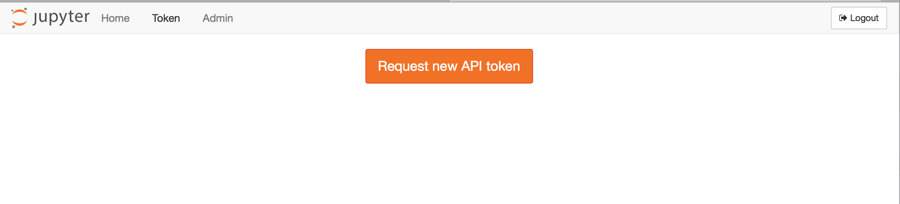
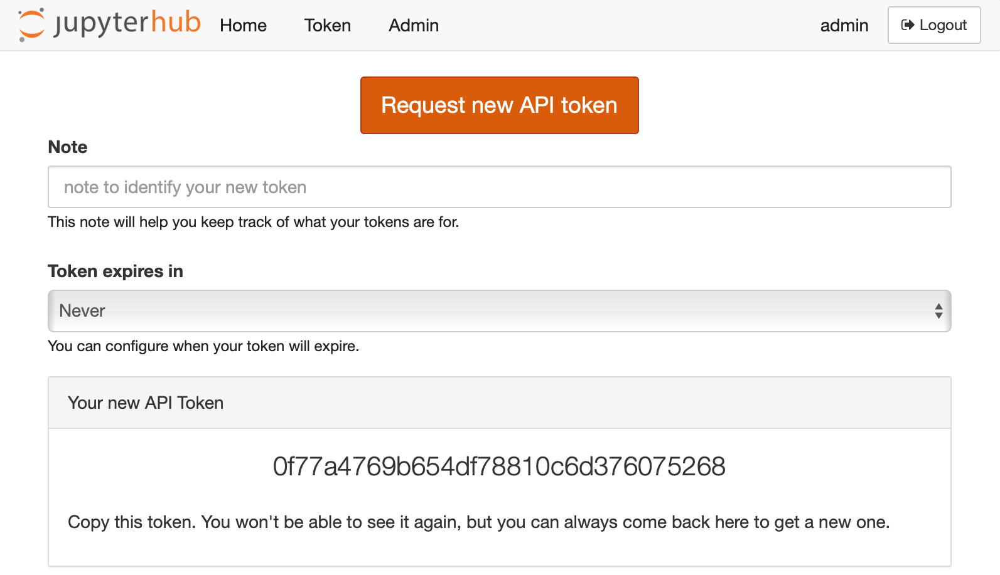

# External services

When working with JupyterHub, a **Service** is defined as a process
that interacts with the Hub's REST API. A Service may perform a specific
or action or task. For example, shutting down individuals' single user
notebook servers that have been idle for some time is a good example of
a task that could be automated by a Service. Let's look at how the
[cull_idle_servers][] script can be used as a Service.

## Real-world example to cull idle servers

JupyterHub has a REST API that can be used by external services. This
document will:

- explain some basic information about API tokens
- clarify that API tokens can be used to authenticate to
  single-user servers as of [version 0.8.0](../changelog)
- show how the [cull_idle_servers][] script can be:
    - used in a Hub-managed service
    - run as a standalone script

Both examples for `cull_idle_servers` will communicate tasks to the
Hub via the REST API.

## API Token basics

### Create an API token

To run such an external service, an API token must be created and
provided to the service.

As of [version 0.6.0](../changelog), the preferred way of doing
this is to first generate an API token:

```bash
openssl rand -hex 32
```

In [version 0.8.0](../changelog), a TOKEN request page for
generating an API token is available from the JupyterHub user interface:





### Pass environment variable with token to the Hub

In the case of `cull_idle_servers`, it is passed as the environment
variable called `JUPYTERHUB_API_TOKEN`.

### Use API tokens for services and tasks that require external access

While API tokens are often associated with a specific user, API tokens
can be used by services that require external access for activities
that may not correspond to a specific human, e.g. adding users during
setup for a tutorial or workshop. Add a service and its API token to the
JupyterHub configuration file, `jupyterhub_config.py`:

```python
c.JupyterHub.services = [
    {'name': 'adding-users', 'api_token': 'super-secret-token'},
]
```

### Restart JupyterHub

Upon restarting JupyterHub, you should see a message like below in the
logs:

```
Adding API token for <username>
```

## Authenticating to single-user servers using API token

In JupyterHub 0.7, there is no mechanism for token authentication to
single-user servers, and only cookies can be used for authentication.
0.8 supports using JupyterHub API tokens to authenticate to single-user
servers.

## Configure `cull-idle` to run as a Hub-Managed Service

In `jupyterhub_config.py`, add the following dictionary for the
`cull-idle` Service to the `c.JupyterHub.services` list:

```python
c.JupyterHub.services = [
    {
        'name': 'cull-idle',
        'admin': True,
        'command': [sys.executable, 'cull_idle_servers.py', '--timeout=3600'],
    }
]
```

where:

- `'admin': True` indicates that the Service has 'admin' permissions, and
- `'command'` indicates that the Service will be launched as a
  subprocess, managed by the Hub.

## Run `cull-idle` manually as a standalone script

Now you can run your script, i.e. `cull_idle_servers`, by providing it
the API token and it will authenticate through the REST API to
interact with it.

This will run `cull-idle` manually. `cull-idle` can be run as a standalone
script anywhere with access to the Hub, and will periodically check for idle
servers and shut them down via the Hub's REST API. In order to shutdown the
servers, the token given to cull-idle must have admin privileges.

Generate an API token and store it in the `JUPYTERHUB_API_TOKEN` environment
variable. Run `cull_idle_servers.py` manually.

```bash
    export JUPYTERHUB_API_TOKEN='token'
    python3 cull_idle_servers.py [--timeout=900] [--url=http://127.0.0.1:8081/hub/api]
```

[cull_idle_servers]: https://github.com/jupyterhub/jupyterhub/blob/master/examples/cull-idle/cull_idle_servers.py
