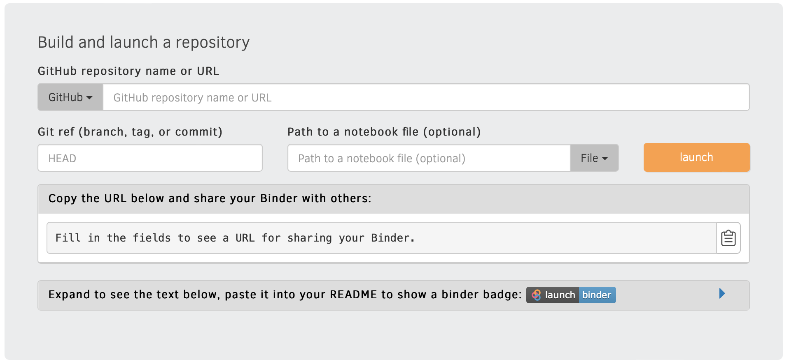
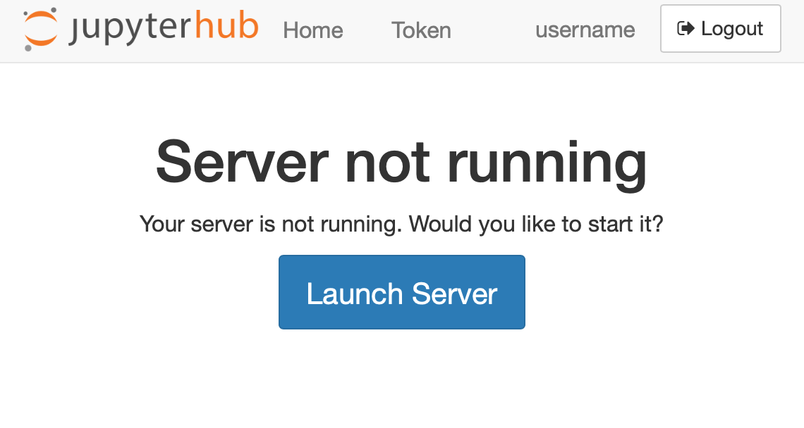
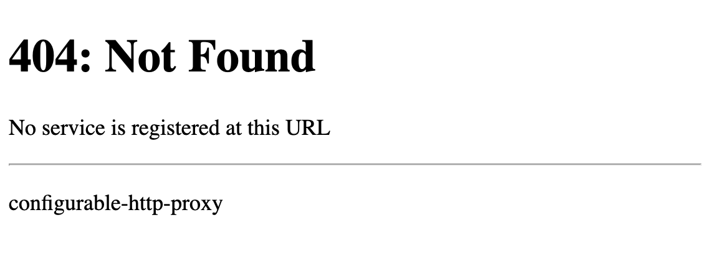
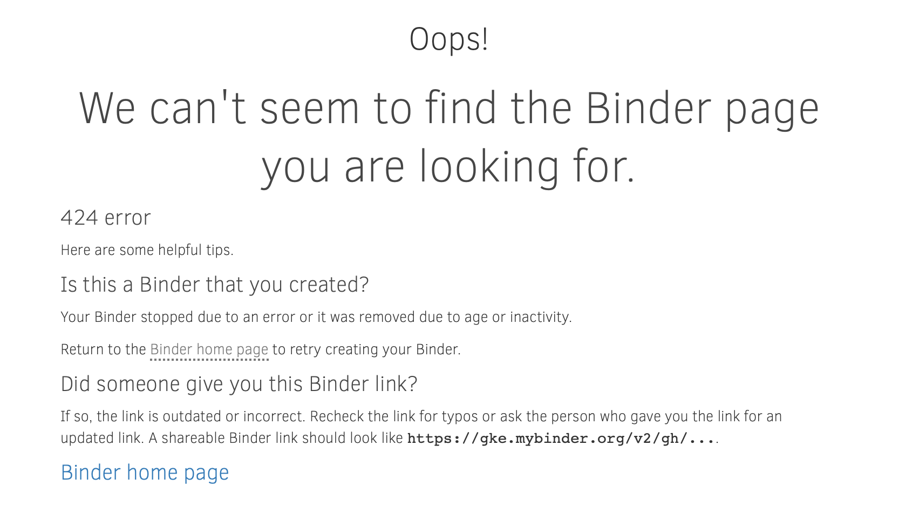

(api-only)=

# Deploying JupyterHub in "API only mode"

As a service for deploying and managing Jupyter servers for users, JupyterHub
exposes this functionality _primarily_ via a [REST API](rest).
For convenience, JupyterHub also ships with a _basic_ web UI built using that REST API.
The basic web UI enables users to click a button to quickly start and stop their servers,
and it lets admins perform some basic user and server management tasks.

The REST API has always provided additional functionality beyond what is available in the basic web UI.
Similarly, we avoid implementing UI functionality that is also not available via the API.
With JupyterHub 2.0, the basic web UI will **always** be composed using the REST API.
In other words, no UI pages should rely on information not available via the REST API.
Previously, some admin UI functionality could only be achieved via admin pages,
such as paginated requests.

## Limited UI customization via templates

The JupyterHub UI is customizable via extensible HTML [templates](templates),
but this has some limited scope to what can be customized.
Adding some content and messages to existing pages is well supported,
but changing the page flow and what pages are available are beyond the scope of what is customizable.

## Rich UI customization with REST API based apps

Increasingly, JupyterHub is used purely as an API for managing Jupyter servers
for other Jupyter-based applications that might want to present a different user experience.
If you want a fully customized user experience,
you can now disable the Hub UI and use your own pages together with the JupyterHub REST API
to build your own web application to serve your users,
relying on the Hub only as an API for managing users and servers.

One example of such an application is [BinderHub][], which powers https://mybinder.org,
and motivates many of these changes.

BinderHub is distinct from a traditional JupyterHub deployment
because it uses temporary users created for each launch.
Instead of presenting a login page,
users are presented with a form to specify what environment they would like to launch:



When a launch is requested:

1. an image is built, if necessary
2. a temporary user is created,
3. a server is launched for that user, and
4. when running, users are redirected to an already running server with an auth token in the URL
5. after the session is over, the user is deleted

This means that a lot of JupyterHub's UI flow doesn't make sense:

- there is no way for users to login
- the human user doesn't map onto a JupyterHub `User` in a meaningful way
- when a server isn't running, there isn't a 'restart your server' action available because the user has been deleted
- users do not have any access to any Hub functionality, so presenting pages for those features would be confusing

BinderHub is one of the motivating use cases for JupyterHub supporting being used _only_ via its API.
We'll use BinderHub here as an example of various configuration options.

[binderhub]: https://binderhub.readthedocs.io

## Disabling Hub UI

`c.JupyterHub.hub_routespec` is a configuration option to specify which URL prefix should be routed to the Hub.
The default is `/` which means that the Hub will receive all requests not already specified to be routed somewhere else.

There are three values that are most logical for `hub_routespec`:

- `/` - this is the default, and used in most deployments.
  It is also the only option prior to JupyterHub 1.4.
- `/hub/` - this serves only Hub pages, both UI and API
- `/hub/api` - this serves _only the Hub API_, so all Hub UI is disabled,
  aside from the OAuth confirmation page, if used.

If you choose a hub routespec other than `/`,
the main JupyterHub feature you will lose is the automatic handling of requests for `/user/:username`
when the requested server is not running.

JupyterHub's handling of this request shows this page,
telling you that the server is not running,
with a button to launch it again:



If you set `hub_routespec` to something other than `/`,
it is likely that you also want to register another destination for `/` to handle requests to not-running servers.
If you don't, you will see a default 404 page from the proxy:



For mybinder.org, the default "start my server" page doesn't make sense,
because when a server is gone, there is no restart action.
Instead, we provide hints about how to get back to a link to start a _new_ server:



To achieve this, mybinder.org registers a route for `/` that goes to a custom endpoint
that runs nginx and only serves this static HTML error page.
This is set with

```python
c.Proxy.extra_routes = {
    "/": "http://custom-404-entpoint/",
}
```

You may want to use an alternate behavior, such as redirecting to a landing page,
or taking some other action based on the requested page.

If you use `c.JupyterHub.hub_routespec = "/hub/"`,
then all the Hub pages will be available,
and only this default-page-404 issue will come up.

If you use `c.JupyterHub.hub_routespec = "/hub/api/"`,
then only the Hub _API_ will be available,
and all UI will be up to you.
mybinder.org takes this last option,
because none of the Hub UI pages really make sense.
Binder users don't have any reason to know or care that JupyterHub happens
to be an implementation detail of how their environment is managed.
Seeing Hub error pages and messages in that situation is more likely to be confusing than helpful.

:::{versionadded} 1.4

`c.JupyterHub.hub_routespec` and `c.Proxy.extra_routes` are new in JupyterHub 1.4.
:::
