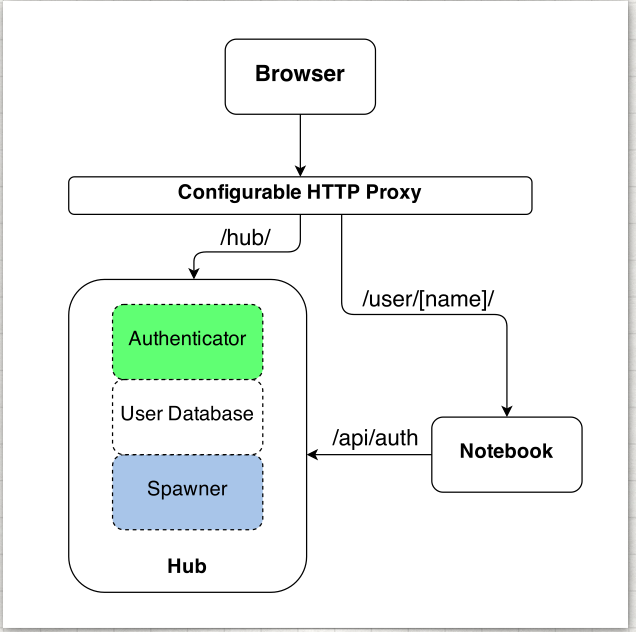

JupyterHub
==========

With JupyterHub you can create a **multi-user Hub** which spawns, manages,
and proxies multiple instances of the single-user
`Jupyter notebook <https://jupyter-notebook.readthedocs.io/en/latest/>`_ server.
Due to its flexibility and customization options, JupyterHub can be used to
serve notebooks to a class of students, a corporate data science group, or a
scientific research group.

Three subsystems make up JupyterHub:

* a multi-user **Hub** (tornado process)
* a **configurable http proxy** (node-http-proxy)
* multiple **single-user Jupyter notebook servers** (Python/IPython/tornado)

JupyterHub's basic flow of operations includes:

- The Hub spawns a proxy
- The proxy forwards all requests to the Hub by default
- The Hub handles user login and spawns single-user servers on demand
- The Hub configures the proxy to forward URL prefixes to the single-user notebook servers

For convenient administration of the Hub, its users, and :doc:`services`
(added in version 7.0), JupyterHub also provides a
`REST API <http://petstore.swagger.io/?url=https://raw.githubusercontent.com/jupyterhub/jupyterhub/master/docs/rest-api.yml#!/default>`__.

Contents
--------

**User Guide**

* :doc:`quickstart`
* :doc:`getting-started`
* :doc:`howitworks`
* :doc:`websecurity`
* :doc:`rest`

.. toctree::
   :maxdepth: 2
   :hidden:
   :caption: User Guide

   quickstart
   getting-started
   howitworks
   websecurity
   rest

**Configuration Guide**

* :doc:`authenticators`
* :doc:`spawners`
* :doc:`services`
* :doc:`config-examples`
* :doc:`upgrading`
* :doc:`troubleshooting`

.. toctree::
   :maxdepth: 2
   :hidden:
   :caption: Configuration Guide

   authenticators
   spawners
   services
   config-examples
   upgrading
   troubleshooting

**API Reference**

* :doc:`api/index`

.. toctree::
   :maxdepth: 2
   :hidden:
   :caption: API Reference

   api/index

**About JupyterHub**

* :doc:`changelog`
* :doc:`contributor-list`

.. toctree::
   :maxdepth: 2
   :hidden:
   :caption: About JupyterHub

   changelog
   contributor-list

Indices and tables
------------------

* :ref:`genindex`
* :ref:`modindex`

Questions? Suggestions?
-----------------------

- `Jupyter mailing list <https://groups.google.com/forum/#!forum/jupyter>`_
- `Jupyter website <https://jupyter.org>`_
