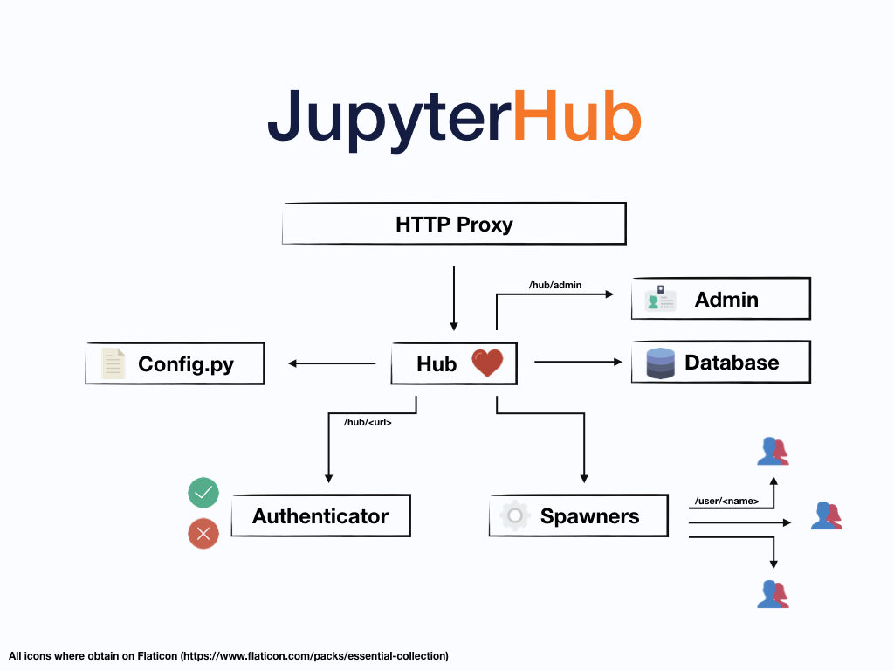

==========
JupyterHub
==========

`JupyterHub`_ is the best way to serve `Jupyter notebook`_ for multiple users.
It can be used in a class of students, a corporate data science group or scientific
research group. It is a multi-user **Hub** that spawns, manages, and proxies multiple
instances of the single-user `Jupyter notebook`_ server.

To make life easier, JupyterHub has distributions. Be sure to
take a look at them before continuing with the configuration of the broad
original system of `JupyterHub`_. Today, you can find two main cases:

1. If you need a simple case for a small amount of users (0-100) and single server
   take a look at
   `The Littlest JupyterHub <https://github.com/jupyterhub/the-littlest-jupyterhub>`__ distribution.
2. If you need to allow for even more users, a dynamic amount of servers can be used on a cloud,
   take a look at the `Zero to JupyterHub with Kubernetes <https://github.com/jupyterhub/zero-to-jupyterhub-k8s>`__ .

Four subsystems make up JupyterHub:

* a **Hub** (tornado process) that is the heart of JupyterHub
* a **configurable http proxy** (node-http-proxy) that receives the requests from the client's browser
* multiple **single-user Jupyter notebook servers** (Python/IPython/tornado) that are monitored by Spawners
* an **authentication class** that manages how users can access the system

Besides these central pieces, you can add optional configurations through a `config.py` file and manage users kernels on an admin panel. A simplification of the whole system can be seen in the figure below:

JupyterHub performs the following functions:

- The Hub launches a proxy
- The proxy forwards all requests to the Hub by default
- The Hub handles user login and spawns single-user servers on demand
- The Hub configures the proxy to forward URL prefixes to the single-user
  notebook servers

For convenient administration of the Hub, its users, and services,
JupyterHub also provides a `REST API`_.

The JupyterHub team and Project Jupyter value our community, and JupyterHub
follows the Jupyter `Community Guides <https://jupyter.readthedocs.io/en/latest/community/content-community.html>`_.

Contents
========

.. _index/distributions:

Distributions
-------------

A JupyterHub **distribution** is tailored towards a particular set of
use cases. These are generally easier to set up than setting up
JupyterHub from scratch, assuming they fit your use case.

The two popular ones are:

* `Zero to JupyterHub on Kubernetes <http://z2jh.jupyter.org>`_, for
  running JupyterHub on top of `Kubernetes <https://k8s.io>`_. This
  can scale to large number of machines & users.
* `The Littlest JupyterHub <http://tljh.jupyter.org>`_, for an easy
  to set up & run JupyterHub supporting 1-100 users on a single machine.

Installation Guide
------------------

.. toctree::
   :maxdepth: 2

   installation-guide

Getting Started
---------------

.. toctree::
   :maxdepth: 2

   getting-started/index

Technical Reference
-------------------

.. toctree::
   :maxdepth: 2

   reference/index

Administrators guide
--------------------

.. toctree::
   :maxdepth: 2

   index-admin

API Reference
-------------

.. toctree::
   :maxdepth: 2

   api/index

Contributing
------------

We want you to contribute to JupyterHub in ways that are most exciting
& useful to you. We value documentation, testing, bug reporting & code equally,
and are glad to have your contributions in whatever form you wish :)

Our `Code of Conduct <https://github.com/jupyter/governance/blob/master/conduct/code_of_conduct.md>`_
(`reporting guidelines <https://github.com/jupyter/governance/blob/master/conduct/reporting_online.md>`_)
helps keep our community welcoming to as many people as possible.

.. toctree::
   :maxdepth: 2

   contributing/index

About JupyterHub
----------------

.. toctree::
   :maxdepth: 2

   index-about

Indices and tables
==================

* :ref:`genindex`
* :ref:`modindex`

Questions? Suggestions?
=======================

- `Jupyter mailing list <https://groups.google.com/forum/#!forum/jupyter>`_
- `Jupyter website <https://jupyter.org>`_

.. _JupyterHub: https://github.com/jupyterhub/jupyterhub
.. _Jupyter notebook: https://jupyter-notebook.readthedocs.io/en/latest/
.. _REST API: http://petstore.swagger.io/?url=https://raw.githubusercontent.com/jupyterhub/jupyterhub/master/docs/rest-api.yml#!/default
