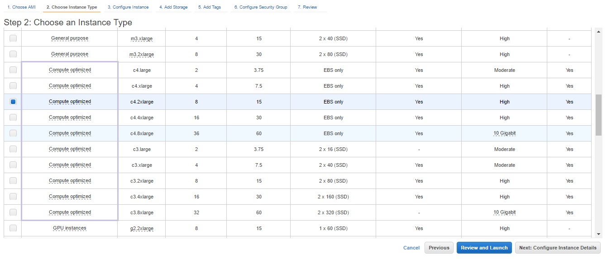
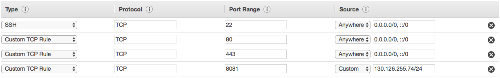

# JupyterHub Deployment on AWS

Documentation on deploying JupyterHub on an AWS EC2 Instance using NGINX Plus.

>CAUTION: Document is a work-in-progress. Information found on this page is partially incomplete and may require additional research.

## Setting Up Amazon EC2 Instance

### AMI
Choose one of the following Amazon Machine Images that are compatible with NGINX Plus:

* NGINX Plus – Amazon Linux AMI (HVM)
* NGINX Plus – Ubuntu AMI (HVM)
* NGINX Plus – Amazon Linux AMI (PV)
* NGINX Plus – Ubuntu AMI (PV)

Refer to the [NGINX AMI Installation Guide](https://www.nginx.com/resources/admin-guide/setting-nginx-plus-environment-amazon-ec2/) for more information.

### Instance Type & Storage
Instance type selection depends heavily on memory usage. Amazon Compute Optimized instances are recommended.

As a rule of thumb consider **100-200 MB/user** plus **5x-10x the amount of data you are loading from disk**, depending on the kind of analysis. After selecting your instance, you can add more memory and select memory type (GP2/IO1) in the 'Add Storage' page.

(Pictured below: c4.2xlarge)

### Configure Security Group
The standard HTTPS and HTTP ports (80, 443) need to be opened to allow JupyterHub to be proxied by NGINX.

Additionally, in order to enable Docker containers to connect to JupyterHub port 8081 will need to be opened. Open a new 'Custom TCP Rule' and set the Source in CIDR Block Notation to:
> <Netword IP Address>/24

Below is a reference image for the security group set-up. Depending on specific use-cases, port rules may differ and likely should not be open to 'anywhere'.  Your network IP will also differ.

Refer to the [Amazon EC2 Security Groups for Linux Instances Page](http://docs.aws.amazon.com/AWSEC2/latest/UserGuide/using-network-security.html) for more information.

----

## To-Do Sections
- [x] Setting Up Amazon EC2 Instance
- [ ] Setting Up JupyterHub & Web Server on EC2 VM
- [ ] Setting Up Docker Spawner
