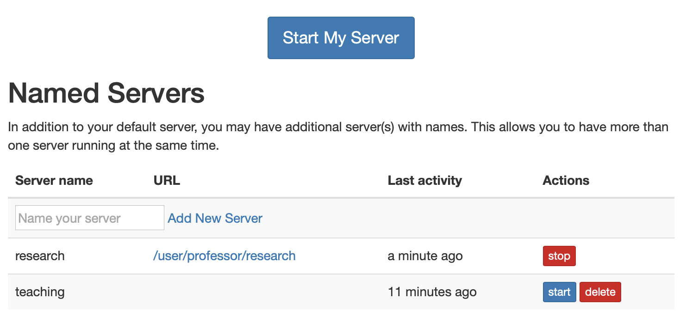
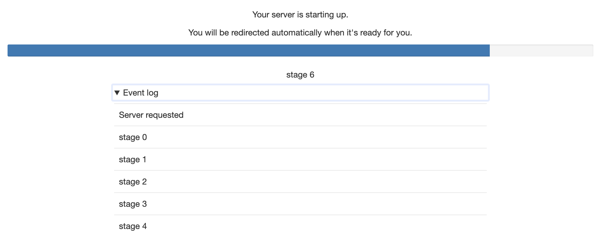
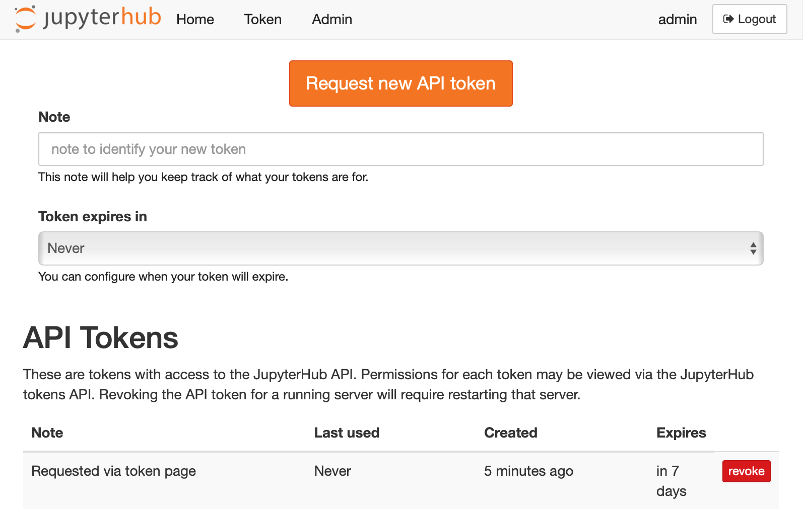
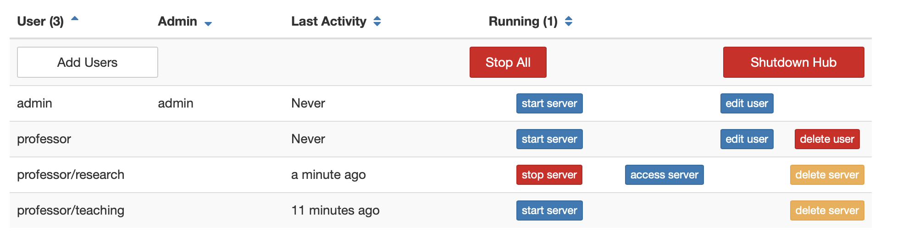

# JupyterHub URL scheme

This document describes how JupyterHub routes requests.

This does not include the [REST API](./rest.md) urls.

In general, all URLs can be prefixed with `c.JupyterHub.base_url` to
run the whole JupyterHub application on a prefix.

All authenticated handlers redirect to `/hub/login` to login users
prior to being redirected back to the originating page.
The returned request should preserve all query parameters.


## `/`

The top-level request is always a simple redirect to `/hub/`,
to be handled by the default JupyterHub handler.

In general, all requests to `/anything` that do not start with `/hub/`
but are routed to the Hub, will be redirected to `/hub/anything` before being handled by the Hub.

## `/hub/`

This is an authenticated URL.

This handler redirects users to the default URL of the application,
which defaults to the user's default server.
That is, it redirects to `/hub/spawn` if the user's server is not running,
or the server itself (`/user/:name`) if the server is running.

This default url behavior can be customized in two ways:

To redirect users to the JupyterHub home page (`/hub/home`)
instead of spawning their server,
set `redirect_to_server` to False:

```python
c.JupyterHub.redirect_to_server = False
```

This might be useful if you have a Hub where you expect
users to be managing multiple server configurations
and automatic spawning is not desirable.

Second, you can customise the landing page to any page you like,
such as a custom service you have deployed e.g. with course information:

```python
c.JupyterHub.default_url = '/services/my-landing-service'
```

## `/hub/home`



By default, the Hub home page has just one or two buttons
for starting and stopping the user's server.

If named servers are enabled, there will be some additional
tools for management of named servers.

*Version added: 1.0* named server UI is new in 1.0.

## `/hub/login`

This is the JupyterHub login page.
If you have a form-based username+password login,
such as the default PAMAuthenticator,
this page will render the login form.


If login is handled by an external service,
e.g. with OAuth, this page will have a button,
declaring "Login with ..." which users can click
to login with the chosen service.


If you want to skip the user-interaction to initiate logging in
via the button, you can set

```python
c.Authenticator.auto_login = True
```

This can be useful when the user is "already logged in" via some mechanism,
but a handshake via redirects is necessary to complete the authentication with JupyterHub.

## `/hub/logout`

Visiting `/hub/logout` clears cookies from the current browser.
Note that **logging out does not stop a user's server(s)** by default.

If you would like to shutdown user servers on logout,
you can enable this behavior with:

```python
c.JupyterHub.shutdown_on_logout = True
```

Be careful with this setting because logging out one browser
does not mean the user is no longer actively using their server from another machine.

## `/user/:username[/:servername]`

If a user's server is running, this URL is handled by the user's given server,
not the Hub.
The username is the first part and, if using named servers,
the server name is the second part.

If the user's server is *not* running, this will be redirected to `/hub/user/:username/...`

## `/hub/user/:username[/:servername]`

This URL indicates a request for a user server that is not running
(because `/user/...` would have been handled by the notebook server
if the specified server were running).

Handling this URL is the most complicated condition in JupyterHub,
because there can be many states:

1. server is not active
  a. user matches
  b. user doesn't match
2. server is ready
3. server is pending, but not ready

If the server is pending spawn,
the browser will be redirected to `/hub/spawn-pending/:username/:servername`
to see a progress page while waiting for the server to be ready.

If the server is not active at all,
a page will be served with a link to `/hub/spawn/:username/:servername`.
Following that link will launch the requested server.
The HTTP status will be 503 in this case because a request has been made for a server that is not running.

If the server is ready, it is assumed that the proxy has not yet registered the route.
Some checks are performed and a delay is added before redirecting back to `/user/:username/:servername/...`.
If something is really wrong, this can result in a redirect loop.

Visiting this page will never result in triggering the spawn of servers
without additional user action (i.e. clicking the link on the page)


*Version changed: 1.0*

Prior to 1.0, this URL itself was responsible for spawning servers,
and served the progress page if it was pending,
redirected to running servers, and
This was useful because it made sure that requested servers were restarted after they stopped,
but could also be harmful because unused servers would continuously be restarted if e.g.
an idle JupyterLab frontend were open pointed at it,
which constantly makes polling requests.

### Special handling of API requests

Requests to `/user/:username[/:servername]/api/...` are assumed to be
from applications connected to stopped servers.
These are failed with 503 and an informative JSON error message
indicating how to spawn the server.
This is meant to help applications such as JupyterLab
that are connected to a server that has stopped.

*Version changed: 1.0*

JupyterHub 0.9 failed these API requests with status 404,
but 1.0 uses 503.

## `/user-redirect/...`

This URL is for sharing a URL that will redirect a user
to a path on their own default server.
This is useful when users have the same file at the same URL on their servers,
and you want a single link to give to any user that will open that file on their server.

e.g. a link to `/user-redirect/notebooks/Index.ipynb`
will send user `hortense` to `/user/hortense/notebooks/Index.ipynb`

**DO NOT** share links to your own server with other users.
This will not work in general,
unless you grant those users access to your server.

**Contributions welcome:** The JupyterLab "shareable link" should share this link
when run with JupyterHub, but it does not.
See [jupyterlab-hub](https://github.com/jupyterhub/jupyterlab-hub)
where this should probably be done and
[this issue in JupyterLab](https://github.com/jupyterlab/jupyterlab/issues/5388)
that is intended to make it possible.

## Spawning

### `/hub/spawn[/:username[/:servername]]`

Requesting `/hub/spawn` will spawn the default server for the current user.
If `username` and optionally `servername` are specified,
then the specified server for the specified user will be spawned.
Once spawn has been requested,
the browser is redirected to `/hub/spawn-pending/...`.

If `Spawner.options_form` is used,
this will render a form,
and a POST request will trigger the actual spawn and redirect.


*Version added: 1.0*

1.0 adds the ability to specify username and servername.
Prior to 1.0, only `/hub/spawn` was recognized for the default server.

*Version changed: 1.0*

Prior to 1.0, this page redirected back to `/hub/user/:username`,
which was responsible for triggering spawn and rendering progress, etc.

### `/hub/spawn-pending[/:username[/:servername]]`



*Version added: 1.0* this URL is new in JupyterHub 1.0.

This page renders the progress view for the given spawn request.
Once the server is ready,
the browser is redirected to the running server at `/user/:username/:servername/...`.

If this page is requested at any time after the specified server is ready,
the browser will be redirected to the running server.

Requesting this page will never trigger any side effects.
If the server is not running (e.g. because the spawn has failed),
the spawn failure message (if applicable) will be displayed,
and the page will show a link back to `/hub/spawn/...`.

## `/hub/token`



On this page, users can manage their JupyterHub API tokens.
They can revoke access and request new tokens for writing scripts
against the [JupyterHub REST API](./rest.md).

## `/hub/admin`



Administrators can take various administrative actions from this page:

1. add/remove users
2. grant admin privileges
3. start/stop user servers
4. shutdown JupyterHub itself
