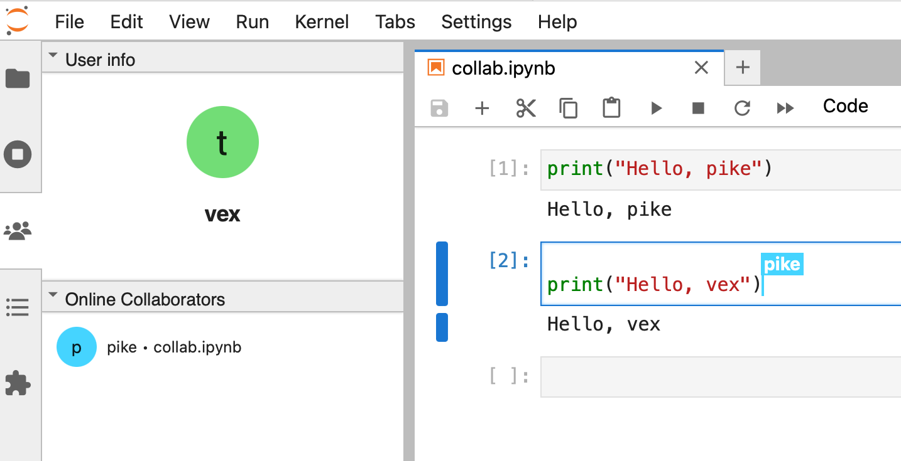
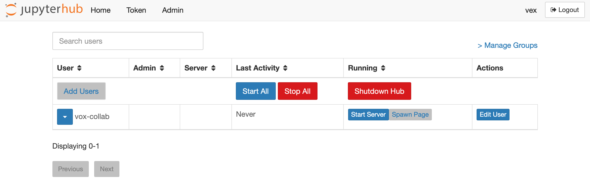

# Real-time collaboration without impersonation



:::{note}
It is recommended to use at least JupyterLab 3.6 with JupyterHub >= 3.1.1 for this.
:::

JupyterLab has support for real-time collaboration (RTC), where multiple users are working with the same Jupyter server and see each other's edits.
Beyond other collaborative-editing environments, Jupyter includes _execution_.
So granting someone access to your server also means granting them access to **run code as you**.
That's a pretty big difference, and may not be acceptable to your users (or sysadmins!).

One strategy for this is to have the concept of "collaboration accounts", which function as users themselves and represent the _collaboration_ instead of any individual human.
So instead of running code _as you_, anyone with access to the collaboration can run code _as the collaboration_.

## Goals

Our goal is to:

1. preserve default security, where nobody has access to each other's servers
2. allow adding and removing users to collaborations without restarting JupyterHub
3. enable different behavior for collaboration, such as JupyterLab's "collaborative mode". This could also include mounting project-specific data sources, etc.

Key points to consider:

1. Roles are how we grant permission to users or groups.
2. A user can be in many groups, and both users and groups can have many roles.
3. Users and groups cannot have their role assignments change without restarting JupyterHub.
4. Users _can_ have their _group_ assignments change at any time,
   and Authenticators can even delegate group membership to your identity provider,
   such as GitHub teams, etc.

A collaboration account should:

1. not be a real human user
2. be able to launch a server (this _may_ mean a real system user or not, depending on the Spawner)
3. launch a server with a different configuration than other users

And users with access to collaborations should be able to:

1. start and stop servers for collaboration users
2. access collaboration servers
3. see what other users are using the server, according to their JupyterHub identity

## Initial setup

First, we are going to define our collaborations and their initial membership.
We do this in a yaml file, but it could come from some other source,
such as your identity provider or another data source:

```yaml
projects:
  vox:
    members:
      - vex
      - vax
      - pike
  mighty:
    members:
      - fjord
      - beau
      - jester
```

This is a small data structure where the keys of `projects` are the names of the collaboration groups,
and the `members` are a list of real users who should have access to these servers.

First, we are going to prepare to define the roles and groups:

```python
c.JupyterHub.load_roles = []

c.JupyterHub.load_groups = {
    # collaborative accounts get added to this group
    # so it's easy to see which accounts are collaboration accounts
    "collaborative": [],
}
```

where we create the `collaborative` group which will contain only the collaboration accounts themselves.

### Creating collaboration accounts

Next, we are going to iterate through our collaborations, create users, and assign permissions.
We are going to:

1. create a JupyterHub user for each collaboration
1. assign the collaboration user to the collaboration group
1. create a _role_ granting access to the collaboration user's account
1. create a _group_ for each collaboration
1. assign the group to the role, so it has access to the account
1. assign members of the project to the collaboration group, so _they_ have access to the project.

```python
for project_name, project in project_config["projects"].items():
    # get the members of the project
    members = project.get("members", [])
    print(f"Adding project {project_name} with members {members}")
    # add them to a group for the project
    c.JupyterHub.load_groups[project_name] = members
    # define a new user for the collaboration
    collab_user = f"{project_name}-collab"
    # add the collab user to the 'collaborative' group
    # so we can identify it as a collab account
    c.JupyterHub.load_groups["collaborative"].append(collab_user)

    # finally, grant members of the project collaboration group
    # access to the collab user's server,
    # and the admin UI so they can start/stop the server
    c.JupyterHub.load_roles.append(
        {
            "name": f"collab-access-{project_name}",
            "scopes": [
                f"access:servers!user={collab_user}",
                f"admin:servers!user={collab_user}",
                "admin-ui",
                f"list:users!user={collab_user}",
            ],
            "groups": [project_name],
        }
    )
```

The `members` step could be skipped if group membership is managed by the authenticator, or handled via the admin UI later, in which case we only need to handle group _creation_ and role assignment.

This configuration code runs when jupyterhub starts up, and as noted above, users and groups cannot have their role assignments change without restarting JupyterHub. If new collaboration groups are created (within configuration, via the admin page, or via the Authenticator), the hub will need to be restarted in order for it to load roles for those new groups.

### Distinguishing collaborative servers

Finally, we want to enable RTC only on the collaborative user servers (and _only_ the collaborative user servers),
which we do via a `pre_spawn_hook` that checks for membership in the `collaborative` group:

```python

def pre_spawn_hook(spawner):
    group_names = {group.name for group in spawner.user.groups}
    if "collaborative" in group_names:
        spawner.log.info(f"Enabling RTC for user {spawner.user.name}")
        spawner.args.append("--LabApp.collaborative=True")


c.Spawner.pre_spawn_hook = pre_spawn_hook
```

This is also where we would put other collaboration customization, such as mounting data sets, any other collective credentials, etc.

### Permissions

What permissions did we need?

- `access:servers!user={collab_user}` is the main one -this is what grants us access to the running server.
  But it doesn't grant us access to start or stop it.
- `admin:servers!user={collab_user}` grants us access to start and stop the collaboration user's servers
- `admin-ui` and `list:users!user={collab_user}` allow users who are members of collaboration accounts access to the admin UI,
  but _only_ with the ability to see the collaboration accounts they have access to,
  not any other users.

The `admin-ui` and `list:users` permissions are not strictly required, but they provide a shortcut to having UI to list and access collaboration, but users will probably want to have convenient access.
The only built-in UI JupyterHub has to view other users' servers is the admin page.
Users can have very limited access to the admin page to take the few actions they are allowed to do without needing any elevated permissions, so that's the quickest way to given them the buttons they need for this, but it may not be how you want to do it in the long run.
If you provide the necessary links (e.g. `https://yourhub.example/hub/spawn/vox-collab/`) on some other page, these permissions are not necessary.


