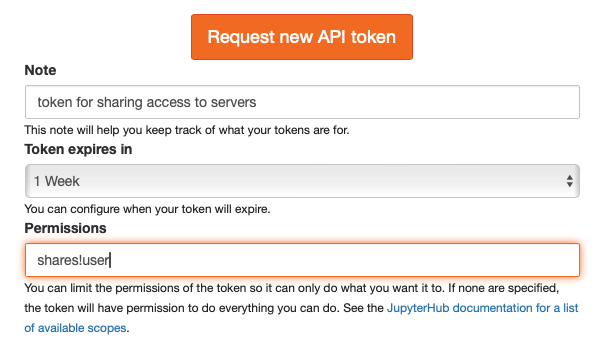

(sharing-tutorial)=

# Sharing access to your server

In JupyterHub 5.0, users can grant each other limited access to their servers without intervention by Hub administrators.
There is not (yet!) any UI for granting shared access, so this tutorial goes through the steps of using the JupyterHub API to grant access to servers.

For more background on how sharing works in JupyterHub, see the [sharing reference documentation](sharing-reference).

## Setup: enable sharing (admin)

First, sharing must be _enabled_ on the JupyterHub deployment.
That is, grant (some) users permission to share their servers with others.
Users cannot share their servers by default.
This is the only step that requires an admin action.
To grant users permission to share access to their servers,
add the `shares!user` scope to the default `user` role:

```python
c.JupyterHub.load_roles = [
    {
        "name": "user",
        "scopes": ["self", "shares!user"],
    },
]
```

With this, only the sharing via invitation code (described below) will be available.

Additionally, if you want users to be able to share access with a **specific user or group** (more below),
a user must have permission to read that user or group's name.
To enable the _full_ sharing API for all users:

```python
c.JupyterHub.load_roles = [
    {
        "name": "user",
        "scopes": ["self", "shares!user", "read:users:name", "read:groups:name"],
    },
]
```

Note that this exposes the ability for all users to _discover_ existing user and group names,
which is part of why we have the share-by-code pattern,
so users don't need this ability to share with each other.
Adding filters lets you limit who can be shared with by name.

:::{note}
Removing a user's permission to grant shares only prevents _future_ shares.
Any shared permissions previously granted by a user will remain and must be revoked separately,
if desired.
:::

### Grant servers permission to share themselves (optional, admin)

The most natural place to want to grant access to a server is when viewing that server.
By default, the tokens used when talking to a server have extremely limited permissions.
You can grant sharing permissions to servers themselves in one of two ways.

The first is to grant sharing permission to the tokens used by browser requests.
This is what you would do if you had a JupyterLab extension that presented UI for managing shares
(this should exist! We haven't made it yet).
To grant these tokens sharing permissions:

```python
c.Spawner.oauth_client_allowed_scopes = ["access:servers!server", "shares!server"]
```

JupyterHub's `user-sharing` example does it this way.
The nice thing about this approach is that only users who already have those permissions will get a token which can take these actions.
The downside (in terms of convenience) is that the browser token is only accessible to the javascript (e.g. JupyterLab) and/or jupyter-server request handlers,
but not notebooks or terminals.

The second way, which is less secure, but perhaps more convenient for demonstration purposes,
is to grant the _server itself_ permission to grant access to itself.

```python
c.Spawner.server_token_scopes = [
  "users:activity!user",
  "shares!server",
]
```

The security downside of this approach is that anyone who can access the server generally can assume the permissions of the server token.
Effectively, this means anyone who the server is shared _with_ will gain permission to further share the server with others.
This is not the case for the first approach, but this token is accessible to terminals and notebook kernels, making it easier to illustrate.

## Get a token

Now, assuming the _user_ has permission to share their server (step 0), we need a token to make the API requests in this tutorial.
You can do this at the token page, or inherit it from the single-user server environment if one of the above configurations has been selected by admins.

To request a token with only the permissions required (`shares!user`) on the token page:



This token will be in the `Authorization` header.
To create a {py:class}`requests.Session` that will send this header on every request:

```python
import requests
from getpass import getpass

token = getpass.getpass("JupyterHub API token: ")

session = requests.Session()
session.headers = {"Authorization": f"Bearer {token}"}
```

We will make subsequent requests in this tutorial with this session object, so the header is present.

## Issue a sharing code

We are going to make a POST request to `/hub/api/share-codes/username/` to issue a _sharing code_.
This is a _code_, which can be _exchanged_ by one or more users for access to the shared service.

A sharing code:

- always expires (default: after one day)
- can be _exchanged_ multiple times for shared access to the server

When the sharing code expires, any permissions granted by the code will remain
(think of it like an invitation to collaborate on a repository or to a chat group - the invitation can expire, but once accepted, access persists).

To request a share code:

```
POST /hub/api/share-codes/:username/:servername
```

Assuming your username is `barb` and you want to share access to your default server, this would be:

```
POST /hub/api/share-codes/barb/
```

```python
# sample values, replace with your actual hub
hub_url = "http://127.0.0.1:8000"
username = "barb"

r = session.post(f"{hub_url}/hub/api/share-codes/{username}/")
```

which will have a JSON response:

```python
{
  'server': {'user': {'name': 'barb'},
    'name': '',
    'url': '/user/barb/',
    'ready': True,
  },
  'scopes': ['access:servers!server=barb/'],
  'id': 'sc_2',
  'created_at': '2024-01-10T13:01:32.972409Z',
  'expires_at': '2024-01-11T13:01:32.970126Z',
  'exchange_count': 0,
  'last_exchanged_at': None,
  'code': 'U-eYLFT1lGstEqfMHpAIvTZ1MRjZ1Y1a-loGQ0K86to',
  'accept_url': '/hub/accept-share?code=U-eYLFT1lGstEqfMHpAIvTZ1MRjZ1Y1a-loGQ0K86to',
  'full_accept_url': 'https://hub.example.org/accept-share?code=U-eYLFT1lGstEqfMHpAIvTZ1MRjZ1Y1a-loGQ0K86to',
}
```

The most relevant fields here are `code`, which contains the code itself, and `accept_url`, which is the URL path for the page another user.
Note: it does not contain the _hostname_ of the hub, which JupyterHub often does not know.
If `public_url` configuration is defined, `full_accept_url` will be the full URL including the host.
Otherwise, it will be null.

Share codes are guaranteed to be url-safe, so no encoding is required.

### Expanding or limiting the share code

You can specify scopes (must be limited to this specific server) and expiration of the sharing code.

:::{note}
The granted permissions do not expire, only the code itself.
That means that after expiration, users may not exchange the code anymore,
but any user who has exchanged it will still have those permissions.
:::

The _default_ scopes are only `access:servers!server=:user/:server`, and the default expiration is one day (86400).
These can be overridden in the JSON body of the POST request that issued the token:

```python
import json

options = {
  "scopes": [
    f"access:servers!server={username}/", # access the server (default)
    f"servers!server={username}/", # start/stop the server
    f"shares!server={username}/", # further share the server with others
  ],
  "expires_in": 3600, # code expires in one hour
}

session.post(f"{hub_url}/hub/api/share-codes/{username}/", data=json.dumps(options))
```

### Distribute the sharing code

Now that you have a code and/or a URL, anyone you share the code with will be able to visit `$JUPYTERHUB/hub/accept-share?code=code`.

### Sharing a link to a specific page

The `accept-share` page also accepts a `next` URL parameter, which can be a redirect to a specific page, rather than the default page of the server.
For example:

```
/hub/accept-code?code=abc123&next=/users/barb/lab/tree/mynotebook.ipynb
```

would be a link that can be shared with any JupyterHub user that will take them directly to the file `mynotebook.ipynb` in JupyterLab on barb's server after granting them access to the server.

## Reviewing shared access

When you have shared access to your server, it's a good idea to check out who has access.
You can see who has access with:

```python
session.get()
```

which produces a paginated list of who has shared access:

```python
{'items': [{'server': {'user': {'name': 'barb'},
    'name': '',
    'url': '/user/barb/',
    'ready': True},
   'scopes': ['access:servers!server=barb/',
    'servers!server=barb/',
    'shares!server=barb/'],
   'user': {'name': 'shared-with'},
   'group': None,
   'kind': 'user',
   'created_at': '2024-01-10T13:16:56.432599Z'}],
 '_pagination': {'offset': 0, 'limit': 200, 'total': 1, 'next': None}}
```

## Revoking shared access

There are two ways to revoke access to a shared server:

1. `PATCH` requests can revoke individual permissions from individual users or groups
2. `DELETE` requests revokes all shared permissions from anyone (unsharing the server in one step)

To revoke one or more scopes from a user:

```python
options = {
    "user": "shared-with",
    "scopes": ["shares!server=barb/"],
}

session.patch(f"{hub_url}/hub/api/shares/{username}/", data=json.dumps(options))
```

The Share model with remaining permissions, if any, will be returned:

```python
{'server': {'user': {'name': 'barb'},
  'name': '',
  'url': '/user/barb/',
  'ready': True},
 'scopes': ['access:servers!server=barb/', 'servers!server=barb/'],
 'user': {'name': 'shared-with'},
 'group': None,
 'kind': 'user',
 'created_at': '2024-01-10T13:16:56.432599Z'}
```

If no permissions remain, the response will be an empty dict (`{}`).

To revoke all permissions for a single user, leave `scopes` unspecified:

```python
options = {
    "user": "shared-with",
}

session.patch(f"{hub_url}/hub/api/shares/{username}/", data=json.dumps(options))
```

Or revoke all shared permissions from all users for the server:

```python
session.delete(f"{hub_url}/hub/api/shares/{username}/")
```
