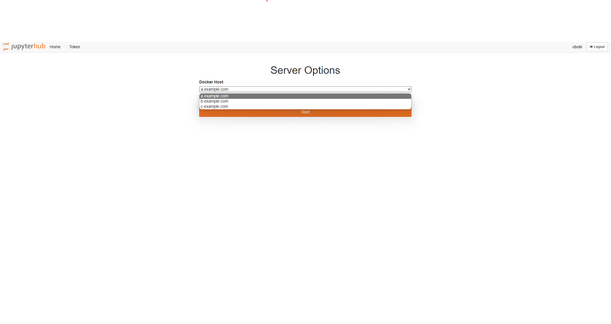

# Creating NB Containers on multiple docker hosts using form

Utilize multiple docker hosts as spawning pools without docker swarm or k8s.

## Run

1.  Write the spawning pool information in the `tls_config_by_hosts` of the `jupyterhub_config.py` file.
2.  Enter the `docker-compose up` command.
3.  Visit http://<YOUR_PUBLIC_HUB_IP>:8000

